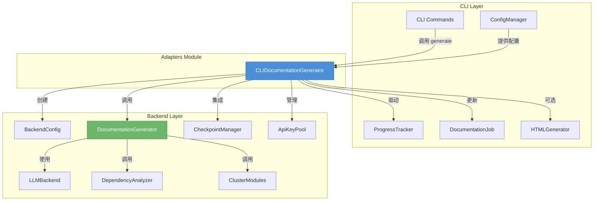
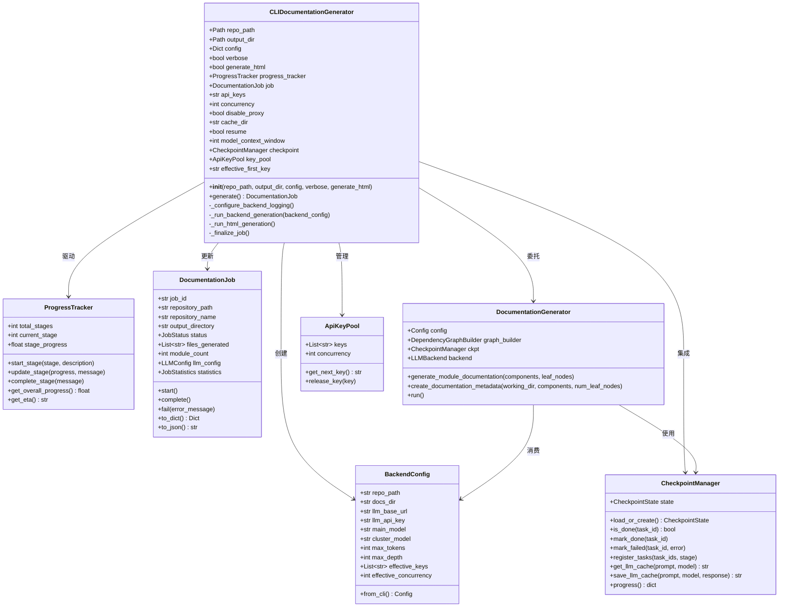
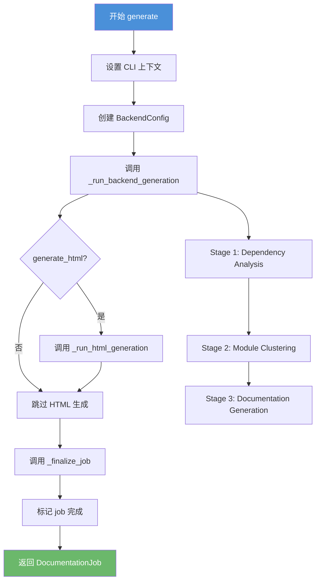
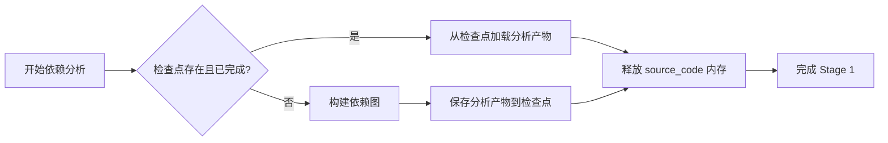
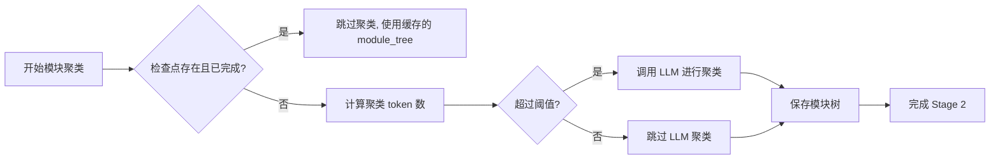
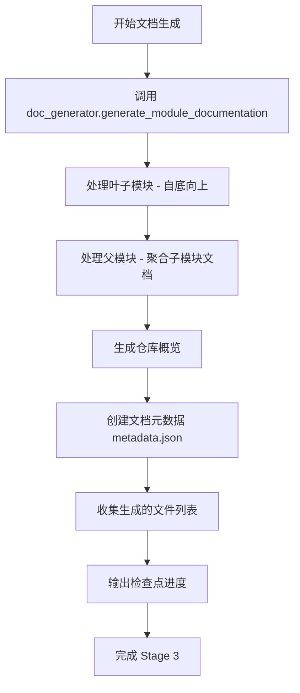
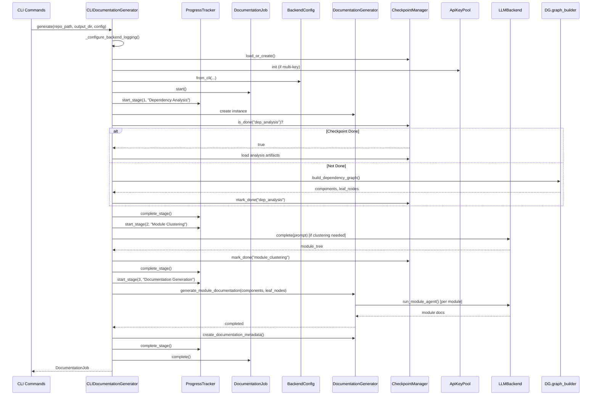

# Adapters 模块文档

## 概述

**Adapters（适配器）** 模块是 CodeWiki CLI 与后端引擎之间的桥梁层。它位于 `codewiki/cli/adapters/` 目录下，核心职责是将 CLI 层的配置、进度报告和错误处理与后端的文档生成逻辑解耦，提供统一的命令行接口调用入口。

主要功能包括：
- **配置适配**：将 CLI 的用户配置（YAML/JSON）转换为后端 `Config` 对象
- **进度跟踪**：将后端的多阶段生成过程映射到 CLI 可感知的进度条
- **断点续传**：集成 `CheckpointManager`，支持在中断后恢复生成流程
- **多 Key 管理**：集成 `ApiKeyPool`，支持多 API Key 轮询与并发控制
- **日志配置**：将后端日志重定向到 CLI 控制台和文件系统
- **流程编排**：协调依赖分析、模块聚类、文档生成、HTML 输出等完整流水线

## 架构概览



## 核心组件

### CLIDocumentationGenerator

**文件**: `codewiki/cli/adapters/doc_generator.py`

这是 Adapters 模块唯一的公开类，封装了完整的文档生成流程。它继承/包装了后端 `DocumentationGenerator`，并添加了 CLI 专用的特性。

#### 类图



#### 构造函数详解

```python
def __init__(
    self,
    repo_path: Path,
    output_dir: Path,
    config: Dict[str, Any],
    verbose: bool = False,
    generate_html: bool = False
)
```

**参数说明**:

| 参数 | 类型 | 说明 |
|------|------|------|
| `repo_path` | `Path` | 待生成文档的仓库路径 |
| `output_dir` | `Path` | 文档输出目录 |
| `config` | `Dict[str, Any]` | LLM 配置字典（包含模型、API key、代理等设置） |
| `verbose` | `bool` | 是否启用详细日志输出 |
| `generate_html` | `bool` | 是否同时生成 HTML 文档查看器 |

**初始化流程**:

1. 从 `config` 字典中提取配置项：`api_keys`、`concurrency`、`disable_proxy`、`cache_dir`、`resume`、`model_context_window`
2. 解析 `api_key` 或 `api_keys` 中的首个有效 Key 作为 `effective_first_key`（用于 OpenAI 客户端认证）
3. 初始化 `ProgressTracker`（5 阶段进度跟踪器）
4. 创建 `DocumentationJob` 并填充元数据
5. 调用 `_configure_backend_logging()` 配置后端日志
6. 如果启用 `resume`，初始化 `CheckpointManager` 并加载或创建检查点
7. 如果配置了多个 API Key，初始化 `ApiKeyPool` 用于轮询分发

#### generate() 方法

这是 Adapters 模块的入口方法，执行完整的文档生成流水线：



**异常处理**:
- 捕获 `APIError`：标记 Job 失败并抛出
- 捕获其他异常：记录错误信息到 Job 并抛出

#### _run_backend_generation() 方法

这是核心生成逻辑，分为 3 个阶段：

##### Stage 1: 依赖分析 (权重 40%)



- 检查 `CheckpointManager` 中 `dep_analysis` 阶段是否已完成
- 如果是：从检查点加载序列化的 `components` 和 `leaf_nodes`
- 如果否：调用 `doc_generator.graph_builder.build_dependency_graph()` 进行分析
- 保存分析产物到检查点用于断点续传
- **内存优化**：分析完成后释放所有 `Node.source_code` 以节省内存（对于大型仓库可释放 30-50+ MB）

##### Stage 2: 模块聚类 (权重 20%)



- 使用 `get_clustering_input_token_count` 计算输入 token 数
- 如果 token 数未超过 `max_token_per_module` 阈值，直接使用所有叶子节点作为模块
- 否则调用 `cluster_modules` 使用 LLM 进行智能聚类
- 保存两份模块树：`first_module_tree.json`（原始聚类结果）和 `module_tree.json`（最终结果）

##### Stage 3: 文档生成 (权重 30%)



- 使用动态规划方法自底向上生成文档
- 先处理所有叶子模块（无子模块的模块），再处理父模块
- 每个模块的文档由 LLM Agent 生成
- 父模块文档基于其所有子模块的文档自动聚合
- 最后生成仓库级别的概览文档

#### 内存管理策略

CLIDocumentationGenerator 实现了重要的内存优化：

1. **分析阶段后立即释放源代码**：`build_dependency_graph()` 完成后，遍历所有 `Node` 对象，将 `source_code` 字段置为 `None`
2. **延迟加载**：后续文档生成阶段按需从磁盘读取源代码
3. **显式 GC 回收**：释放大对象后调用 `gc.collect()` 强制回收

```python
if components is not None:
    freed_bytes = 0
    for node in components.values():
        if node.source_code is not None:
            freed_bytes += len(node.source_code.encode("utf-8", errors="ignore"))
            node.source_code = None
    if freed_bytes > 0:
        logger.info("[Memory] Freed %d bytes...", freed_bytes, len(components))
    gc.collect()
```

#### 日志配置 (_configure_backend_logging)

```mermaid
flowchart TD
    A[配置后端日志] --> B[获取 backend logger]
    B --> C[清除现有 handlers]
    C --> D{verbose?}
    D -->|是| E[控制台: INFO 级别 → stdout]
    D -->|否| F[控制台: WARNING 级别 → stderr]
    E --> G[控制台: ColoredFormatter]
    F --> G
    G --> H[文件 handler: DEBUG 级别 → /usr/log/codewiki/]
    H --> I[Logger 级别: min(控制台, 文件)]
    I --> J[关闭向上传播]
```

- **控制台输出**：详细模式输出到 stdout，非详细模式输出到 stderr
- **文件输出**：始终启用文件日志（DEBUG 级别），持久化到 `/usr/log/codewiki/`
- **彩色格式化**：使用 `ColoredFormatter` 增强可读性

#### 向后兼容性

通过 `inspect.signature` 动态检测后端 `Config.from_cli` 的参数列表，仅传递后端支持的高级参数：

```python
backend_params = _inspect.signature(BackendConfig.from_cli).parameters
extra_kwargs = {}
for name, value in (...):
    if name in backend_params:
        extra_kwargs[name] = value
```

这种方式确保新旧后端版本的兼容性，不会因为后端不识别某个参数而崩溃。

## 数据流



## 依赖关系

```mermaid
graph TB
    subgraph "Adapters Module Dependencies"
        AD[adapters/doc_generator.py]
    end

    subgraph "CLI Utils"
        PT[utils/progress.py]
        ERR[utils/errors.py]
    end

    subgraph "CLI Models"
        JOB[models/job.py]
        CONF[models/config.py]
    end

    subgraph "CLI Services"
        HG[html_generator.py]
    end

    subgraph "Backend Core"
        DG[be/documentation_generator.py]
        CFG[src/config.py]
        CP[be/checkpoint.py]
        KP[be/key_pool.py]
        CL[be/cluster_modules.py]
    end

    subgraph "Dependency Analyzer"
        LOG[be/dependency_analyzer/utils/logging_config.py]
        SER[be/dependency_analyzer/utils/serialization.py]
    end

    AD --> PT
    AD --> JOB
    AD --> ERR
    AD --> HG
    AD --> DG
    AD --> CFG
    AD --> CP
    AD --> KP
    AD --> CL
    AD --> LOG
    AD --> SER

    style AD fill:#4a90d9,color:#fff,stroke:#2a6db9
    style DG fill:#6bb86b,color:#fff
    style CP fill:#e8a838,color:#fff
    style KP fill:#d97373,color:#fff
```



## 配置映射

CLI 配置到后端配置的映射关系：

| CLI Config Key | 后端配置字段 | 说明 |
|---------------|-------------|------|
| `base_url` | `llm_base_url` | LLM API 基础 URL |
| `api_key` | `llm_api_key` | 单一 API Key（首 Key） |
| `api_keys` | `api_keys` | 逗号分隔的多 API Key |
| `main_model` | `main_model` | 主要生成模型 |
| `cluster_model` | `cluster_model` | 聚类模型 |
| `fallback_model` | `fallback_model` | 备用模型 |
| `provider` | `provider` | 提供商类型 |
| `max_tokens` | `max_tokens` | 最大输出 Token |
| `max_token_per_module` | `max_token_per_module` | 模块聚类阈值 |
| `max_token_per_leaf_module` | `max_token_per_leaf_module` | 叶子模块阈值 |
| `max_depth` | `max_depth` | 最大分析深度 |
| `concurrency` | `concurrency` | 并发数 |
| `disable_proxy` | `disable_proxy` | 禁用代理 |
| `cache_dir` | `cache_dir` | 缓存目录 |
| `resume` | `resume` | 启用断点续传 |
| `model_context_window` | `model_context_window` | 模型上下文窗口 |

## 进度跟踪阶段

| 阶段 | 名称 | 权重 | 说明 |
|------|------|------|------|
| 1 | 依赖分析 | 40% | 解析仓库结构、构建依赖图 |
| 2 | 模块聚类 | 20% | 将文件聚类为文档模块 |
| 3 | 文档生成 | 30% | 逐模块生成 Markdown 文档 |
| 4 | HTML 生成（可选） | 5% | 生成 HTML 查看器 |
| 5 | 最终处理 | 5% | 验证元数据、完成 Job |

## 异常处理

```mermaid
flowchart TD
    A[generate() 调用] --> B[try 块]
    B --> C{发生异常?}
    C -->|APIError| D[job.fail(error)]
    D --> E[抛出 APIError]
    C -->|其他异常| F[job.fail(error)]
    F --> G[抛出原始异常]
    C -->|无异常| H[job.complete()]
    H --> I[返回 job]
    
    subgraph "后端异常传播"
        J[依赖分析失败] -->|APIError| K["Dependency analysis failed: ..."]
        L[模块聚类失败] -->|APIError| M["Module clustering failed: ..."]
        N[文档生成失败] -->|APIError| O["Documentation generation failed: ..."]
    end
```

## 使用示例

```python
from pathlib import Path
from codewiki.cli.adapters.doc_generator import CLIDocumentationGenerator

# 配置 LLM
config = {
    'api_key': 'sk-xxx',
    'base_url': 'https://api.openai.com/v1',
    'main_model': 'gpt-4o',
    'cluster_model': 'gpt-4o-mini',
    'max_tokens': 32768,
    'max_depth': 2,
    'resume': True,
    'concurrency': 3,
    'api_keys': 'sk-key1,sk-key2,sk-key3',  # 多 Key 轮询
}

# 创建适配器
generator = CLIDocumentationGenerator(
    repo_path=Path('/path/to/repo'),
    output_dir=Path('./docs'),
    config=config,
    verbose=True,
    generate_html=True
)

# 生成文档
job = generator.generate()
print(f"Job ID: {job.job_id}")
print(f"Status: {job.status}")
print(f"Generated files: {job.files_generated}")
```

## 与 CLI 命令的集成

Adapters 模块被 CLI 的 `generate` 命令调用。完整的调用链条如下：

```mermaid
flowchart LR
    A[codewiki generate] --> B[commands/generate.py]
    B --> C[合并配置: CLI参数 + 文件配置]
    C --> D[创建 CLIDocumentationGenerator]
    D --> E[调用 generate()]
    E --> F[返回 DocumentationJob]
    F --> G[输出结果到控制台]
```

参见 [cli.md](cli.md) 了解 CLI 命令的详细信息。

## 参考

- [cli.md](cli.md) - CLI 层整体文档
- [backend_core.md](backend_core.md) - 后端核心模块文档
- [dependency_analyzer.md](dependency_analyzer.md) - 依赖分析器文档
- [models_job.md](models_job.md) - Job 模型文档
- [models_config.md](models_config.md) - 配置模型文档
- [utils.md](utils.md) - CLI 工具模块文档
- [config_manager.md](config_manager.md) - 配置管理模块文档
- [html_generator.md](html_generator.md) - HTML 生成器模块文档
