# CLI 模块文档

## 概述

**CLI 模块** 是 CodeWiki 的命令行接口核心模块，负责编排整个文档生成工作流程。它将用户面向的 CLI 操作与后端服务桥接起来，管理配置、Git 集成、进度报告和文档输出生成。

### 模块定位

CLI 模块在整个 CodeWiki 系统中扮演 **编排者** 角色：

- **用户入口**：作为用户与系统交互的主要界面（通过 `codewiki` 命令）
- **配置管理**：安全的凭据存储与配置持久化
- **工作流编排**：协调依赖分析、模块聚类、文档生成等阶段
- **输出生成**：创建 Markdown 文档和交互式 HTML 查看器
- **Git 集成**：管理文档分支的创建、提交和远程操作

### 核心功能

1. **配置管理**：通过系统密钥链或文件回退方式安全存储 API 密钥和 LLM 设置
2. **文档生成**：完整的 5 阶段流水线（依赖分析 → 模块聚类 → 文档生成 → HTML 输出 → 最终化）
3. **增量更新**：仅重新生成受变更影响的模块，提高效率
4. **检查点恢复**：支持从上次中断处恢复文档生成
5. **多密钥并发**：支持多个 API 密钥轮换，提高吞吐量
6. **Git 工作流**：自动创建文档分支、提交文档、生成 PR 链接
7. **GitHub Pages**：生成自包含的 HTML 文档查看器

---

## 架构概览

### 整体架构

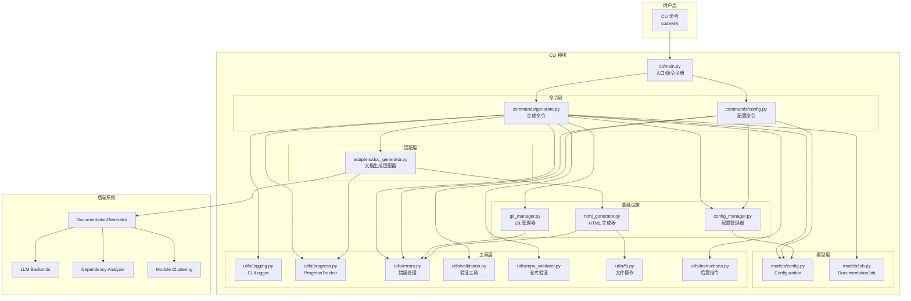

### 模块依赖关系

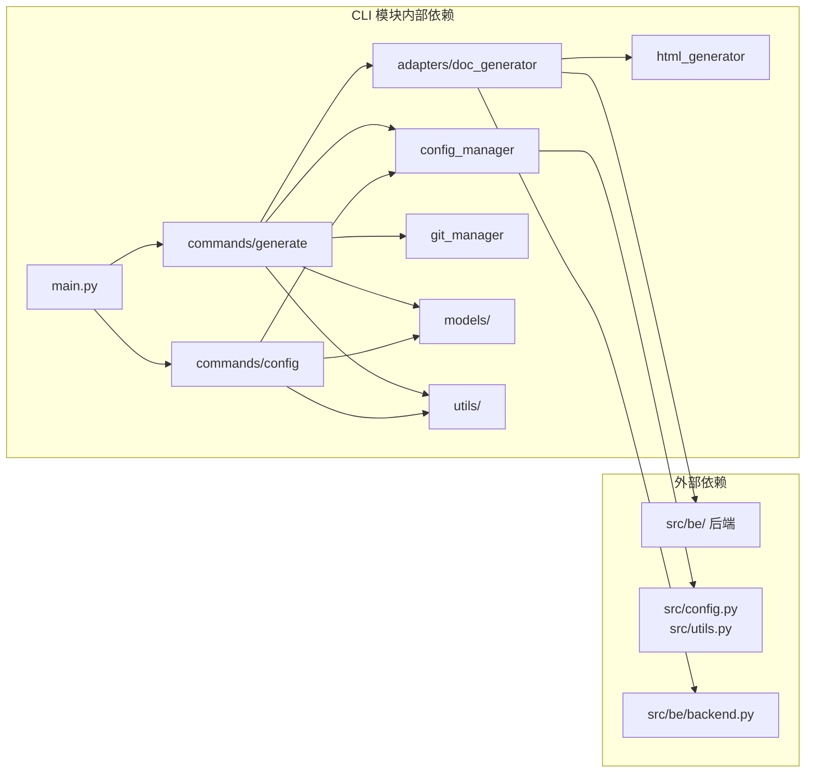

### 包结构

```
codewiki/cli/
├── __init__.py                  # 包初始化
├── main.py                      # CLI 入口，命令注册
├── config_manager.py            # 配置管理器（密钥链集成）
├── git_manager.py               # Git 操作管理
├── html_generator.py            # HTML 文档查看器生成
├── models/
│   ├── __init__.py
│   ├── config.py                # Configuration, AgentInstructions
│   └── job.py                   # DocumentationJob, JobStatus
├── adapters/
│   ├── __init__.py
│   └── doc_generator.py         # CLIDocumentationGenerator 适配器
├── commands/
│   ├── __init__.py
│   ├── generate.py              # generate/status 命令
│   └── config.py                # config 命令组
└── utils/
    ├── __init__.py
    ├── errors.py                # 错误类型与退出码
    ├── validation.py            # URL/API Key/模型名验证
    ├── repo_validator.py        # 仓库验证
    ├── fs.py                    # 安全文件读写
    ├── progress.py              # 进度追踪
    ├── logging.py               # CLI 日志
    ├── api_errors.py            # API 错误处理
    └── instructions.py          # 生成后指令显示
```

---

## 核心组件详解

### 1. CLI 入口 (`main.py`)

**职责**：定义 Click 命令组，注册子命令，作为整个 CLI 的入口点。

**关键特性**：
- 使用 Click 框架构建命令界面
- 注册三个顶级命令：`generate`、`status`、`config`、`mcp`
- `version` 命令显示版本信息
- `mcp` 命令启动 MCP（Model Context Protocol）服务器
- 异常处理：统一捕获 `KeyboardInterrupt` 和未预期异常

**命令注册流程**：

```mermaid
flowchart TD
    ENTRY[main() 入口] --> CLI[cli Click Group]
    CLI --> CMD1[generate 命令]
    CLI --> CMD2[status 命令]
    CLI --> CMD3[config 命令组]
    CLI --> CMD4[mcp 命令]
    CLI --> CMD5[version 命令]
    
    CMD1 --> GEN_IMPL[commands/generate.py]
    CMD2 --> GEN_IMPL
    CMD3 --> CONF_IMPL[commands/config.py]
    CMD4 --> MCP_SRV[codewiki.mcp.server]
    
    GEN_IMPL --> ERR_HANDLE[异常处理]
    ERR_HANDLE --> EXIT1[退出码 0]
    ERR_HANDLE --> EXIT130[退出码 130 - 用户中断]
    ERR_HANDLE --> EXIT1_GEN[退出码 1 - 通用错误]
```

### 2. 配置管理器 (`config_manager.py`)

**职责**：安全的配置和凭据管理，支持智能回退机制。

**核心功能**：
- **密钥链集成**：使用系统密钥链（macOS Keychain、Windows Credential Manager、Linux Secret Service）
- **文件回退**：当密钥链不可用时，优雅地回退到 `~/.codewiki/credentials.json`
- **环境变量控制**：`CODEWIKI_NO_KEYRING=1` 强制使用文件存储（适用于无头容器）
- **提供者感知**：不同提供者有不同的验证规则（API 模式 vs 订阅模式）
- **多密钥支持**：支持逗号分隔的多个 API 密钥

**存储结构**：

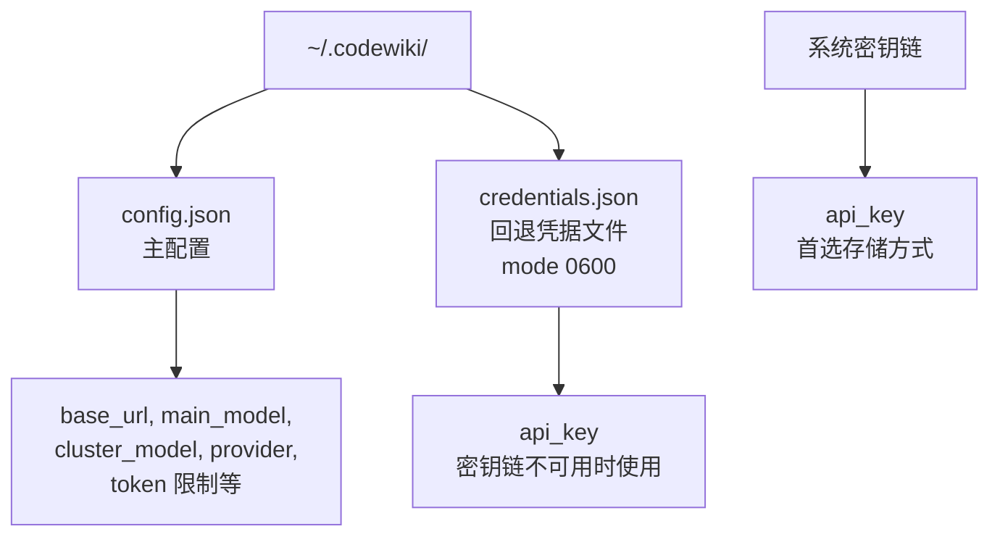

**配置加载流程**：

```mermaid
flowchart TD
    START[load() 调用] --> CHK_CONFIG{~/.codewiki/config.json 存在?}
    CHK_CONFIG -->|否| RET_FALSE[返回 False]
    CHK_CONFIG -->|是| LOAD_JSON[加载 JSON]
    LOAD_JSON --> CHK_KEYRING{密钥链可用?}
    CHK_KEYRING -->|是| TRY_KEYRING[从密钥链获取 API Key]
    CHK_KEYRING -->|否| TRY_FILE[从 credentials.json 获取]
    TRY_KEYRING -->|成功| USE_KEYRING[使用密钥链值]
    TRY_KEYRING -->|失败| TRY_FILE
    TRY_FILE -->|存在| USE_FILE[使用文件值]
    TRY_FILE -->|不存在| NO_KEY[无 API Key]
    USE_KEYRING --> DONE[返回 Configuration]
    USE_FILE --> DONE
    NO_KEY --> DONE
```

**关键 API**：

| 方法 | 说明 |
|------|------|
| `load()` | 从文件和密钥链加载配置 |
| `save(...)` | 保存配置到文件和密钥链 |
| `get_api_key()` | 获取 API 密钥（优先密钥链） |
| `get_config()` | 获取 Configuration 对象 |
| `is_configured()` | 检查配置是否完整有效 |
| `delete_api_key()` | 删除 API 密钥 |
| `clear()` | 清除所有配置 |

### 3. 文档生成适配器 (`adapters/doc_generator.py`)

**职责**：包装后端 `DocumentationGenerator`，添加 CLI 特定的进度报告、检查点恢复等特性。

**5 阶段流水线**：

```mermaid
flowchart TD
    START[generate() 调用] --> STAGE1[阶段 1: 依赖分析<br/>权重 40%]
    STAGE1 --> STAGE2[阶段 2: 模块聚类<br/>权重 20%]
    STAGE2 --> STAGE3[阶段 3: 文档生成<br/>权重 30%]
    STAGE3 --> OPT{--generate-html?}
    OPT -->|是| STAGE4[阶段 4: HTML 生成<br/>权重 5%]
    OPT -->|否| STAGE5[阶段 5: 最终化<br/>权重 5%]
    STAGE4 --> STAGE5
    STAGE5 --> DONE[完成]
    
    subgraph "阶段 1 详情"
        S1_INIT[初始化分析器]
        S1_PARSE[解析源文件]
        S1_BUILD[构建依赖图]
        S1_LEAF[识别叶节点]
        S1_CKPT{检查点可用?}
        S1_CKPT -->|是| S1_SKIP[跳过分析<br/>加载已保存结果]
        S1_CKPT -->|否| S1_FULL[完整分析]
    end
    
    subgraph "阶段 2 详情"
        S2_INIT[准备叶节点]
        S2_CACHE{已缓存模块树?}
        S2_CACHE -->|是| S2_LOAD[加载缓存]
        S2_CACHE -->|否| S2_CLUSTER[LLM 聚类]
        S2_SAVE[保存模块树]
    end
    
    subgraph "阶段 3 详情"
        S3_GEN[逐模块生成文档]
        S3_OVERVIEW[创建仓库概览]
        S3_META[生成 metadata.json]
    end
```

**检查点恢复机制**：

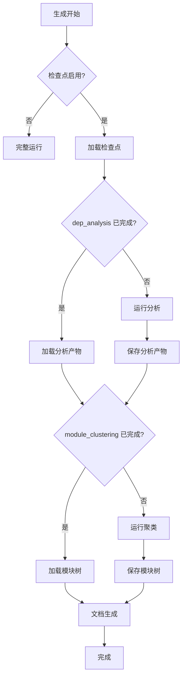

**多密钥并发**：

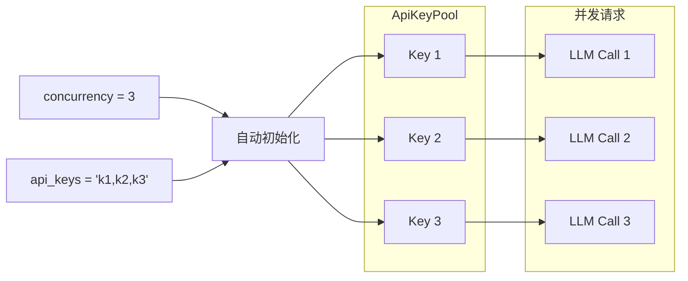

**内存优化**：
- 依赖分析完成后，释放所有 `Node.source_code` 字段以节省内存
- 使用 `gc.collect()` 主动触发垃圾回收

### 4. Git 管理器 (`git_manager.py`)

**职责**：无缝的 Git 集成，用于可选的文档提交和分支管理。

**能力矩阵**：

| 操作 | 方法 | 说明 |
|------|------|------|
| 仓库验证 | `__init__()` | 验证工作目录是否为 Git 仓库 |
| 状态检查 | `check_clean_working_directory()` | 检查工作目录是否干净 |
| 分支创建 | `create_documentation_branch()` | 创建时间戳分支 `docs/codewiki-YYYYMMDD-HHMMSS` |
| 文档提交 | `commit_documentation()` | 提交生成的文档 |
| 远程检测 | `get_remote_url()` | 获取远程仓库 URL |
| PR 链接生成 | `get_github_pr_url()` | 生成 GitHub PR 创建链接 |

**分支策略**：

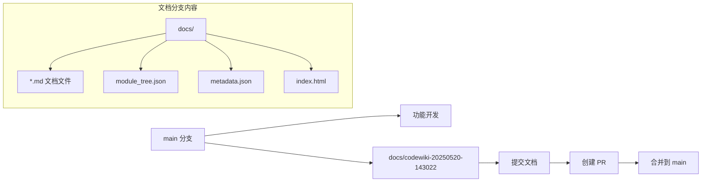

**工作目录检查逻辑**：

```mermaid
flowchart TD
    REQ[create_documentation_branch()] --> CHK{force=True?}
    CHK -->|是| CREATE[创建分支]
    CHK -->|否| CHECK[检查工作目录]
    CHECK --> CLEAN{干净?}
    CLEAN -->|是| CREATE
    CLEAN -->|否| ERROR[抛出 RepositoryError<br/>提示用户提交或 stash]
    CREATE --> DONE[返回分支名]
```

### 5. HTML 生成器 (`html_generator.py`)

**职责**：创建自包含的静态 HTML 文档查看器，用于 GitHub Pages 部署。

**核心特性**：
- 基于模板的 HTML 生成
- 自动加载 `module_tree.json` 和 `metadata.json`
- 嵌入式 CSS/JS（单文件部署）
- 仓库信息自动检测（从 Git 远程 URL）
- 元数据可视化（模型信息、生成时间、统计数据）

**模板变量**：

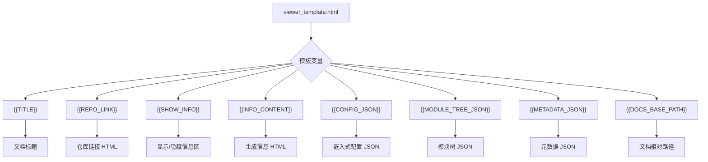

**生成流程**：

```mermaid
flowchart TD
    START[generate()] --> DETECT[detect_repository_info]
    DETECT --> LOAD_TREE{提供 module_tree?}
    LOAD_TREE -->|否| AUTO_TREE[从 docs_dir 自动加载]
    LOAD_TREE -->|是| USE_TREE[使用提供的树]
    AUTO_TREE --> LOAD_META{提供 metadata?}
    USE_TREE --> LOAD_META
    LOAD_META -->|否| AUTO_META[从 docs_dir 自动加载]
    LOAD_META -->|是| USE_META[使用提供的元数据]
    AUTO_META --> BUILD_INFO[_build_info_content]
    USE_META --> BUILD_INFO
    BUILD_INFO --> FILL[填充模板变量]
    FILL --> WRITE[安全写入 index.html]
    WRITE --> DONE[完成]
```

### 6. 配置数据模型 (`models/config.py`)

**核心类**：

#### `AgentInstructions`

自定义文档代理指令，控制文档生成的各个方面。

```python
@dataclass
class AgentInstructions:
    include_patterns: Optional[List[str]]  # 包含文件模式，如 ["*.cs", "*.py"]
    exclude_patterns: Optional[List[str]]  # 排除文件模式，如 ["*Tests*"]
    focus_modules: Optional[List[str]]    # 重点模块，如 ["src/core"]
    doc_type: Optional[str]              # 文档类型：api, architecture, user-guide, developer
    custom_instructions: Optional[str]   # 自由格式指令
```

**指令类型映射**：

| 文档类型 | 生成的 Prompt 添加 |
|---------|-------------------|
| `api` | "Focus on API documentation: endpoints, parameters, return types, and usage examples." |
| `architecture` | "Focus on architecture documentation: system design, component relationships, and data flow." |
| `user-guide` | "Focus on user guide documentation: how to use features, step-by-step tutorials." |
| `developer` | "Focus on developer documentation: code structure, contribution guidelines, and implementation details." |

#### `Configuration`

持久化 CLI 配置，存储在 `~/.codewiki/config.json`。

**关键字段**：

| 字段 | 默认值 | 说明 |
|------|--------|------|
| `base_url` | `""` | LLM API 基础 URL |
| `main_model` | `""` | 主要文档生成模型 |
| `cluster_model` | `""` | 模块聚类模型 |
| `fallback_model` | `"glm-4p5"` | 回退模型 |
| `provider` | `"openai-compatible"` | LLM 提供者类型 |
| `max_tokens` | `32768` | 最大生成 tokens |
| `max_token_per_module` | `36369` | 每模块最大 tokens |
| `max_token_per_leaf_module` | `16000` | 每叶节点最大 tokens |
| `max_depth` | `2` | 最大层级分解深度 |
| `api_keys` | `""` | 逗号分隔的多 API 密钥 |
| `concurrency` | `0` | 最大并发数（0=自动） |
| `cache_dir` | `".codewiki_cache"` | 检查点缓存目录 |
| `resume` | `True` | 启用检查点恢复 |
| `model_context_window` | `0` | 模型上下文窗口限制（0=自动检测） |

**配置转换流程**：

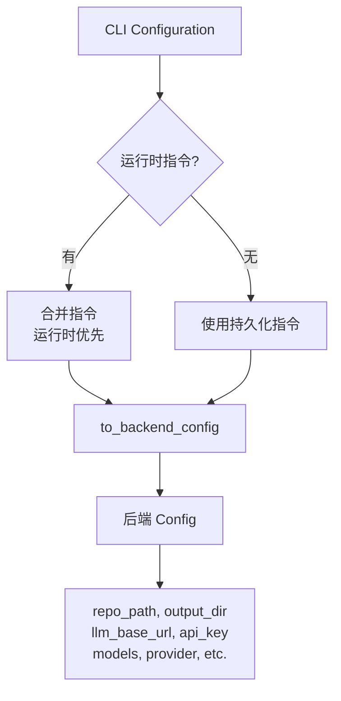

**提供者验证逻辑**：

| 提供者 | 必需字段 | 说明 |
|--------|---------|------|
| `openai-compatible` | `base_url`, `main_model`, `cluster_model`, `fallback_model` | 标准 API 模式 |
| `anthropic` | `main_model` | 订阅模式（claude-code/codex），无需 API key |
| `azure-openai` | `base_url`, `main_model`, `cluster_model` | + `api_version`, `azure_deployment` |
| `bedrock` | `main_model`, `cluster_model` | + `aws_region` |

### 7. 作业数据模型 (`models/job.py`)

**核心类**：

#### `DocumentationJob`

完整的文档生成作业表示，从创建到完成的全生命周期跟踪。

**作业生命周期**：

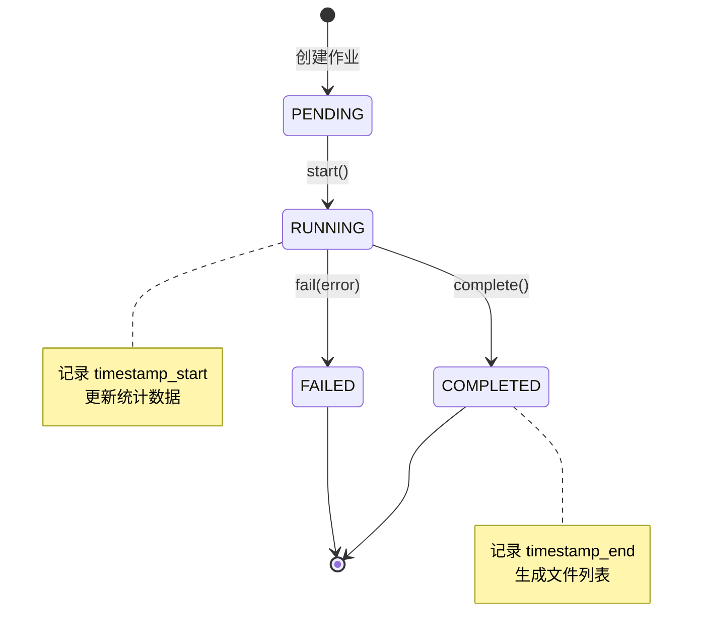

**作业数据结构**：

```json
{
  "job_id": "550e8400-e29b-41d4-a716-446655440000",
  "repository_path": "/path/to/repo",
  "repository_name": "my-repo",
  "output_directory": "/path/to/repo/docs",
  "commit_hash": "abc123def456",
  "status": "completed",
  "files_generated": ["overview.md", "api.md", "architecture.md"],
  "module_count": 8,
  "statistics": {
    "total_files_analyzed": 156,
    "leaf_nodes": 12,
    "max_depth": 3,
    "total_tokens_used": 125000
  }
}
```

**辅助类**：

| 类 | 字段 | 说明 |
|----|------|------|
| `JobStatus` | `PENDING`, `RUNNING`, `COMPLETED`, `FAILED` | 作业状态枚举 |
| `GenerationOptions` | `create_branch`, `github_pages`, `no_cache`, `custom_output` | 生成选项 |
| `JobStatistics` | `total_files_analyzed`, `leaf_nodes`, `max_depth`, `total_tokens_used` | 统计数据 |
| `LLMConfig` | `main_model`, `cluster_model`, `base_url` | LLM 配置快照 |

---

## 数据流

### 完整的文档生成流程

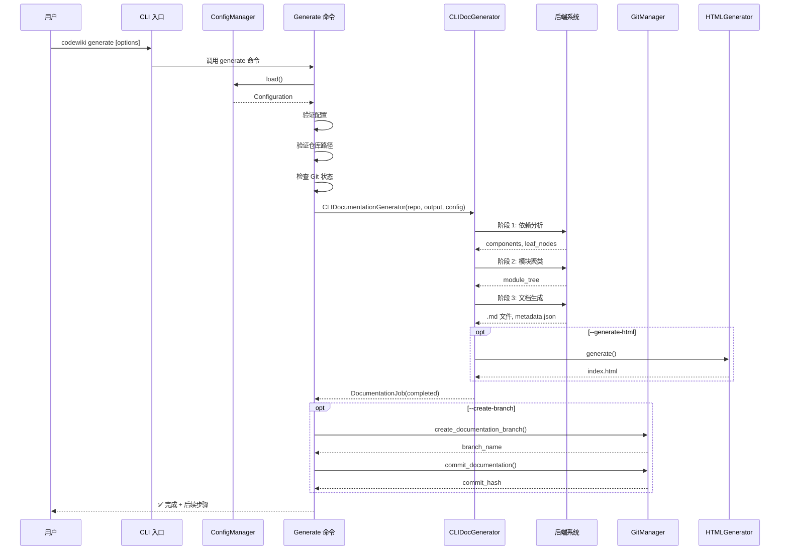

### 增量更新流程

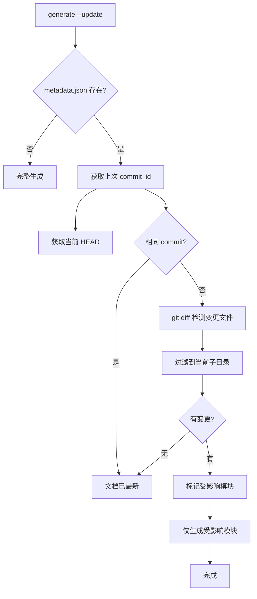

---

## 命令参考

### `codewiki generate`

**选项**：

| 选项 | 简写 | 类型 | 默认值 | 说明 |
|------|------|------|--------|------|
| `--output` | `-o` | PATH | `docs` | 输出目录 |
| `--create-branch` | | flag | `False` | 创建 Git 分支 |
| `--github-pages` | | flag | `False` | 生成 HTML 查看器 |
| `--no-cache` | | flag | `False` | 强制重新生成 |
| `--include` | `-i` | str | `None` | 包含文件模式 |
| `--exclude` | `-e` | str | `None` | 排除文件模式 |
| `--focus` | `-f` | str | `None` | 重点模块 |
| `--doc-type` | `-t` | choice | `None` | 文档类型 |
| `--instructions` | | str | `None` | 自定义指令 |
| `--verbose` | `-v` | flag | `False` | 详细输出 |
| `--max-tokens` | | int | `None` | 覆盖 max_tokens |
| `--update` | | flag | `False` | 增量更新 |
| `--resume/--no-resume` | | bool | `True` | 检查点恢复 |
| `--clear-cache` | | flag | `False` | 清除缓存 |
| `--cache-dir` | | str | `None` | 缓存目录 |
| `--concurrency` | | int | `None` | 覆盖并发数 |

### `codewiki config`

**子命令**：

| 子命令 | 说明 |
|--------|------|
| `config set` | 设置配置值 |
| `config show` | 显示当前配置 |
| `config validate` | 验证配置完整性 |
| `config clear` | 清除所有配置 |
| `config setup` | 交互式配置向导 |

### `codewiki status`

显示文档生成作业的状态信息。

### `codewiki mcp`

启动 MCP（Model Context Protocol）服务器，将文档生成工具暴露给 MCP 客户端。

### `codewiki version`

显示版本信息。

---

## 错误处理

### 错误层级

```
Exception
  └─ CodeWikiError (基础 CLI 错误)
      ├─ ConfigurationError (exit=2) 配置加载/验证错误
      ├─ APIError (exit=4)           LLM API 错误
      ├─ RepositoryError (exit=3)    Git 仓库错误
      └─ FileSystemError (exit=5)    文件系统错误
```

### 退出码

| 退出码 | 含义 | 触发场景 |
|--------|------|---------|
| 0 | 成功 | 命令执行成功 |
| 1 | 通用错误 | 未预期的异常 |
| 2 | 配置错误 | 缺少 API Key、配置不完整 |
| 3 | 仓库错误 | 非 Git 仓库、不支持的语言 |
| 4 | API 错误 | LLM API 超时、认证失败 |
| 5 | 文件系统错误 | 权限不足、磁盘空间满 |
| 130 | 用户中断 | Ctrl+C |

### 错误处理函数

```python
def handle_error(error: Exception, verbose: bool = False) -> int:
    """处理错误并返回适当的退出码"""
```

---

## 关键设计模式

### 1. **适配器模式**
`CLIDocumentationGenerator` 适配后端 `DocumentationGenerator`，添加 CLI 特有功能而不修改后端代码。

```python
# 后端提供纯文档生成逻辑
doc_generator = DocumentationGenerator(config)

# CLI 适配器包装并添加进度反馈
self.progress_tracker.update_stage(0.5, "解析源文件中...")
```

### 2. **配置即代码**
配置从持久化存储加载，可以按命令覆盖，既支持全局默认也支持命令级定制。

```python
# 加载全局配置
config_mgr.load()

# 应用 CLI 覆盖
config_mgr.save(base_url=args.base_url, main_model=args.model)
```

### 3. **进度回调模式**
通过进度追踪器提供实时反馈，可被 CLI、日志或监控系统消费。

```python
progress_tracker.start_stage(1, "依赖分析")
progress_tracker.update_stage(0.5, "分析依赖中...")
progress_tracker.complete_stage()
```

### 4. **回退/降级**
关键功能有回退机制防止单点故障：

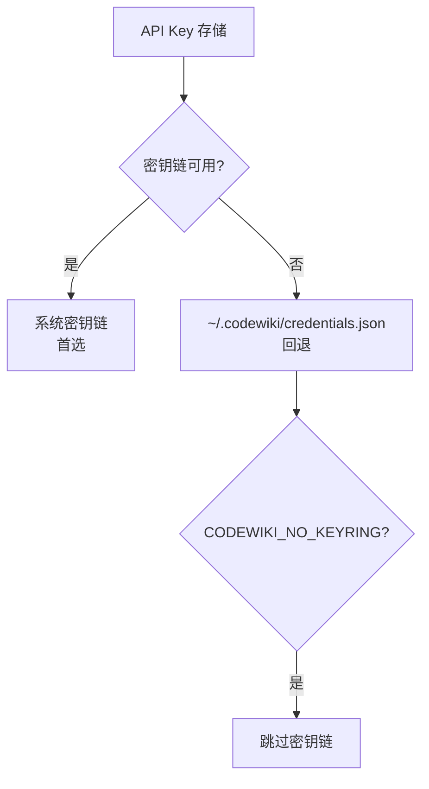

### 5. **惰性加载**
资源仅在需要时加载：

```python
# HTML 生成器自动从 docs_dir 加载 module_tree 和 metadata
html_generator.generate(docs_dir=output_dir)
# 内部按需加载 module_tree.json 和 metadata.json
```

---

## 与其他模块的集成

### 依赖的后端模块

| 模块 | 依赖组件 | 说明 |
|------|---------|------|
| [config_and_utils](config.md) | `Config.from_cli()` | 配置转换（CLI → 后端） |
| [documentation_generator](documentation_generation.md) | `DocumentationGenerator` | 文档生成核心逻辑 |
| [dependency_analyzer](dependency_analyzer.md) | `DependencyGraphBuilder`, `Node` | 代码分析与依赖图构建 |
| [llm_backends](llm_backends.md) | `LLMBackend`, `is_caw_provider()` | LLM 提供者管理 |
| [checkpoint](documentation_generation.md) | `CheckpointManager` | 检查点恢复 |
| [key_pool](llm_backends.md) | `ApiKeyPool` | 多密钥并发管理 |

### 前端 Web 应用

CLI 生成的文档和元数据格式与 [前端 Web 应用](frontend_web_app.md) 共享，使得生成的文档既可通过 CLI 查看，也可通过 Web 界面浏览。

---

## 安全考虑

1. **API 密钥管理**
   - 首选系统密钥链存储
   - 回退文件权限设为 `0600`（仅所有者读写）
   - 多密钥通过逗号分隔字符串存储，密钥链中保持加密

2. **凭据处理**
   - 作业序列化从不包含凭据
   - `LLMConfig` 只存储模型名称，不存密钥
   - 密钥仅在 `to_backend_config()` 运行时传入

3. **安全文件操作**
   - 使用原子写入（临时文件 + 重命名）防止数据损坏
   - 路径规范化防止目录遍历攻击
   - HTML 输出中的特殊字符转义

---

## 配置示例

### 标准 API 模式

```bash
codewiki config set \
  --api-key sk-ant-xxx \
  --base-url https://api.anthropic.com \
  --main-model claude-sonnet-4-20250514 \
  --cluster-model claude-sonnet-4-20250514 \
  --fallback-model glm-4p5 \
  --provider openai-compatible
```

### Azure OpenAI

```bash
codewiki config set \
  --api-key azure-xxx \
  --base-url https://my-resource.openai.azure.com \
  --main-model gpt-4-deployment \
  --cluster-model gpt-4-deployment \
  --provider azure-openai \
  --api-version 2024-12-01-preview \
  --azure-deployment my-deployment
```

### 订阅模式（Claude Code）

```bash
codewiki config set \
  --provider claude-code \
  --main-model claude-sonnet-4-5
```

### 多密钥并发配置

```bash
codewiki config set \
  --api-keys "sk-key1,sk-key2,sk-key3" \
  --concurrency 3
```

### 自定义代理指令

```bash
codewiki generate \
  --include "*.py,*.ts" \
  --exclude "*_test.py,*spec*" \
  --focus "src/core,src/api" \
  --doc-type architecture \
  --instructions "Emphasize error handling patterns and security considerations"
```

---

## 性能优化

### 检查点恢复
- 跳过已完成的阶段，从中断处继续
- 依赖分析结果持久化到 `analysis_artifacts.json`
- 模块树缓存到 `first_module_tree.json`

### 增量更新
- 使用 `--update` 标志仅重新生成受 Git 变更影响的模块
- 通过 `git diff` 检测变更文件
- 自动失效包含变更文件的模块缓存

### 内存管理
- 依赖分析完成后释放源代码文本，减少内存占用
- 主动垃圾回收，避免大型仓库的内存压力
- 惰性加载模块树和元数据

### 并发优化
- 多 API 密钥轮换，提高 LLM 调用吞吐量
- 自动并发控制（并发数 = 密钥数）
- 代理禁用选项减少网络延迟

---

## 相关文档

- [配置与工具模块](config.md) - 后端 Config 和文件管理器
- [文档生成模块](documentation_generation.md) - 文档生成核心逻辑和检查点
- [依赖分析模块](dependency_analyzer.md) - 代码依赖分析引擎
- [LLM 后端模块](llm_backends.md) - LLM 提供者集成和密钥池
- [前端 Web 应用](frontend_web_app.md) - Web 界面和作业管理
- [CLI 工具模块](cli_utils.md) - 日志和进度追踪工具
