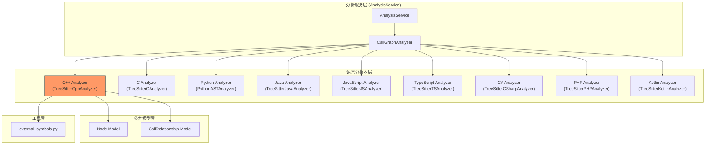
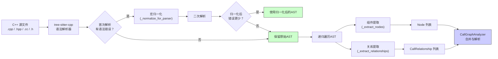
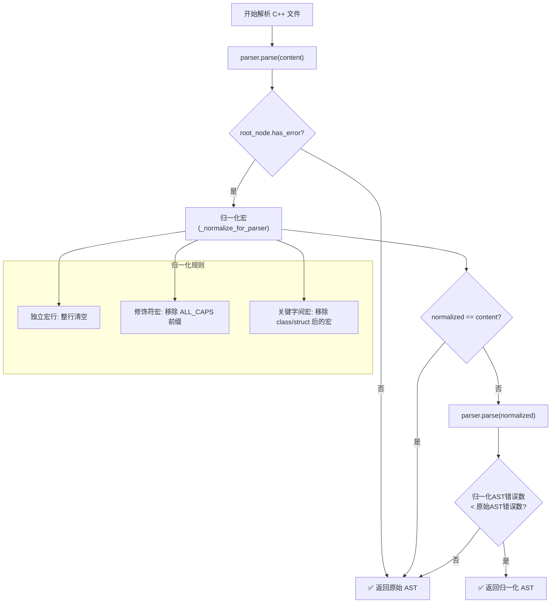

# C++ 依赖分析器模块 (TreeSitterCppAnalyzer)

## 概述

C++ 依赖分析器是 CodeWiki 多语言依赖分析系统中的一个核心语言分析模块。它基于 **tree-sitter** 解析引擎，专门用于解析 C++ 源代码，提取代码中的组件（类、结构体、函数、方法、类型别名、命名空间、全局变量）以及它们之间的调用关系。

该模块通过智能的**宏恢复机制**处理 C++ 中常见的宏污染问题，能有效解析被宏修饰的复杂 C++ 代码结构，并支持跨文件的调用关系解析。

---

## 架构图

### 1. 模块在系统中的位置



### 2. TreeSitterCppAnalyzer 内部架构

```mermaid
graph TB
    subgraph "TreeSitterCppAnalyzer"
        Init["__init__()"] --> Analyze["_analyze()"]

        subgraph "解析阶段"
            Analyze --> Parse["_parse_with_macro_recovery()"]
            Parse --> Norm["_normalize_for_parser()"]
            Parse --> Count["_count_parse_errors()"]
        end

        subgraph "组件提取阶段"
            Analyze --> Extract["_extract_nodes()"]
            Extract --> Classes["class_specifier / struct_specifier"]
            Extract --> Funcs["function_definition"]
            Extract --> Decls["declaration"]
            Extract --> Aliases["alias_declaration / type_definition"]
            Extract --> Namespaces["namespace_definition"]
        end

        subgraph "关系提取阶段"
            Analyze --> Relations["_extract_relationships()"]
            Relations --> Calls["call_expression"]
            Relations --> Inheritance["base_class_clause"]
            Relations --> New["new_expression"]
            Relations --> VarRef["identifier (variable refs)"]
        end

        subgraph "辅助方法"
            Relations --> FindMethod["_find_method_component()"]
            Relations --> FindVar["_find_variable_type()"]
            Relations --> FindContaining["_find_containing_function_or_method()"]
            Relations --> Template["_find_template_parameters()"]
            Relations --> IsSystem["_is_system_function()"]
        end
    end

    subgraph "输出"
        Extract --> Nodes["nodes: List[Node]"]
        Relations --> CallsOut["call_relationships: List[CallRelationship]"]
    end

    style Parse fill:#bbf,stroke:#333
    style Extract fill:#bfb,stroke:#333
    style Relations fill:#fbb,stroke:#333
```



### 3. 数据流图



### 4. 宏恢复决策流程



---

## 核心组件说明

### 1. TreeSitterCppAnalyzer

**类定义**: `codewiki/src/be/dependency_analyzer/analyzers/cpp.py`

主分析器类，负责解析 C++ 源代码并提取组件和调用关系。

| 属性 | 类型 | 说明 |
|------|------|------|
| `file_path` | `Path` | 待分析文件的路径 |
| `content` | `str` | 文件源码内容 |
| `repo_path` | `str` | 仓库根路径（用于计算相对路径） |
| `nodes` | `List[Node]` | 提取的组件节点列表 |
| `call_relationships` | `List[CallRelationship]` | 提取的调用关系列表 |

**核心方法**：

| 方法 | 访问级别 | 说明 |
|------|---------|------|
| `_analyze()` | private | 主分析流程：解析 → 提取节点 → 提取关系 |
| `_parse_with_macro_recovery()` | private | 带宏恢复的解析，自动选择最优AST |
| `_normalize_for_parser()` | private | 归一化 ALL_CAPS 宏，帮助 tree-sitter 正确解析 |
| `_count_parse_errors()` | private | 统计 AST 中的解析错误数量 |
| `_extract_nodes()` | private | 递归提取 AST 中的组件节点 |
| `_extract_relationships()` | private | 递归提取 AST 中的调用关系 |

### 2. 宏处理正则表达式

分析器使用 4 个正则表达式来识别和处理 C++ 中的宏：

| 正则 | 模式 | 匹配目标 |
|------|------|---------|
| `_SPECIFIER_MACRO_RE` | `(^\s*\|[{};>,]\s*)([A-Z][A-Z0-9_]*[A-Z0-9])(\s+)(?=[A-Za-z_~])` | 声明前的 ALL_CAPS 属性宏，如 `EXPORT_API void foo()` |
| `_SPECIFIER_MACRO_CALL_RE` | `(^\s*\|[{};>,]\s*)([A-Z][A-Z0-9_]*[A-Z0-9])\s*\([^()]*\)(\s+)(?=[A-Za-z_~])` | 函数式属性宏，如 `VISIBILITY("default") void f()` |
| `_KEYWORD_MACRO_RE` | `\b(class\|struct\|union\|enum)(\s+)([A-Z][A-Z0-9_]*[A-Z0-9])\s+(?=[A-Za-z_~])` | 关键字与类型名之间的宏，如 `class LIB_API logger` |
| `_STANDALONE_MACRO_RE` | `^\s*([A-Z][A-Z0-9_]*[A-Z0-9])(\s*\([^()]*\))?\s*$` | 独立的宏声明行，如 `LIB_BEGIN_NAMESPACE` |

这些正则的设计原则是**名称无关**的——不依赖任何特定库的前缀，而是基于 ALL_CAPS 这一 C/C++ 宏的命名约定。

### 3. 外部符号过滤

调用 `external_symbols` 模块中的工具函数进行外部符号判断：

```python
# 判断是否为 C++ 标准库函数或宏
def _is_system_function(func_name: str) -> bool:
    if is_external_symbol("cpp", func_name):
        return True
    return is_macro_name(func_name)
```

- `is_external_symbol("cpp", name)`：检查是否为 C++ 标准库符号（STL成员函数、std::类型等）
- `is_macro_name(name)`：检查是否为 ALL_CAPS 宏（基于命名约定启发式判断）

详细的外部符号列表请参考 [external_symbols.md](external_symbols.md)（待创建）。

---

## 组件提取详解

`_extract_nodes()` 方法递归遍历 tree-sitter AST，根据节点类型提取不同组件：

### 支持提取的组件类型

| AST 节点类型 | 映射的组件类型 | 示例 |
|-------------|--------------|------|
| `class_specifier` | `class` | `class MyClass { ... };` |
| `struct_specifier` | `struct` | `struct Point { int x; int y; };` |
| `function_definition` | `function` / `method` | `void foo() { ... }` |
| `declaration` (含 `function_declarator`) | `method` | `void Class::method() { ... }` |
| `declaration` (全局变量) | `variable` | `int global_var = 42;` |
| `alias_declaration` | `type_alias` | `using String = std::string;` |
| `type_definition` | `type_alias` | `typedef int INT;` |
| `namespace_definition` | `namespace` | `namespace my_ns { ... }` |

### 方法识别策略

方法（method）与函数（function）的区分通过两种方式：

1. **语法嵌套检测**：通过 `_find_containing_class_for_method()` 向上遍历 AST，检查是否在 `class_specifier` 或 `struct_specifier` 内部
2. **限定名检测**：通过 `_get_qualified_declarator_parts()` 解析限定标识符，如 `Class::method` 中的 `Class` 部分

### 模板参数过滤

`_find_template_parameters()` 方法收集当前作用域内的模板类型参数名，避免将模板参数（如 `T`、`Char`）误报为未解析的项目符号。

---

## 关系提取详解

`_extract_relationships()` 方法递归遍历 AST，从多种语法结构中提取调用关系：

### 1. 函数调用 (`call_expression`)

```python
# 处理的调用类型
foo()                 # 直接调用
obj.method()          # 成员函数调用
obj->method()         # 指针成员函数调用
```

**解析流程**：

1. 确定调用者所在的函数/方法（`_find_containing_function_or_method`）
2. 提取被调用的函数名
3. 对于成员调用，尝试解析接收者类型（`_find_variable_type`）
4. 根据解析结果进行不同级别的匹配

**匹配优先级**：
- 精确匹配：通过类型限定名找到方法
- 全局匹配：在 `top_level_nodes` 中查找函数名
- 类匹配：查找包含该方法的类
- 未解析输出：对于无法解析的调用，标记为 `is_resolved=False` 供后续跨文件解析使用

### 2. 继承关系 (`base_class_clause`)

```python
class Derived : public Base { ... };  # Base 被记录为继承关系
```

排除模板参数和宏名，避免误报。

### 3. 对象创建 (`new_expression`)

```python
auto obj = new MyClass();  # MyClass 被记录为依赖
```

### 4. 全局变量引用 (`identifier`)

当在函数/方法中引用到已提取的全局变量时，记录依赖关系。

---

## 集成与使用

### 在 CallGraphAnalyzer 中的调用

```python
# CallGraphAnalyzer._analyze_cpp_file()
from codewiki.src.be.dependency_analyzer.analyzers.cpp import analyze_cpp_file

functions, relationships = analyze_cpp_file(file_path, content, repo_path=repo_dir)

for func in functions:
    func_id = func.id if func.id else f"{file_path}:{func.name}"
    self.functions[func_id] = func

self.call_relationships.extend(relationships)
```

### .h 头文件路由

`CallGraphAnalyzer._route_contextual_headers()` 方法负责将 `.h` 文件路由到正确的语言分析器：

- 如果 `.h` 文件内容包含 C++ 特征（`namespace`、`class`、`template`、`typename` 等），路由到 C++ 分析器
- 如果仓库包含 `.cpp` 文件但不包含 `.c` 文件，所有 `.h` 文件默认使用 C++ 分析器
- 否则使用 C 分析器

### 跨文件调用解析

分析器生成的未解析调用（`is_resolved=False`）在 `CallGraphAnalyzer._resolve_call_relationships()` 中进行跨文件解析：

1. 构建精确名称索引和简名称索引
2. 尝试通过名称匹配找到对应的组件
3. 如果仍然无法解析，通过 `_is_external_callee()` 检查是否为外部符号
4. 外部符号被过滤剔除，仅保留可能为项目内部符号的未解析调用

---

## 与架构系统中其他模块的关系

| 模块 | 关系 | 说明 |
|------|------|------|
| [analysis_service.md](analysis_service.md) | 上层调用 | AnalysisService 通过 CallGraphAnalyzer 调用 C++ 分析器 |
| [call_graph_analyzer.md](call_graph_analyzer.md) | 直接调用 | CallGraphAnalyzer 负责调用和结果合并 |
| [dependency_parser.md](dependency_parser.md) | 间接使用 | DependencyParser 使用 AnalysisService 的结果 |
| [dependency_graphs_builder.md](dependency_graphs_builder.md) | 下游消费 | 使用分析结果构建依赖图 |
| [c.md](c.md) | 同级模块 | C 语言分析器，与 C++ 分析器共享部分逻辑（如 external_symbols） |
| [external_symbols.md](external_symbols.md) | 工具依赖 | 提供外部符号判断和宏名识别 |

---

## 配置与扩展

### 支持的文件扩展名

| 扩展名 | 说明 |
|--------|------|
| `.cpp` | C++ 源文件 |
| `.cc` | C++ 源文件（替代扩展名） |
| `.cxx` | C++ 源文件（替代扩展名） |
| `.c++` | C++ 源文件（替代扩展名） |
| `.hpp` | C++ 头文件 |
| `.hxx` | C++ 头文件（替代扩展名） |
| `.h++` | C++ 头文件（替代扩展名） |
| `.h` | 头文件（通过内容检测路由到 C 或 C++） |

### 局限性

1. **宏依赖命名约定**：宏恢复依赖 ALL_CAPS 命名约定，如果项目使用非全大写的宏名，可能无法正确识别
2. **模板元编程**：复杂的模板元编程（如 SFINAE、变参模板等）可能无法完全正确解析
3. **条件编译**：`#ifdef` / `#ifndef` 等预处理器条件编译不在当前处理范围内
4. **动态库加载**：通过 `dlopen`/`dlsym` 的动态调用无法被静态分析捕获

---

## 性能考虑

- **超时保护**：每个文件分析有 30 秒超时限制（由 `CallGraphAnalyzer._analyze_code_file` 中的 `with timeout(30)` 提供）
- **错误计数优化**：宏恢复机制通过比较错误计数自动选择最优 AST，避免不必要的归一化
- **行数保持**：归一化过程保持行数不变，确保错误报告的行号准确
