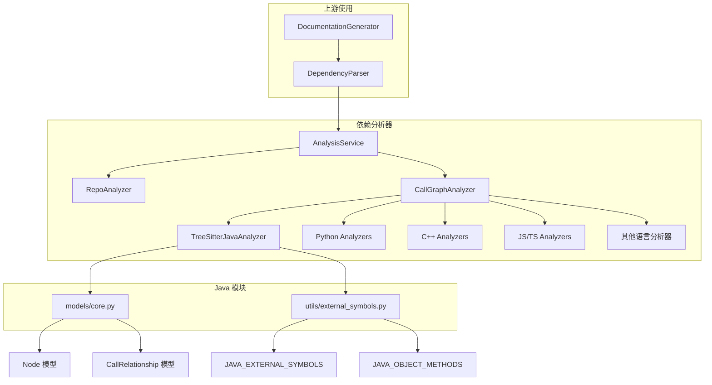
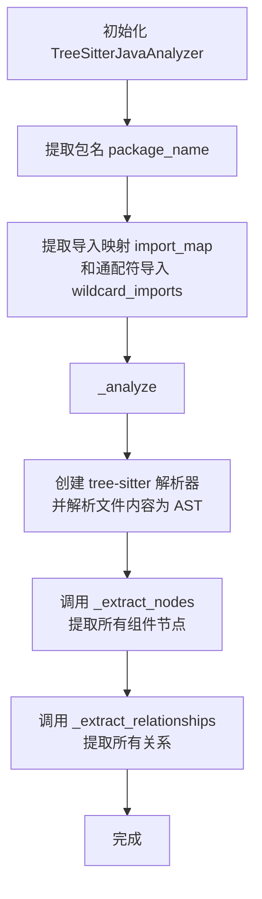
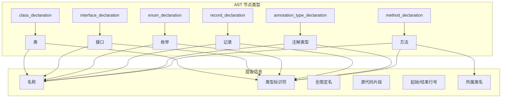
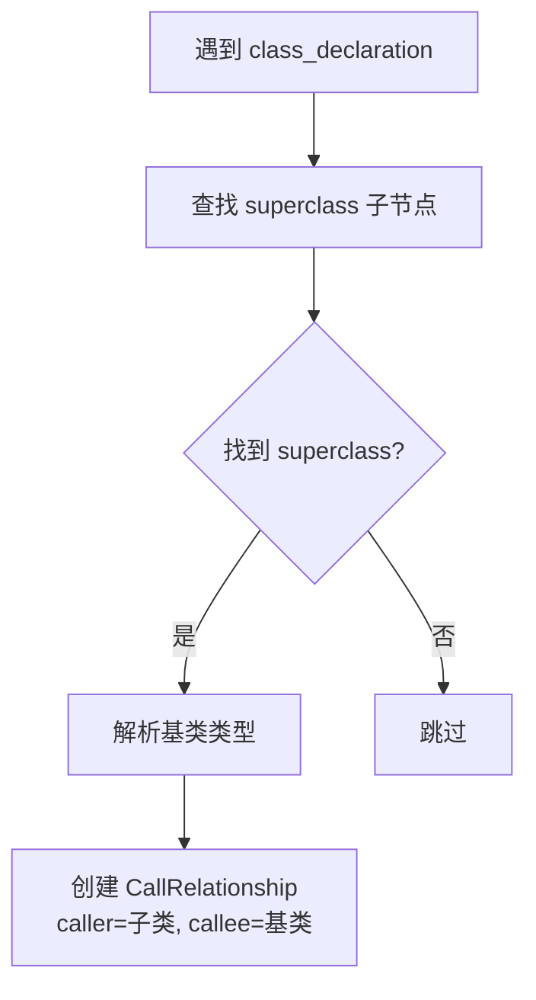
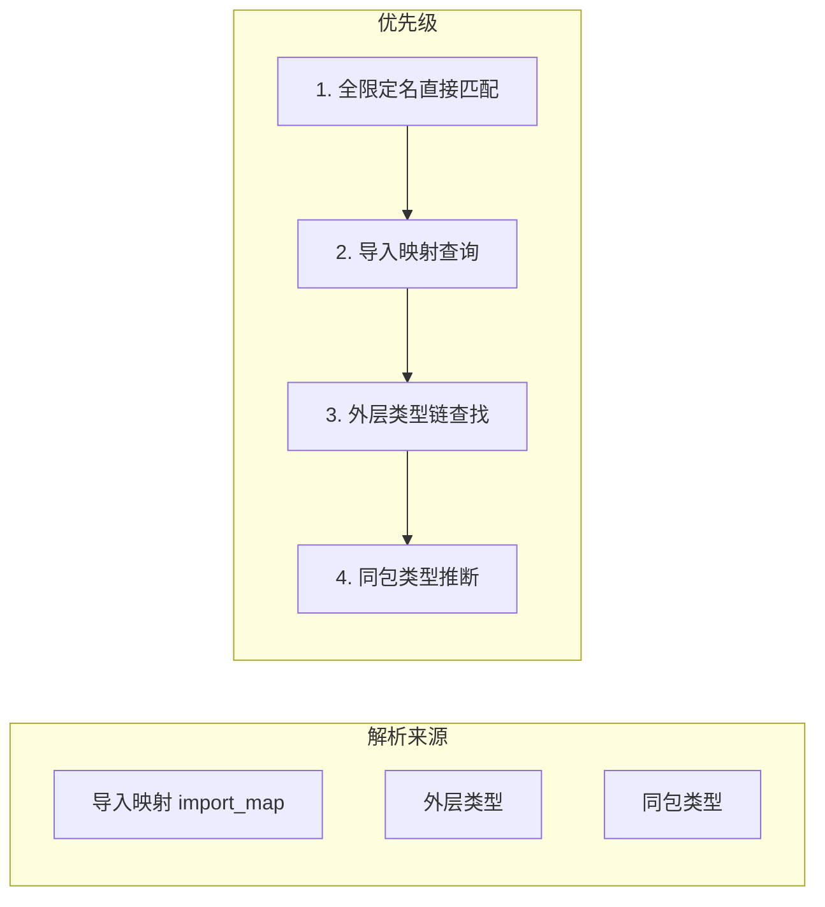
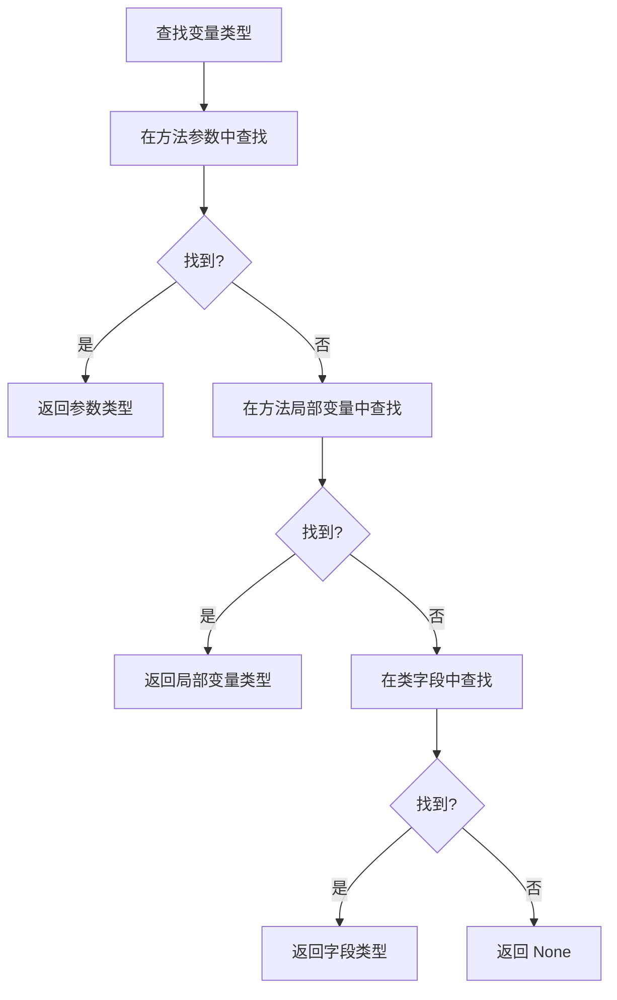

# Java 依赖分析模块

## 概述

Java 模块是 CodeWiki 依赖分析器的一个语言特定分析器，负责解析 Java 源代码文件并提取其中的组件（类、接口、枚举、记录、注解、方法）以及它们之间的调用关系和依赖关系。该模块基于 **tree-sitter** 解析器生成 Java 代码的抽象语法树（AST），并通过遍历 AST 来识别所有代码结构和关系。

### 核心功能

- **组件提取**：识别 Java 文件中的顶层类型声明和方法声明
- **关系分析**：检测继承、接口实现、字段类型使用、方法调用和对象创建
- **类型解析**：根据导入声明和包信息解析类型全限定名
- **外部符号过滤**：自动过滤 Java 运行时库（JDK）和第三方库的外部符号

---

## 架构概览

### 模块位置与依赖关系

Java 模块位于 `dependency_analyzer/analyzers/java.py`，是依赖分析器分析流水线的一部分：



### 分析流水线中的数据流

```mermaid
flowchart LR
    subgraph "输入"
        F1[Java 文件路径]
        F2[Java 文件内容]
        F3[仓库根路径]
    end
    
    subgraph "分析过程"
        P1[初始化解析器] --> P2[提取包名 & 导入映射]
        P2 --> P3[解析 AST]
        P3 --> P4[提取节点]
        P3 --> P5[提取关系]
    end
    
    subgraph "输出"
        O1[nodes: List[Node]]
        O2[call_relationships: List[CallRelationship]]
    end
    
    F1 --> P1
    F2 --> P1
    F3 --> P1
    P4 --> O1
    P5 --> O2
```

---

## 核心组件详解

### `TreeSitterJavaAnalyzer`

**文件**: `codewiki/src/be/dependency_analyzer/analyzers/java.py`

这是 Java 模块的核心类，负责单个 Java 文件的完整分析。其构造函数接收文件路径、文件内容和可选的仓库根路径，并在初始化时自动执行完整的分析和关系提取。

#### 初始化流程



#### 初始化参数

| 参数 | 类型 | 说明 |
|------|------|------|
| `file_path` | `str` | Java 源文件路径 |
| `content` | `str` | 文件内容字符串 |
| `repo_path` | `str` (可选) | 仓库根路径，用于解析相对路径 |

#### 主要属性

| 属性 | 类型 | 说明 |
|------|------|------|
| `nodes` | `List[Node]` | 从文件中提取的所有组件节点 |
| `call_relationships` | `List[CallRelationship]` | 提取的所有调用/依赖关系 |
| `package_name` | `str` | 从源码中提取的包名 |
| `import_map` | `dict[str, str]` | 显式导入的映射表（简单名 → 全限定名） |
| `wildcard_imports` | `list[str]` | 通配符导入的包列表 |

---

## 支持的分析功能

### 1. 组件节点提取 (`_extract_nodes`)

该方法遍历 AST 并识别以下 Java 构造：



对于方法，分析器会自动计算 `<ClassName>.<methodName>` 格式的显示名称，并记录其所属的容器类型。

### 2. 关系提取 (`_extract_relationships`)

该方法检测以下 5 种类型的关系：

| 关系类型 | 检测场景 | 示例 |
|----------|----------|------|
| **继承** (Inheritance) | 类扩展另一个类 | `class Dog extends Animal` |
| **接口实现** (Implementation) | 类/枚举/记录实现接口 | `class Dog implements Pet` |
| **字段类型使用** (Field Type Use) | 类中声明其他类型的字段 | `Animal pet;` |
| **方法调用** (Method Invocation) | 调用对象的方法 | `dog.bark()` |
| **对象创建** (Object Creation) | 实例化其他类 | `new Dog()` |

#### 继承关系分析流程



#### 方法调用关系分析流程

```mermaid
flowchart TD
    Start[遇到 method_invocation] --> FindIds[提取标识符]
    FindIds --> HasObj{是否有对象名?}
    
    HasObj -- 是, 且首字母大写 --> Static[视为静态方法调用]
    HasObj -- 是, 且首字母小写 --> Variable[查找变量类型]
    HasObj -- 否 --> Bare[裸调用, 查找当前类型]
    
    Static --> Resolve[解析目标类型]
    Variable --> ResolveType[通过变量声明推断类型]
    Bare --> Local[在本地作用域查找方法]
    
    Resolve --> Filter{是否外部符号?}
    ResolveType --> Filter
    Local --> Filter
    
    Filter -- 是 --> Skip[跳过, 不创建关系]
    Filter -- 否 --> Create[创建 CallRelationship]
```



### 3. 类型解析系统

Java 分析器实现了完整的类型解析机制，以将源码中的简单类型名解析为全限定名：

#### 解析优先级



- **`_resolve_java_type`**: 解析类型名称，按以下顺序尝试：
  1. 如果已包含 `.`，直接作为全限定名返回
  2. 在 `import_map` 中查找
  3. 在外层容器类型链中查找（处理内部类场景）
  4. 添加当前包名前缀

- **`_resolve_java_member`**: 解析成员（方法）调用，按以下顺序尝试：
  1. 如果指定了目标类型，构造 `<类型>.方法名` 尝试匹配
  2. 在外层容器类型链中查找
  3. 在静态导入（`import_map`）中查找

### 4. 变量类型推断

分析器通过 `_find_variable_type` 方法实现基本的变量类型推断：



### 5. 外部符号过滤

分析器使用 `_is_primitive_type` 和 `_skip_type` 方法过滤不需要跟踪的符号：

| 过滤类型 | 说明 |
|----------|------|
| **Java 基本类型** | `boolean`, `byte`, `char`, `double`, `float`, `int`, `long`, `short`, `void`, `var` |
| **JDK 运行时类型** | 通过 `is_external_symbol` 检查，包括 `java.*`, `javax.*`, `jdk.*`, `sun.*` 前缀和 `java.lang` 类型 |
| **类型参数** | 泛型类型参数如 `<K, V>` 中的 `K`, `V` |
| **java.lang.Object 方法** | `equals`, `hashCode`, `toString` 等继承方法（通过 `JAVA_OBJECT_METHODS`） |

---

## 数据模型

### Node

分析器提取的每个代码组件都会被建模为 `Node` 对象。对于 Java 文件，关键字段包括：

```python
class Node(BaseModel):
    id: str                    # 唯一标识符: "<相对路径>::<名称>"
    name: str                  # 组件名称
    component_type: str       # 组件类型: "class", "interface", "enum", "record", "annotation", "method", "abstract class"
    file_path: str            # 文件绝对路径
    relative_path: str        # 相对于仓库根目录的路径
    source_code: Optional[str]  # 源代码片段
    start_line: int           # 起始行号
    end_line: int             # 结束行号
    class_name: Optional[str]  # 对于方法，所属的类名
    display_name: Optional[str]  # 显示名称: "<类型> <名称>"
    language: Optional[str]    # "java"
    qualified_name: Optional[str]  # 全限定名: "com.example.MyClass"
```

### CallRelationship

表示组件之间的依赖关系：

```python
class CallRelationship(BaseModel):
    caller: str               # 调用方的组件 ID
    callee: str               # 被调用方的组件 ID
    call_line: Optional[int]  # 调用发生的行号
    is_resolved: bool         # 是否已解析为项目内的组件
```

---

## 与其他模块的关系

### 调用者：CallGraphAnalyzer

Java 分析器由 `CallGraphAnalyzer._analyze_java_file` 方法调用，是代码分析流水线的一部分：

1. `CallGraphAnalyzer.analyze_code_files` 接收从文件树中提取的代码文件列表
2. 对每个 Java 文件调用 `_analyze_java_file`，该方法导入 `analyze_java_file` 函数
3. `analyze_java_file` 创建 `TreeSitterJavaAnalyzer` 实例并返回提取的节点和关系
4. 这些节点和关系被合并到全局的 `functions` 字典和 `call_relationships` 列表中
5. 最后通过 `_resolve_call_relationships` 进行跨文件关系解析

### 下游：DependencyParser

`DependencyParser` 使用 `AnalysisService`，而 `AnalysisService` 内部使用 `CallGraphAnalyzer`。解析后的组件和关系最终被 `DocumentationGenerator` 用于生成文档。

### 兄弟模块

Java 模块与其他语言分析器（Python、JavaScript、TypeScript、C、C++、C#、Kotlin、PHP）共享相同的接口规范：
- 导出一个 `analyze_<language>_file` 函数
- 接收 `(file_path, content, repo_path)` 参数
- 返回 `(List[Node], List[CallRelationship])` 元组

---

## API 参考

### 主要导出函数

#### `analyze_java_file`

```python
def analyze_java_file(
    file_path: str, 
    content: str, 
    repo_path: str = None
) -> Tuple[List[Node], List[CallRelationship]]
```

分析单个 Java 文件，提取所有组件和关系。

**参数**:
- `file_path` (str): Java 源文件路径
- `content` (str): 文件内容
- `repo_path` (str, optional): 仓库根路径

**返回**:
- `Tuple[List[Node], List[CallRelationship]]`: (组件节点列表, 调用关系列表)

**异常**: 可能抛出任何 tree-sitter 解析异常

### TreeSitterJavaAnalyzer 关键方法

| 方法 | 可见性 | 说明 |
|------|--------|------|
| `__init__` | public | 初始化分析器，自动执行分析 |
| `_analyze` | private | 主分析入口，创建解析器并触发节点和关系提取 |
| `_extract_nodes` | private | 递归遍历 AST 提取组件节点 |
| `_extract_relationships` | private | 递归遍历 AST 提取调用关系 |
| `_resolve_java_type` | private | 将简单类型名解析为全限定名 |
| `_resolve_java_member` | private | 解析方法调用的目标 |
| `_find_variable_type` | private | 通过作用域分析推断变量类型 |
| `_is_primitive_type` | private | 判断是否为 Java 基本类型或 JDK 类型 |
| `_skip_type` | private | 判断是否应该跳过该类型（非项目组件） |
| `_get_module_path` | private | 将文件路径转换为模块路径 |
| `_get_component_id` | private | 生成组件的唯一标识符 |
| `_get_identifier_name` | private | 从 AST 节点获取标识符名称 |
| `_get_type_name` | private | 从类型节点获取类型名称 |
| `_find_containing_class` | private | 查找包含当前节点的最近类声明 |
| `_find_containing_method` | private | 查找包含当前节点的最近方法声明 |
| `_find_containing_type_names` | private | 获取当前节点所在的所有外层类型名称 |
| `_find_type_parameters` | private | 获取作用域内的泛型类型参数 |
| `_qualified_type_name` | private | 生成类型的全限定名 |
| `_qualified_member_name` | private | 生成成员的全限定名 |

---

## 使用示例

### 直接调用

```python
from codewiki.src.be.dependency_analyzer.analyzers.java import analyze_java_file

# 分析单个 Java 文件
nodes, relationships = analyze_java_file(
    "/path/to/project/src/com/example/MyClass.java",
    content=open("MyClass.java").read(),
    repo_path="/path/to/project"
)

# 打印提取的组件
for node in nodes:
    print(f"[{node.component_type}] {node.name} ({node.qualified_name})")
    print(f"  位置: {node.file_path}:{node.start_line}-{node.end_line}")

# 打印提取的关系
for rel in relationships:
    print(f"{rel.caller} -> {rel.callee} (行 {rel.call_line})")
```

### 通过依赖分析器使用

```python
from codewiki.src.be.dependency_analyzer.ast_parser import DependencyParser

parser = DependencyParser(
    repo_path="/path/to/project",
    include_patterns=["*.java"],
    exclude_patterns=["*Test*", "*build*"]
)

components = parser.parse_repository()
# components 包含所有 Java 组件及其依赖关系
```

---

## 设计决策与限制

### 设计决策

1. **基于 tree-sitter**：使用 tree-sitter 而非正则表达式进行代码分析，以获得准确的 AST 结构，支持嵌套类型和方法体分析
2. **一次扫描**：节点提取和关系提取在同一次 AST 遍历中完成，避免重复解析
3. **懒解析关系**：初始提取时所有关系标记为 `is_resolved=False`，由上游 `CallGraphAnalyzer` 在全局范围内解析
4. **保守的外部符号过滤**：明确过滤 JDK 类型以避免虚假的跨项目依赖，同时保留同一包内的未导入类型引用

### 已知限制

1. **不支持动态类加载**：无法解析通过反射、`Class.forName()` 或 SPI 加载的类型
2. **有限的泛型解析**：泛型类型参数被简单过滤，不支持完整的泛型擦除或类型推断
3. **方法重载不敏感**：不同参数列表的同名方法被视为同一个组件
4. **跨文件内部类**：内部类的全限定名解析依赖于同一文件中已解析的节点缓存
5. **Lambda 表达式**：Lambda 表达式不会被提取为独立的组件节点

---

## 相关文档

- [dependency_analyzer](dependency_analyzer.md) - 依赖分析器总体设计
- [后端模块](backend.md) - 后端服务架构
- [Python 分析器](python.md) - Python 语言分析器参考
- [C++ 分析器](cpp.md) - C++ 语言分析器参考
