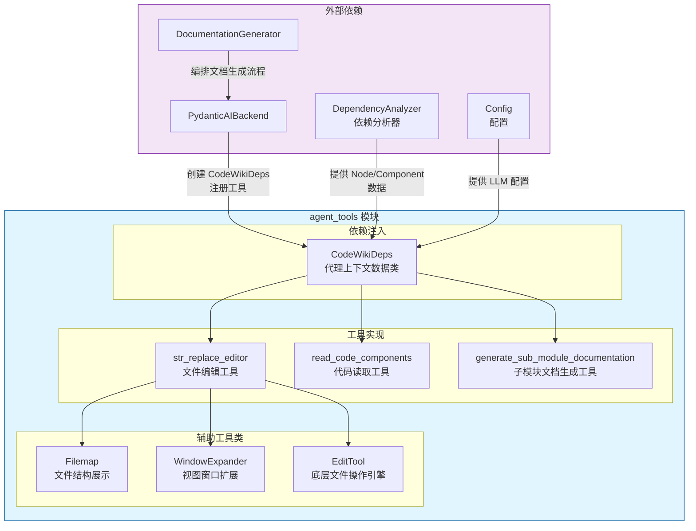
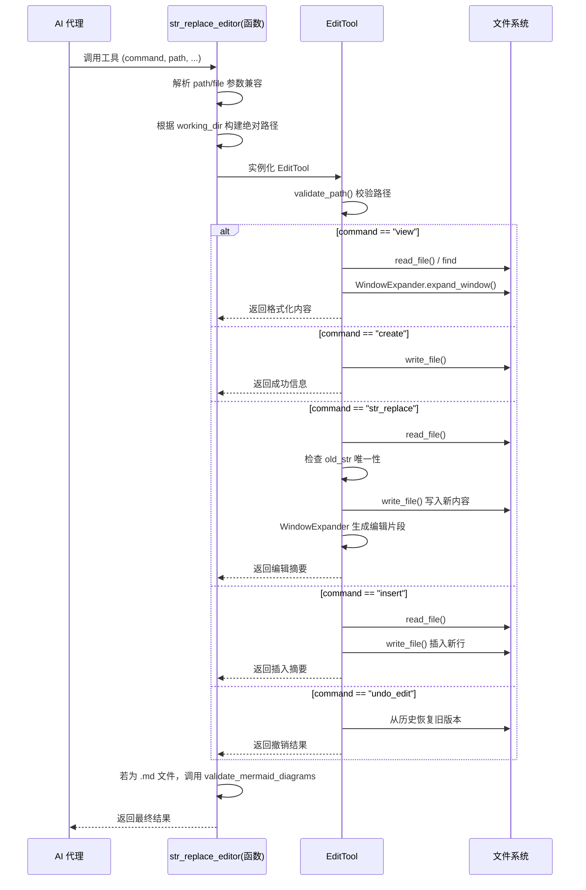
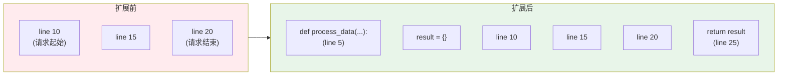
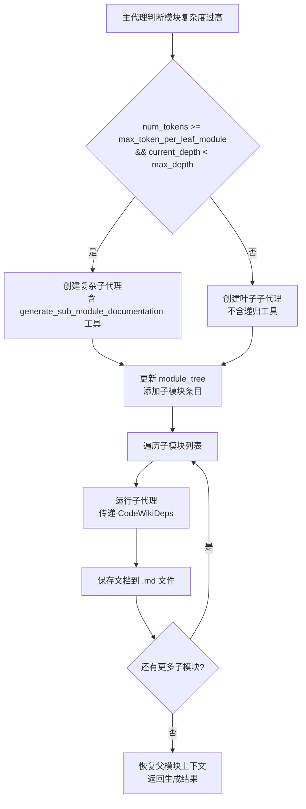
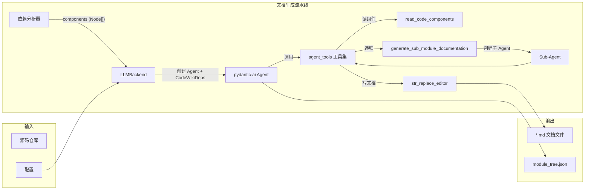
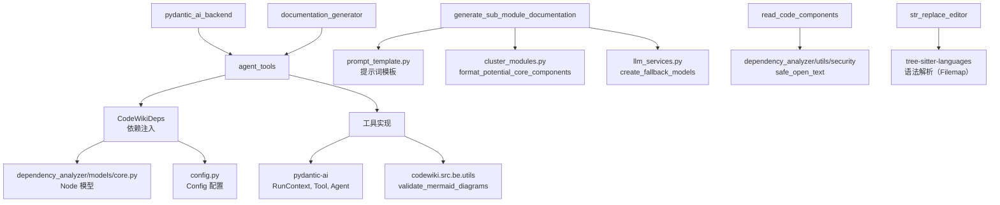

# Agent Tools 模块

## 概述

`agent_tools` 模块是 CodeWiki 系统中为 AI 代理（Agent）提供的工具集合，位于后端架构的核心层。该模块实现了 AI 代理在生成文档过程中所需的三大核心能力：

1. **文件系统操作** — 查看、创建、编辑文档和源码文件
2. **代码组件读取** — 根据组件 ID 读取仓库中特定代码片段的源码
3. **子模块文档生成** — 递归地将复杂模块的文档生成任务委派给子代理

模块与 [pydantic_ai_backend](pydantic_ai_backend.md) 和 [documentation_generator](documentation_generator.md) 紧密协作，为 `LLMBackend` 接口提供具体的工具实现。所有工具均封装为 `pydantic-ai` 的 `Tool` 对象，以 `RunContext[CodeWikiDeps]` 作为依赖注入上下文。

---

## 架构与组件关系



### 核心组件一览

| 组件 | 文件 | 类型 | 职责 |
|------|------|------|------|
| `CodeWikiDeps` | `deps.py` | DataClass | 代理上下文的依赖注入容器 |
| `EditTool` | `str_replace_editor.py` | Class | 底层文件编辑引擎（核心逻辑） |
| `Filemap` | `str_replace_editor.py` | Class | tree-sitter 驱动的文件结构展示 |
| `WindowExpander` | `str_replace_editor.py` | Class | 智能视图窗口扩展 |
| `str_replace_editor` (函数) | `str_replace_editor.py` | Function | `pydantic-ai` 工具接口函数 |
| `read_code_components` | `read_code_components.py` | Function | 组件代码读取工具 |
| `generate_sub_module_documentation` | `generate_sub_module_documentations.py` | Function | 子模块文档递归生成工具 |

---

## 组件详细说明

### 1. CodeWikiDeps — 依赖注入上下文

**文件**: `codewiki/src/be/agent_tools/deps.py`

`CodeWikiDeps` 是一个数据类，充当 AI 代理运行时的依赖注入容器。在 [PydanticAIBackend](pydantic_ai_backend.md) 的 `run_module_agent` 方法中创建实例，然后传递给 `pydantic-ai` 的 `Agent.run()` 作为上下文。

```python
@dataclass
class CodeWikiDeps:
    absolute_docs_path: str      # 文档输出目录的绝对路径
    absolute_repo_path: str      # 源码仓库的绝对路径
    registry: dict               # 全局注册表（用于跨调用持久化状态）
    components: dict[str, Node]  # 组件 ID → Node 的映射（来自依赖分析器）
    path_to_current_module: list[str]  # 当前模块在模块树中的路径
    current_module_name: str     # 当前正在处理的模块名称
    module_tree: dict[str, any]  # 当前模块树结构（由聚类阶段生成）
    max_depth: int               # 最大递归深度
    current_depth: int           # 当前递归深度
    config: Config               # LLM 配置和全局设置
    custom_instructions: str     # 用户自定义指令（可选）
```

**关键依赖**:
- `codewiki.src.be.dependency_analyzer.models.core.Node` — 组件节点模型
- `codewiki.src.config.Config` — 全局配置

---

### 2. str_replace_editor — 文件编辑工具

**文件**: `codewiki/src/be/agent_tools/str_replace_editor.py`

这是模块中最核心的工具，源自 [SWE-agent](https://github.com/SWE-agent/SWE-agent) 的 `str_replace_editor`，经过适配以支持 CodeWiki 的双目录工作模式（`repo` 与 `docs`）。

#### 架构设计



#### 支持的命令

| 命令 | 描述 | 必要参数 |
|------|------|----------|
| `view` | 查看文件或目录内容 | `path`, `view_range`(可选) |
| `create` | 创建新文件 | `path`, `file_text` |
| `str_replace` | 替换文件中的字符串 | `path`, `old_str`, `new_str`(可选) |
| `insert` | 在指定行插入内容 | `path`, `insert_line`, `new_str` |
| `undo_edit` | 撤销最近一次编辑 | `path` |

#### 工作目录模式

工具支持两种工作目录模式，通过 `working_dir` 参数控制：

- **`repo`** — 操作源码仓库文件，**仅允许 `view` 命令**（只读保护）
- **`docs`** — 操作文档输出目录，支持所有命令（读写）

#### 关键辅助类

##### EditTool

底层文件操作引擎，封装了所有命令的具体实现：

- **状态持久化**: 通过 `registry` 中的 `file_history` 跨调用维护文件编辑历史
- **智能读取**: 支持 `utf-8`、`latin-1` 等多编码自动检测
- **路径兼容**: 同时支持 `path` 和 `file` 参数（适配不同模型的行为差异）
- **自动换行符处理**: 使用 `expandtabs()` 统一处理制表符

##### Filemap

基于 tree-sitter 的 Python 文件结构化展示工具。当文件过大时，自动折叠函数/类的方法体，生成侧边栏式的大纲视图：

```python
# 对函数体超过 5 行的定义自动折叠
elide_line_ranges = [
    (node.start_point[0], node.end_point[0])
    for node, _ in query.captures(tree.root_node)
    if node.end_point[0] - node.start_point[0] >= 5
]
```

##### WindowExpander

智能窗口扩展工具，当 agent 请求查看特定行范围时，自动向上/下扩展到完整的函数定义、类定义或空行分隔的代码块，提高上下文连贯性：



扩展策略：
- 空行 → 1 分
- 连续空行 → 2 分
- Python 函数/类定义 (`def`, `class`, `@`) → 3 分（最高优先级）
- 文件首尾行 → 3 分

#### Mermaid 验证

编辑 `.md` 文件后，工具会自动调用 `validate_mermaid_diagrams`（来自 `codewiki.src.be.utils`）验证文件中所有 Mermaid 图表的语法正确性，确保文档中的图表始终有效。

---

### 3. read_code_components — 代码组件读取工具

**文件**: `codewiki/src/be/agent_tools/read_code_components.py`

提供按组件 ID 列表批量读取源代码的能力。组件 ID 格式为 `文件路径::组件名称`，例如 `"auth/handler.py::AuthHandler"`。

**工作流程**:

1. 在 `ctx.deps.components` 中查找每个组件 ID
2. 如果 `Node.source_code` 可用则直接返回
3. 如果源码已被释放（内存优化），从磁盘按 `(file_path, start_line, end_line)` 读取
4. 返回格式化的源码片段

**安全机制**: 通过 `safe_open_text`（来自 `dependency_analyzer.utils.security`）进行路径穿越防护。

---

### 4. generate_sub_module_documentation — 子模块文档生成工具

**文件**: `codewiki/src/be/agent_tools/generate_sub_module_documentations.py`

递归文档生成的枢纽工具。当主代理判定当前模块过于复杂时，调用此工具将子模块委派给子代理处理。

**核心逻辑**:



**递归控制**:
- `max_depth` — 防止无限递归，超出深度上限的模块自动降级为叶子模块
- `max_token_per_leaf_module` — 控制叶子模块的 token 预算，超出则进一步分解
- `path_to_current_module` — 维护模块树路径栈，确保正确的层级关系

---

## 数据流



---

## 与其他模块的依赖关系



---

## 配置说明

`agent_tools` 模块的行为通过 `Config` 中的以下配置项控制：

| 配置项 | 用途 | 影响组件 |
|--------|------|----------|
| `max_depth` | 模块递归的最大深度 | `CodeWikiDeps`, `generate_sub_module_documentation` |
| `max_token_per_leaf_module` | 叶子模块的 token 预算阈值 | `generate_sub_module_documentation` |
| `main_model` | 主 LLM 模型标识 | `CodeWikiDeps.config` |
| `repo_path` | 源码仓库路径 | `CodeWikiDeps.absolute_repo_path` |
| `docs_dir` | 文档输出目录 | `CodeWikiDeps.absolute_docs_path` |

---

## 设计要点与最佳实践

1. **双目录隔离**: 严格区分 `repo`（只读）和 `docs`（读写）工作目录，防止 AI 代理意外修改源码
2. **递归安全**: 通过 `max_depth` 和 `current_depth` 机制防止无限递归
3. **内存优化**: 组件源码在依赖分析后从内存中释放，按需从磁盘读取
4. **模型兼容**: `path`/`file` 参数双通道设计适配不同 LLM 的工具调用习惯
5. **文档质量保障**: 自动的 Mermaid 图表语法验证确保文档中图表始终有效
6. **编辑可追溯**: `file_history` 维护文件编辑历史，支持撤销操作

---

## 相关文档

- [pydantic_ai_backend](pydantic_ai_backend.md) — 使用 agent_tools 的后端实现
- [documentation_generator](documentation_generator.md) — 文档生成编排器
- [dependency_analyzer](dependency_analyzer.md) — 依赖分析器，提供组件数据
- [config](config.md) — 全局配置模块
- [llm_services](llm_services.md) — LLM 服务与模型管理
