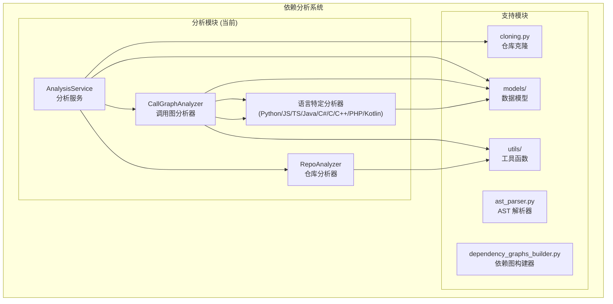
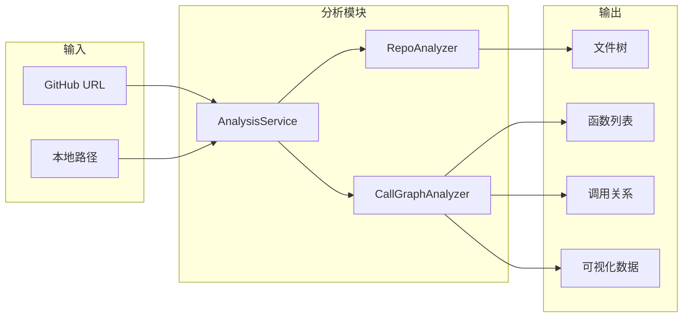
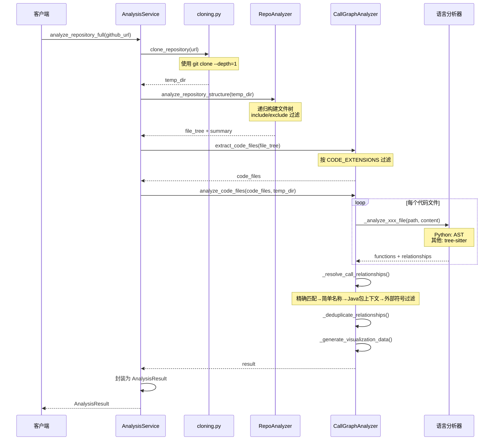
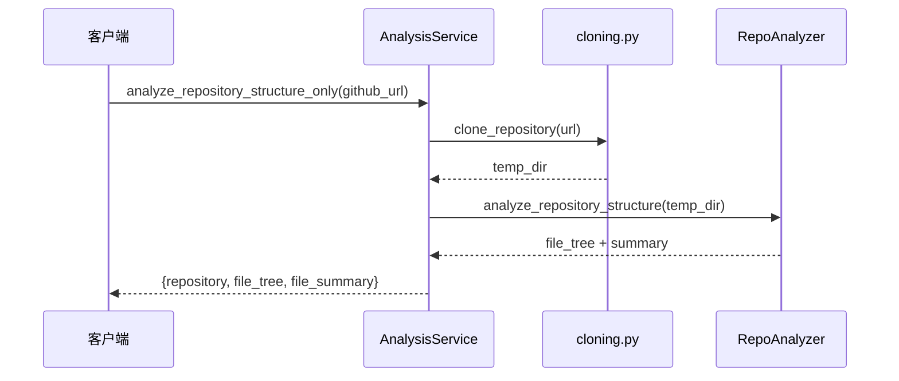
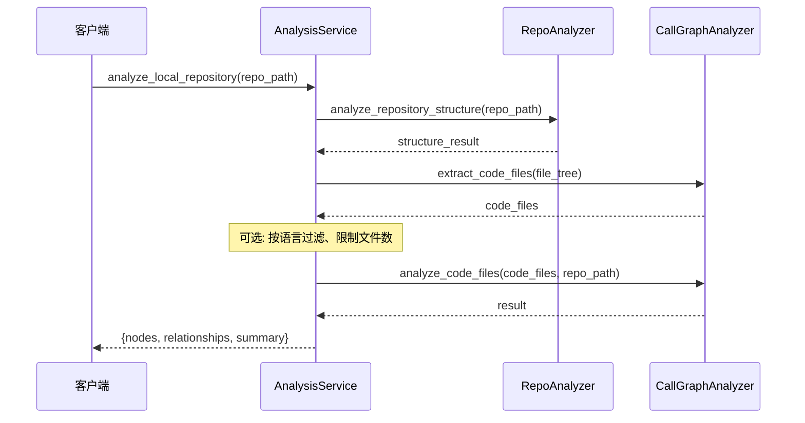
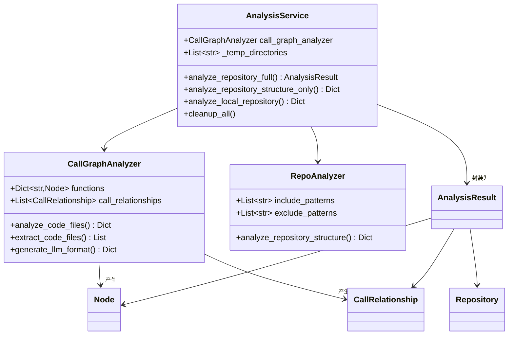

# 分析模块 (Analysis) 文档

## 概述

**分析模块**是 `dependency_analyzer` 依赖分析系统的核心编排层，负责协调从仓库克隆、文件结构分析到多语言调用图生成的完整工作流。该模块位于 `codewiki/src/be/dependency_analyzer/analysis/` 目录下，包含三个核心组件：

- **[AnalysisService](./analysis_service.md)**：分析服务，提供完整和轻量级分析 API
- **[CallGraphAnalyzer](./call_graph_analyzer.md)**：调用图分析器，协调多语言 AST 解析和关系构建
- **[RepoAnalyzer](./repo_analyzer.md)**：仓库分析器，扫描仓库文件结构并生成文件树

## 架构概览

分析模块在依赖分析系统中的位置如下：

## 核心功能

| 功能 | 组件 | 描述 |
|------|------|------|
| **仓库结构分析** | RepoAnalyzer | 递归扫描目录，按模式过滤，生成文件树和统计 |
| **多语言调用图** | CallGraphAnalyzer | 支持 9 种语言的 AST 解析，跨语言函数调用关系提取 |
| **完整分析工作流** | AnalysisService | 克隆 → 结构分析 → 调用图生成 → 清理，一站式 API |
| **轻量级分析** | AnalysisService | 仅结构分析，不生成调用图，适用于快速预览 |
| **本地分析** | AnalysisService | 直接分析本地文件夹，无需克隆 |

## 组件关系与数据流

## 工作流详解

### 完整分析流程（`analyze_repository_full`）

### 结构分析流程（`analyze_repository_structure_only`）

### 本地分析流程（`analyze_local_repository`）

## 核心模型的数据流

## 子模块详细文档

| 文档 | 组件 | 核心类/函数 | 文件 |
|------|------|-------------|------|
| [AnalysisService](./analysis_service.md) | 分析服务 | `AnalysisService` | `analysis_service.py` |
| [CallGraphAnalyzer](./call_graph_analyzer.md) | 调用图分析器 | `CallGraphAnalyzer`, `TimeoutError` | `call_graph_analyzer.py` |
| [RepoAnalyzer](./repo_analyzer.md) | 仓库分析器 | `RepoAnalyzer` | `repo_analyzer.py` |

## 相关模块文档

| 模块 | 文档 | 关系 |
|------|------|------|
| [Models](./models.md) | [核心模型](./models_core.md) · [分析模型](./models_analysis.md) | 分析模块消费 Node、CallRelationship、AnalysisResult |
| [Analyzers](./analyzers.md) | 各语言分析器 | CallGraphAnalyzer 调用各语言分析器解析代码 |
| [Cloning](./cloning.md) | 仓库克隆工具 | AnalysisService 使用 clone_repository 克隆 GitHub 仓库 |
| [Utils](./utils.md) | 工具函数 | 路径安全、模式匹配、外部符号识别 |
| [AST Parser](./ast_parser.md) | AST 解析 | 将分析结果转换为组件依赖图 |
| [Dependency Graph Builder](./dependency_graphs_builder.md) | 依赖图构建 | 消费分析结果构建依赖图 |
