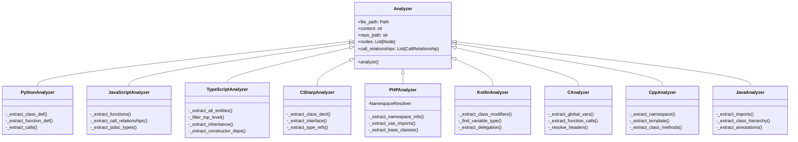

## Purpose

The `analyzers` module is the core language-specific analysis layer of the CodeWiki dependency analyzer. It provides a set of static analyzers that parse source code files in various programming languages, extract high-level code components (classes, functions, interfaces, etc.), and capture the relationships between them (function calls, inheritance, type references, dependency injection). These extracted data structures (`Node` and `CallRelationship`) are then consumed by the upstream analysis pipeline (`CallGraphAnalyzer`, `DependencyParser`, `DependencyGraphBuilder`) to build complete inter‑file dependency graphs and enable visualization and documentation generation.

## Architecture

The analyzers follow a uniform pattern: each is a class (or module‑level function) that takes a source file, its content, and an optional repository root path, and returns a tuple of `List[Node]` and `List[CallRelationship]`. They are invoked by `CallGraphAnalyzer`, which routes files to the appropriate analyzer based on file extension and language detection.

```mermaid
graph TD
    subgraph "CallGraphAnalyzer"
        direction LR
        A[Analyze code files] --> B{File extension}
        B -->|.py| C[Python analyzer]
        B -->|.js/.jsx| D[JavaScript analyzer]
        B -->|.ts/.tsx| E[TypeScript analyzer]
        B -->|.java| F[Java analyzer]
        B -->|.cs| G[C# analyzer]
        B -->|.c/.h| H[C analyzer]
        B -->|.cpp/.hpp| I[C++ analyzer]
        B -->|.kt/.kts| J[Kotlin analyzer]
        B -->|.php| K[PHP analyzer]
    end

    subgraph "Common Output"
        L[(List[Node])]
        M[(List[CallRelationship])]
    end

    C --> L
    D --> L
    E --> L
    F --> L
    G --> L
    H --> L
    I --> L
    J --> L
    K --> L

    C --> M
    D --> M
    E --> M
    F --> M
    G --> M
    H --> M
    I --> M
    J --> M
    K --> M
```

Each analyzer internally performs a three‑pass approach:

1. **Namespace / environment resolution** (where applicable, e.g., PHP `use` statements, TypeScript ambient declarations)
2. **Component extraction** – traverses the AST to identify top‑level declarations and creates `Node` objects
3. **Relationship extraction** – identifies calls, inheritance, type references, and constructor injection, creating `CallRelationship` objects

A unified method (`_extract_all_entities` → `_filter_top_level_declarations` → `_extract_all_relationships`) is often used, ensuring that only top‑level declarations become nodes while still recording internal relationships.



## Core Components Documentation

The analyzers depend on and produce the following core data models, defined in the `dependency_analyzer` module:

- **`Node`** – Represents a code component (function, class, interface, etc.). Contains metadata like identifier, location in source, parameters, base classes, docstring, and source snippet.
- **`CallRelationship`** – Represents a directed relationship between two components (call, inheritance, type reference). Tracks whether the target has been resolved to a concrete component ID.

These models are consumed by:

- **`CallGraphAnalyzer`** – Orchestrates file routing, invokes analyzers, merges results, and resolves cross‑file relationships.
- **`DependencyParser`** – Builds structured components from the merged analysis results.
- **`DependencyGraphBuilder`** – Converts the components and relationships into visualizable graph data (e.g., for Cytoscape.js).

For detailed usage and design of each language analyzer, refer to the individual component documentation:

- [Python Analyzer](python.md)
- [JavaScript Analyzer](javascript.md)
- [TypeScript Analyzer](typescript.md)
- [C# Analyzer](csharp.md)
- [PHP Analyzer](php.md)
- [Kotlin Analyzer](kotlin.md)
- [C Analyzer](c.md)
- [C++ Analyzer](cpp.md)
- [Java Analyzer](java.md)

The common data models and the overall dependency analysis pipeline are described in:

- [Dependency Analyzer Overview](dependency_analyzer.md)
- [Core Models](models_core.md)
- [CallGraphAnalyzer](call_graph_analyzer.md)
- [DependencyParser](ast_parser.md)