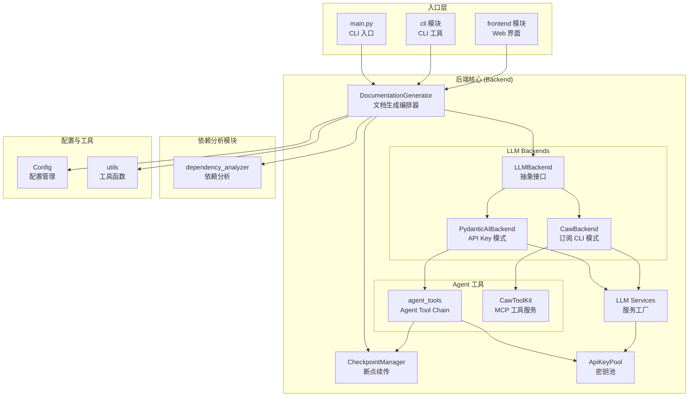
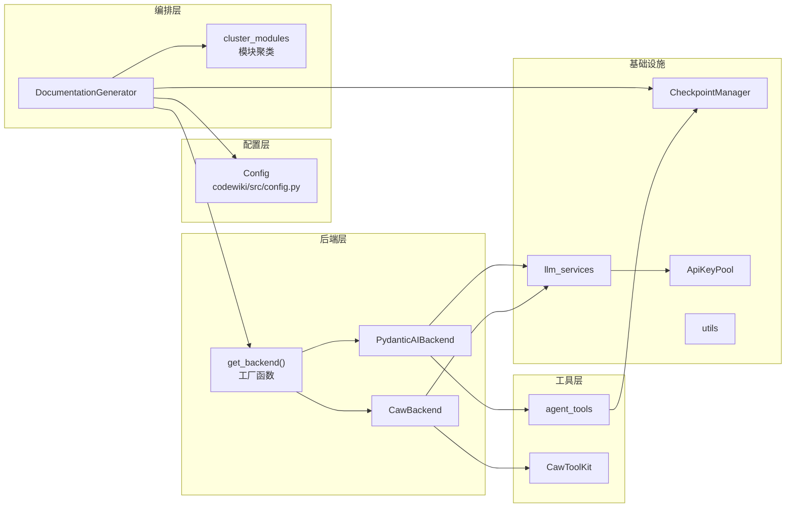
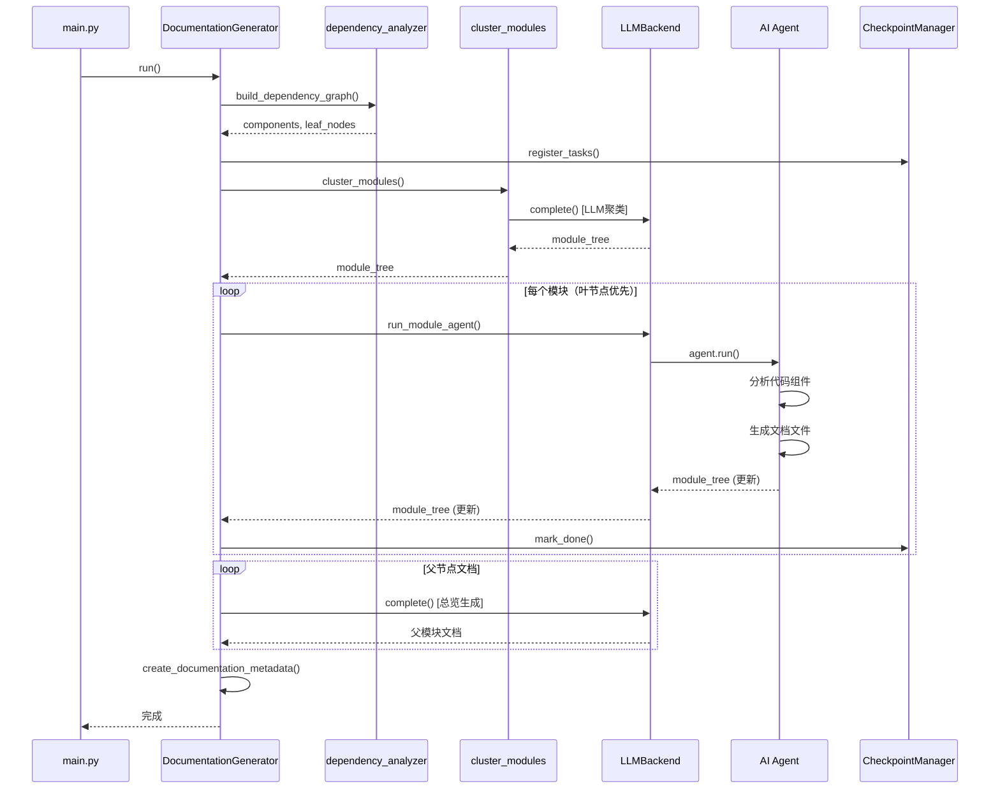

# CodeWiki 后端模块 (Backend)

## 概述

CodeWiki 后端模块是文档生成系统的核心引擎，负责协调从代码分析到文档输出的完整流程。它提供了一系列可插拔的 LLM 后端抽象、智能化的文档生成 Agent 工具链、断点续传机制以及 API 密钥池管理等功能。

### 核心功能

| 功能 | 描述 |
|------|------|
| **多后端 LLM 支持** | 支持 OpenAI 兼容 API、Anthropic Claude、AWS Bedrock、Azure OpenAI 等，以及基于订阅的 Claude Code/Codex CLI |
| **Agent 驱动文档生成** | 使用 AI Agent 自动分析代码组件并生成结构化文档，支持递归分解复杂模块 |
| **断点续传** | 基于检查点机制，支持中断后从上次进度恢复文档生成 |
| **API 密钥池** | 多密钥轮询、并发控制、自动错误冷却 |
| **Mermaid 图表验证** | 自动验证生成的 Mermaid 图表语法正确性 |
| **模块聚类** | 智能将代码组件聚类为模块层次结构 |

### 架构总览

---

## 模块架构

---

## 子模块说明

### 1. [LLM 后端抽象](llm_backends.md) — `backend.py`, `pydantic_ai_backend.py`, `caw_backend.py`

提供统一的 LLM 调用接口，支持两种模式：

- **PydanticAIBackend**（API Key 模式）：通过 pydantic-ai + litellm 包装 OpenAI 兼容/Anthropic/Bedrock/Azure OpenAI 接口，支持多密钥池并发
- **CawBackend**（订阅 CLI 模式）：通过 `caw` 库路由到 Claude Code / Codex CLI，使用用户 OAuth 订阅

核心工厂函数 `get_backend()` 根据配置的 `provider` 自动选择合适的后端。

### 2. [Agent 工具链](agent_tools.md) — `agent_tools/`

为 AI Agent 提供的文件系统操作工具集：

- **CodeWikiDeps**: Agent 运行时的依赖注入上下文
- **str_replace_editor**: 文件查看/创建/编辑/撤销工具，支持 Mermaid 图表语法自动验证
- **read_code_components**: 按组件 ID 读取源代码
- **generate_sub_module_documentation**: 递归将子模块文档生成委托给子 Agent

### 3. [Caw MCP 工具服务](caw_toolkit.md) — `caw_toolkit.py`

为 CawBackend（Claude Code/Codex CLI 模式）提供的 MCP 工具服务器，将 CodeWiki 的三个核心工具（read_code_components、str_replace_editor、generate_sub_module_documentation）以 MCP 协议暴露给 caw Agent。

### 4. [断点续传管理](checkpoint.md) — `checkpoint.py`

基于磁盘的检查点系统，支持：
- 任务状态追踪（PENDING → RUNNING → DONE / FAILED）
- LLM 响应缓存（避免重复 API 调用）
- 多阶段流水线（分析 → 聚类 → 依赖图 → 分解 → 叶节点文档 → 父节点文档 → 总览）

### 5. [API 密钥池](key_pool.md) — `key_pool.py`

多 API 密钥轮询管理：
- 轮询调度算法
- 并发量控制（信号量）
- 自动错误冷却与指数退避
- 认证错误区分处理（401/403 vs 其他错误）

### 6. [LLM 服务工厂](llm_services.md) — `llm_services.py`

LLM 客户端创建和调用封装：
- OpenAI 兼容 API、Azure OpenAI、Bedrock、Anthropic 多 Provider 支持
- 自动重试机制（可配置重试次数与间隔）
- 代理环境变量清理（ProxyDisabledContext）
- `max_completion_tokens` vs `max_tokens` 自动适配

### 7. [文档生成编排器](documentation_generator.md) — `documentation_generator.py`

整个文档生成流程的编排核心：
- 拓扑排序处理顺序（叶节点优先）
- 父模块文档基于子模块文档生成
- 仓库总览文档自动生成
- 文档元数据记录

### 8. [工具函数](utils.md) — `utils.py`

辅助功能：
- Mermaid 图表语法验证（支持 PythonMonkey 和 mermaid-py 双引擎）
- Token 计数（基于 tiktoken）
- 模块复杂度判断

### 9. [模块聚类](cluster_modules.md) — `cluster_modules.py`

智能聚类引擎：
- 基于 LLM 的组件分组
- 递归层次聚类
- Token 预算检查与估算

### 10. [提示模板](prompt_template.md) — `prompt_template.py`

Agent 系统提示词和用户提示词模板：
- SYSTEM_PROMPT / LEAF_SYSTEM_PROMPT：Agent 角色与工作流程定义
- REPO_OVERVIEW_PROMPT / MODULE_OVERVIEW_PROMPT：总览文档生成模板
- CLUSTER_REPO_PROMPT / CLUSTER_MODULE_PROMPT：聚类提示模板

---

## 依赖关系

```mermaid
flowchart TD
    subgraph "外部依赖"
        PAI["pydantic-ai"]
        LIT["litellm"]
        CAW_LIB["caw"]
        MCP["FastMCP / MCP"]
        TIK["tiktoken"]
    end

    subgraph "内部依赖"
        DA["dependency_analyzer 模块"]
        CFG["config 模块"]
        UTILS["utils 模块"]
    end

    subgraph "后端模块文件"
        BE["backend.py"]
        PAI_BE["pydantic_ai_backend.py"]
        CAW_BE["caw_backend.py"]
        CT["caw_toolkit.py"]
        AT_DEPS["agent_tools/deps.py"]
        AT_EDIT["agent_tools/str_replace_editor.py"]
        AT_READ["agent_tools/read_code_components.py"]
        AT_SUB["agent_tools/generate_sub_module_documentations.py"]
        CHK["checkpoint.py"]
        KP["key_pool.py"]
        LS["llm_services.py"]
        DG["documentation_generator.py"]
        CM["cluster_modules.py"]
        PT["prompt_template.py"]
        UT["utils.py"]
    end

    BE --> PAI
    BE --> CAW_LIB
    PAI_BE --> PAI
    PAI_BE --> LS
    CAW_BE --> CAW_LIB
    CAW_BE --> CT
    CT --> MCP
    LS --> LIT
    LS --> PAI
    DG --> DA
    DG --> CFG
    AT_EDIT --> CT
    AT_SUB --> PAI
    UT --> TIK
```

---

## 数据流

---

## 配置参考

主要配置项（定义于 `codewiki/src/config.py` 的 `Config` 类）：

| 配置项 | 默认值 | 说明 |
|--------|--------|------|
| `repo_path` | — | 目标仓库路径 |
| `provider` | `"openai-compatible"` | LLM 提供者类型 |
| `main_model` | `"claude-sonnet-4"` | 主模型名称 |
| `cluster_model` | `main_model` | 聚类模型名称 |
| `max_depth` | `2` | 模块递归分解最大深度 |
| `max_tokens` | `32768` | LLM 响应最大 Token 数 |
| `max_token_per_module` | `36369` | 模块聚类 Token 阈值 |
| `max_token_per_leaf_module` | `16000` | 叶模块子代理 Token 阈值 |
| `api_keys` | `""` | 逗号分隔的多 API 密钥 |
| `concurrency` | `0` | 并发数（0=自动） |
| `cache_dir` | `".codewiki_cache"` | 缓存目录 |
| `resume` | `True` | 是否启用断点续传 |
| `llm_timeout` | `1200` | LLM 调用超时（秒） |

---

## 与其他模块的关系

| 模块 | 关系 | 说明 |
|------|------|------|
| [dependency_analyzer](../dependency_analyzer/dependency_analyzer.md) | 依赖 | 提供代码依赖分析结果 |
| [cli](../cli/cli.md) | 调用 | CLI 工具调用后端接口 |
| [frontend](../frontend/frontend.md) | 调用 | Web 界面调用后端接口 |
| [config](../config/config.md) | 依赖 | 全局配置管理 |
| [utils](../utils/utils.md) | 依赖 | 文件管理工具 |
