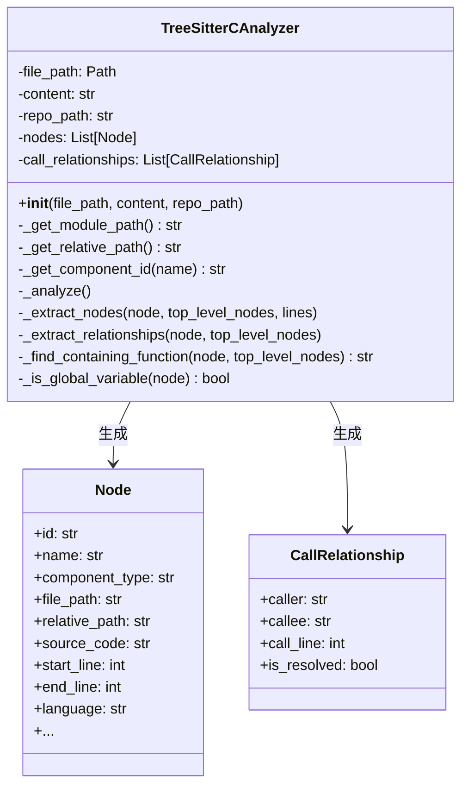
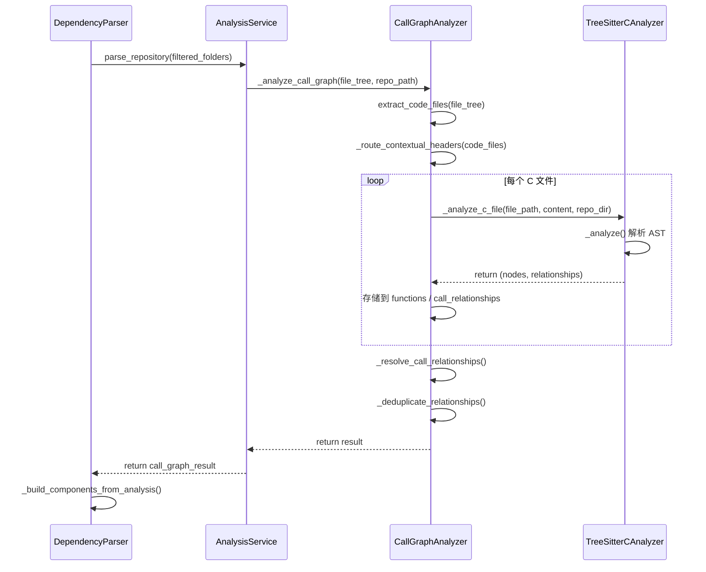

# C 语言分析器模块 (c)

## 概述

C 语言分析器模块提供了对 C 语言源代码的静态分析能力，基于 **tree-sitter** 解析库实现。该模块能够从 C 代码中提取**函数定义**、**结构体定义**和**全局变量**等代码组件，并分析**函数调用关系**以及**函数与全局变量之间的使用关系**，为上层依赖图构建和调用图分析提供基础数据。

该模块是 [dependency_analyzer](dependency_analyzer.md) 项目的多语言分析器之一，与 C++、Java、Python、JavaScript 等其他语言的分析器共同构成完整的跨语言依赖分析体系。

---

## 架构位置

```
dependency_analyzer/
├── analyzers/
│   ├── c/                          ← 当前模块
│   │   └── c.py                    TreeSitterCAnalyzer, analyze_c_file()
│   ├── cpp/
│   ├── csharp/
│   ├── java/
│   ├── javascript/
│   ├── kotlin/
│   ├── php/
│   ├── python/
│   └── typescript/
├── analysis/
│   ├── analysis_service.py         AnalysisService（编排分析流程）
│   ├── call_graph_analyzer.py      CallGraphAnalyzer（调用图分析器）
│   └── repo_analyzer.py            RepoAnalyzer（仓库结构分析）
├── models/
│   ├── core.py                     Node, CallRelationship, Repository
│   └── analysis.py                 AnalysisResult, NodeSelection
├── ast_parser.py                   DependencyParser（高层入口）
└── dependency_graphs_builder.py    DependencyGraphBuilder
```

---

## 核心组件

### 1. `TreeSitterCAnalyzer` 类

该类是 C 语言分析的核心实现，使用 tree-sitter 的 C 语言文法解析源代码，并提取代码结构信息。

#### 类图



#### 构造函数

```python
def __init__(self, file_path: str, content: str, repo_path: str = None):
```

| 参数 | 类型 | 说明 |
|------|------|------|
| `file_path` | `str` | 待分析的 C 文件路径 |
| `content` | `str` | 文件内容字符串 |
| `repo_path` | `str` | 仓库根目录路径（可选），用于生成相对路径 |

构造时自动调用 `_analyze()` 方法完成解析，解析结果存储于 `nodes` 和 `call_relationships` 属性中。

#### 主要方法

| 方法 | 作用 |
|------|------|
| `_analyze()` | 主解析流程：初始化 tree-sitter 解析器，解析文件内容，调用节点提取和关系提取 |
| `_extract_nodes(node, top_level_nodes, lines)` | 递归遍历 AST，识别**函数定义**、**结构体定义**和**全局变量** |
| `_extract_relationships(node, top_level_nodes)` | 递归遍历 AST，提取函数调用关系和函数对全局变量的使用关系 |
| `_find_containing_function(node, top_level_nodes)` | 从给定节点向上查找所属的包含函数 |
| `_is_global_variable(node)` | 判断声明节点是否为全局变量（不在任何函数定义内） |
| `_get_module_path()` | 计算文件对应的模块路径（用于 Python 模块命名风格） |
| `_get_relative_path()` | 计算文件相对于仓库根目录的路径 |
| `_get_component_id(name)` | 生成组件的唯一标识符，格式为 `{相对路径}::{名称}` |

### 2. `analyze_c_file()` 函数

```python
def analyze_c_file(file_path: str, content: str, repo_path: str = None) -> Tuple[List[Node], List[CallRelationship]]:
```

该函数是 `TreeSitterCAnalyzer` 的便捷封装，创建分析器实例并返回解析结果。

| 参数 | 类型 | 说明 |
|------|------|------|
| `file_path` | `str` | 文件路径 |
| `content` | `str` | 文件内容 |
| `repo_path` | `str` | 仓库根路径（可选） |

| 返回值 | 类型 | 说明 |
|--------|------|------|
| `nodes` | `List[Node]` | 提取的代码组件列表（函数、结构体） |
| `call_relationships` | `List[CallRelationship]` | 提取的调用关系列表 |

---

## AST 解析规则

### 节点提取（`_extract_nodes`）

Tree-sitter 解析 C 语言 AST 后，模块识别以下几种顶级结构：

| Tree-sitter 节点类型 | 识别的组件类型 | 说明 |
|----------------------|---------------|------|
| `function_definition` | `"function"` | 函数定义，通过 `function_declarator` > `identifier` 获取函数名 |
| `struct_specifier` | `"struct"` | 结构体定义，通过 `type_identifier` 获取结构体名 |
| `type_definition`（包含 `struct_specifier`） | `"struct"` | typedef 结构体定义，通过末尾的 `type_identifier` 获取 typedef 名称 |
| `declaration`（全局作用域） | `"variable"` | 全局变量声明，通过 `init_declarator` 或 `identifier` 获取变量名 |

对于每个识别的节点，生成一个 `Node` 对象，包含：

- **唯一标识符**：`{相对路径}::{名称}`
- **源代码片段**：从 `start_point` 到 `end_point` 的行
- **行号信息**：起始行和结束行（1-based）
- **语言标识**：`"c"`
- **显示名称**：`"{type} {name}"` 格式

### 关系提取（`_extract_relationships`）

#### 1. 函数调用关系

当遇到 `call_expression` 节点时，提取当前所在函数与被调用函数之间的关系：

```
call_expression
  ├── identifier  ← 被调用函数名
  └── argument_list
```

- `caller`：包含该调用的函数完整 ID
- `callee`：被调用函数的**简单名称**（供跨文件解析使用）
- `call_line`：调用发生的行号
- `is_resolved`：初始为 `False`，由上层 `CallGraphAnalyzer` 进行跨文件解析

#### 2. 全局变量使用关系

当遇到 `identifier` 节点时，检查该标识符是否为已识别的全局变量：

- 若在 `top_level_nodes` 中找到同名的全局变量，则建立关系
- `caller`：包含该引用的函数完整 ID
- `callee`：全局变量的完整组件 ID
- `is_resolved`：设为 `True`（因为同文件内可以直接解析）

---

## 数据模型依赖

该模块依赖 [dependency_analyzer/models/core.py](dependency_analyzer.md) 中定义的两个核心数据模型：

### `Node` 模型

| 字段 | 类型 | 说明 |
|------|------|------|
| `id` | `str` | 组件唯一标识 |
| `name` | `str` | 组件名称（函数名/结构体名/变量名） |
| `component_type` | `str` | 组件类型：`"function"`, `"struct"`, `"variable"` |
| `file_path` | `str` | 绝对文件路径 |
| `relative_path` | `str` | 相对于仓库根目录的路径 |
| `source_code` | `Optional[str]` | 源代码片段 |
| `start_line` / `end_line` | `int` | 起始/结束行号 |
| `language` | `Optional[str]` | 固定为 `"c"` |
| `display_name` | `Optional[str]` | 显示名称，格式 `"{type} {name}"` |

### `CallRelationship` 模型

| 字段 | 类型 | 说明 |
|------|------|------|
| `caller` | `str` | 调用方组件 ID |
| `callee` | `str` | 被调用方 ID（简单名称或完整 ID） |
| `call_line` | `Optional[int]` | 调用行号 |
| `is_resolved` | `bool` | 是否已解析为完整 ID |

---

## 数据流

```mermaid
flowchart LR
    subgraph Input
        A[C 源文件 .c/.h]
        B[仓库根路径]
    end

    subgraph "C 分析器模块"
        C[TreeSitterCAnalyzer]
        D[tree-sitter-c<br>文法解析]
        E[节点提取<br>_extract_nodes]
        F[关系提取<br>_extract_relationships]
    end

    subgraph Output
        G[List[Node]]
        H[List[CallRelationship]]
    end

    subgraph "上层消费者"
        I[CallGraphAnalyzer<br>跨文件解析]
        J[DependencyParser<br>构建组件图]
        K[DependencyGraphBuilder<br>生成依赖图]
    end

    A --> C
    B --> C
    C --> D
    D --> E
    D --> F
    E --> G
    F --> H
    G --> I
    H --> I
    I --> J
    J --> K
```

---

## 集成流程



### 头文件路由（`.h` 文件处理）

在 `CallGraphAnalyzer._route_contextual_headers()` 中，对于 `.h` 头文件进行智能路由：

1. **C++ 信号检测**：检查头文件内容是否包含 `namespace`、`class`、`template`、`typename`、访问修饰符或 `::` 等 C++ 特征
2. **项目类型推断**：
   - 如果项目包含 C++ 源文件（`.cpp`, `.cc`, `.hpp` 等）且不包含 C 源文件（`.c`），则将 `.h` 文件路由为 C++
   - 否则保持为 C
3. **标准头检测**：检查是否包含 C++ 标准库头文件（如 `<iostream>`, `<vector>` 等）

---

## 支持的 C 语言特性

| 特性 | 支持状态 | 说明 |
|------|---------|------|
| 函数定义 | ✅ 支持 | 提取函数名称、参数、源码范围 |
| 结构体定义 | ✅ 支持 | `struct` 和 `typedef struct` 两种形式 |
| 全局变量 | ✅ 支持 | 文件作用域的变量声明 |
| 函数调用 | ✅ 支持 | 提取调用行号，简单名称用于跨文件解析 |
| 全局变量使用 | ✅ 支持 | 同文件内的变量引用 |
| 函数参数 | ❌ 不提取 | 当前未提取参数列表到 `Node.parameters` |
| 宏定义/预处理器 | ❌ 不支持 | `#define`、`#include` 等预处理器指令不纳入分析 |
| 枚举类型 | ❌ 不支持 | `enum` 定义当前未识别 |
| 联合体 | ❌ 不支持 | `union` 定义当前未识别 |
| 函数指针 | ❌ 不支持 | 函数指针变量和调用不作为独立组件 |
| 内联函数 | ✅ 部分支持 | 作为普通函数定义处理 |

---

## 与 C++ 分析器的关系

C 分析器 ([c](c.md)) 与 C++ 分析器 ([cpp](cpp.md)) 是独立的模块，但共享以下设计：

- 均基于 tree-sitter 文法解析
- 均输出 `List[Node]` 和 `List[CallRelationship]`
- 均通过 `CallGraphAnalyzer` 的 `_analyze_c_file` / `_analyze_cpp_file` 调度

主要区别：

| 维度 | C 分析器 | C++ 分析器 |
|------|---------|-----------|
| 文法 | `tree-sitter-c` | `tree-sitter-cpp` |
| 支持结构 | 函数、结构体、全局变量 | 函数、类、方法、命名空间、模板等 |
| 数据类型 | 简单类型系统 | 支持面向对象特性 |
| 调用约定 | 纯 C 调用 | 支持成员函数、重载、虚函数等 |

---

## 使用示例

```python
# 通过 DependencyParser 高层入口使用
from codewiki.src.be.dependency_analyzer.ast_parser import DependencyParser

parser = DependencyParser(repo_path="/path/to/c_project")
components = parser.parse_repository()
# components 中包含所有 C 代码组件的 Node 对象

# 直接使用 C 分析器
from codewiki.src.be.dependency_analyzer.analyzers.c import analyze_c_file

nodes, relationships = analyze_c_file(
    file_path="src/main.c",
    content='''
#include <stdio.h>

int global_counter = 0;

struct Point {
    int x;
    int y;
};

void init_point(struct Point* p, int x, int y) {
    p->x = x;
    p->y = y;
    global_counter++;
}

int main() {
    struct Point pt;
    init_point(&pt, 10, 20);
    return 0;
}
''',
    repo_path="/path/to/c_project"
)

for node in nodes:
    print(f"{node.component_type}: {node.name} ({node.start_line}-{node.end_line})")
# 输出:
#   function: init_point (11-16)
#   function: main (18-22)
#   struct: Point (6-9)
#   variable: global_counter (4-4)

for rel in relationships:
    print(f"{rel.caller} -> {rel.callee} (line {rel.call_line})")
# 输出:
#   src/main.c::init_point -> src/main.c::global_counter (line 15)
#   src/main.c::main -> init_point (line 21)
```

---

## 扩展与定制

### 添加新的 C 语法支持

若需要支持更多 C 语言结构（如 `enum`、`union`），可以在 `_extract_nodes` 方法中添加新的分支：

```python
# 示例：支持枚举类型
elif node.type == "enum_specifier":
    node_type = "enum"
    for child in node.children:
        if child.type == "type_identifier":
            node_name = child.text.decode()
            break
```

### 自定义过滤规则

可在 `CallGraphAnalyzer.extract_code_files()` 或 `RepoAnalyzer` 层面添加文件过滤规则，以排除测试文件或特定目录。

---

## 参考资料

- [dependency_analyzer](dependency_analyzer.md) — 依赖分析器主模块
- [cpp](cpp.md) — C++ 语言分析器模块
- [models/core.py](dependency_analyzer.md) — Node 和 CallRelationship 数据模型定义
- [tree-sitter-c](https://github.com/tree-sitter/tree-sitter-c) — tree-sitter C 语言文法官方仓库
- [tree-sitter 文档](https://tree-sitter.github.io/tree-sitter/) — tree-sitter 解析框架官方文档
