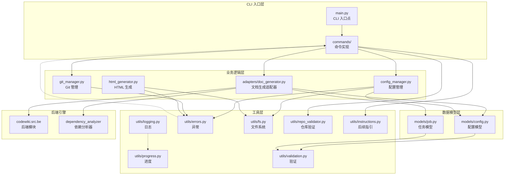
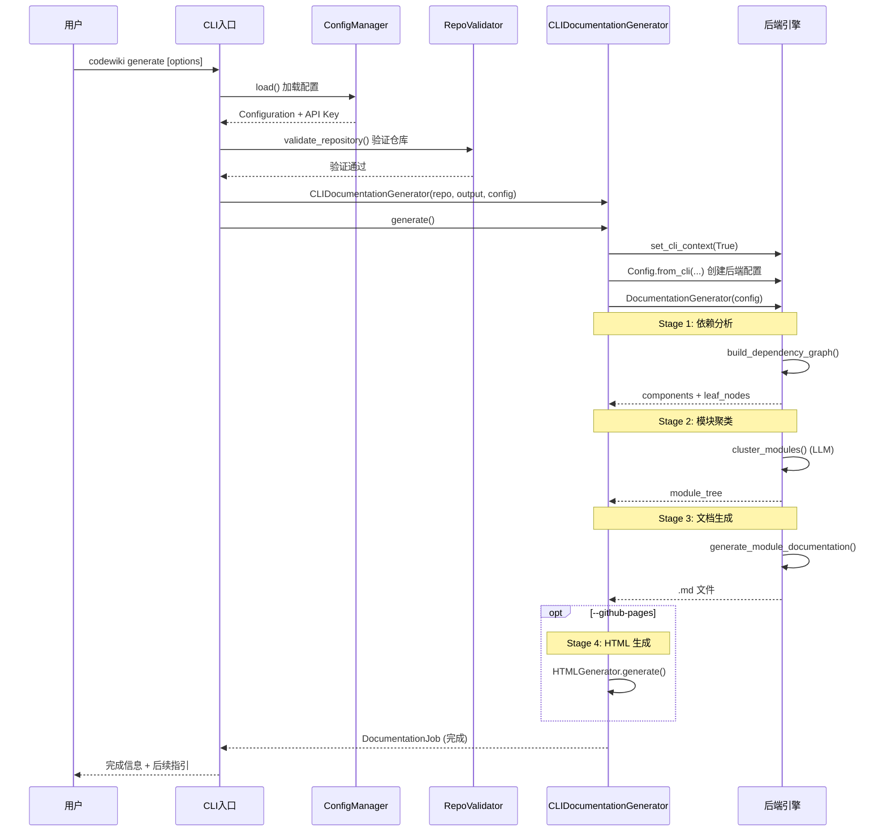
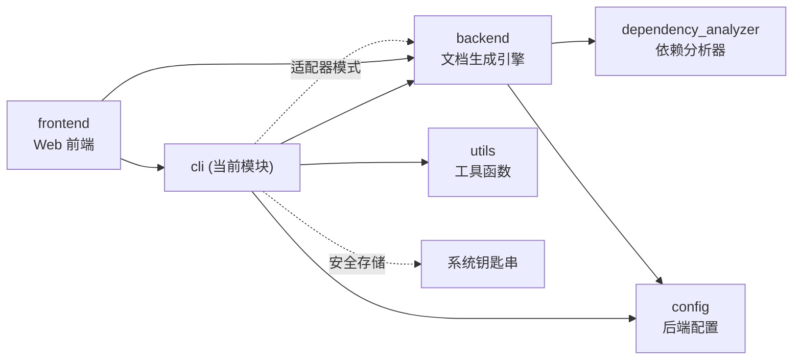
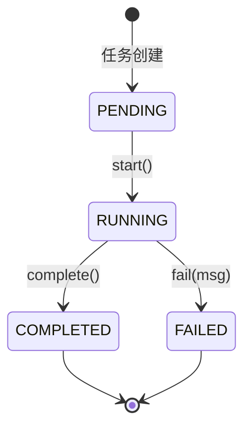

# CodeWiki CLI 模块文档

## 概述

CLI（Command Line Interface）模块是 CodeWiki 的命令行入口，负责协调用户交互、配置管理、Git 操作和文档生成的完整流程。它提供了直观的 Click 命令行界面，用于生成、配置和管理 AI 驱动的代码库文档。

### 核心功能

- **文档生成**：分析代码仓库，利用 LLM 生成结构化文档
- **配置管理**：安全的 API 密钥存储（系统钥匙串 + 文件回退），灵活的提供商配置
- **Git 集成**：分支创建、提交文档、远程仓库检测
- **GitHub Pages 部署**：生成自包含的 HTML 文档查看器
- **增量更新**：检测文件变更，选择性重新生成受影响的模块
- **断点续传**：支持从上次中断处继续文档生成
- **多 API 密钥并发**：多密钥轮询，提高 LLM 调用并发度
- **LLM 调用弹性**：超时控制、自动重试、退避策略

### 技术栈

- **框架**：Click (命令行框架)
- **Git 操作**：GitPython
- **安全存储**：keyring (系统钥匙串)
- **后端集成**：codewiki.src.be 后端模块

---

## 架构概览

### 分层架构



### 数据流



---

## 子模块说明

### 1. [命令实现 (commands)](cli_commands.md)

提供 Click 命令组和具体命令实现，包括：

- **`generate`**：文档生成命令，支持多种选项（输出目录、分支创建、GitHub Pages、增量更新、断点续传等）
- **`config`**：配置管理命令（`set`、`show`、`validate`、`clear`）
- **`status`**：任务状态查询命令
- **`mcp`**：MCP 协议服务器启动命令

### 2. [数据模型 (models)](cli_models.md)

CLI 层的数据模型定义，包括：

- **`Configuration`**：持久化配置（~/.codewiki/config.json），支持多种 LLM 提供商
- **`AgentInstructions`**：自定义代理指令（文件过滤、模块聚焦、文档类型）
- **`DocumentationJob`**：文档生成任务状态追踪
- **`JobStatistics`**：任务统计信息
- **`LLMConfig`**：LLM 配置快照
- **`GenerationOptions`**：生成选项
- **`JobStatus`**：任务状态枚举

### 3. [工具函数 (utils)](cli_utils.md)

提供各种工具函数和辅助类，包括：

- **`CLILogger`**：带颜色输出的 CLI 日志
- **`ProgressTracker`**：多阶段进度追踪（支持 ETA 估算）
- **`ModuleProgressBar`**：模块级进度条
- **错误处理**：`CodeWikiError` 异常体系 + `handle_error()`
- **文件操作**：原子写入 (`safe_write`)、安全读取 (`safe_read`)、目录创建
- **验证函数**：URL、API Key、模型名称、输出目录、仓库路径验证
- **仓库验证**：语言检测、代码文件统计、Git 状态检查
- **后续指引**：GitHub Pages URL 计算、PR 创建指引、完成提示

### 4. [适配器 (adapters)](cli_adapters.md)

**`CLIDocumentationGenerator`**：核心业务逻辑实现，连接 CLI 与后端引擎，负责：

- 配置后端日志（结构化日志 + 彩色控制台输出 + 文件日志）
- 管理断点续传（CheckpointManager）
- 管理多 API 密钥池（ApiKeyPool）
- 执行 5 个阶段：依赖分析 → 模块聚类 → 文档生成 → HTML 生成 → 完成
- 内存优化：分析完成后释放源代码对象

### 5. [Git 管理 (git_manager)](cli_git.md)

**`GitManager`**：Git 操作封装

### 6. [HTML 生成 (html_generator)](cli_html.md)

**`HTMLGenerator`**：GitHub Pages 兼容的 HTML 文档查看器生成

### 7. [配置管理 (config_manager)](cli_config.md)

**`ConfigManager`**：安全的配置存储管理

---

## 模块间依赖关系



CLI 模块通过适配器模式与 [backend](backend.md) 模块交互，[backend](backend.md) 模块负责实际的文档生成和聚类逻辑，并依赖 [dependency_analyzer](dependency_analyzer.md) 进行代码分析。配置文件模型被转换为后端 `Config` 对象传递给后端引擎。

---

## 配置与状态管理

### 配置存储

```
~/.codewiki/
├── config.json       # 非敏感配置（模型、URL、参数等）
└── credentials.json  # API 密钥（钥匙串不可用时的回退，权限 600）
```

### 任务工作流



---

## 扩展指南

### 添加新的 LLM 提供商

1. 在 `Configuration.model` 中添加提供商标识
2. 在 `Configuration.validate()` 中添加验证逻辑
3. 在 `config set` 命令中添加相关选项
4. 在后端 ([backend](backend.md)) 实现对应的后端类

### 添加新的文档类型

1. 在 `AgentInstructions.doc_type` 的映射表中添加类型
2. 在 `generate` 命令的 `--doc-type` 选项中添加

### 添加新的文件过滤规则

1. 在 `AgentInstructions` 中添加过滤字段
2. 在后端 `Config` 中添加对应的属性映射

---

## 相关模块文档

- [后端模块 (backend)](backend.md) - 文档生成引擎
- [依赖分析器 (dependency_analyzer)](dependency_analyzer.md) - 代码依赖分析
- [Web 前端 (frontend)](frontend.md) - Web 界面
- [全局配置 (config)](config.md) - 后端配置
- [工具函数 (utils)](utils.md) - 通用工具
