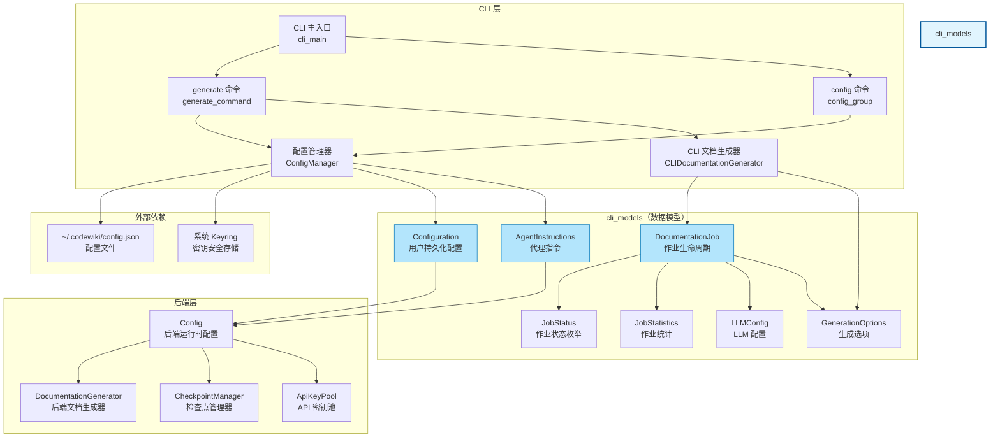
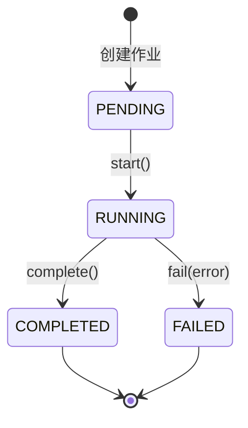
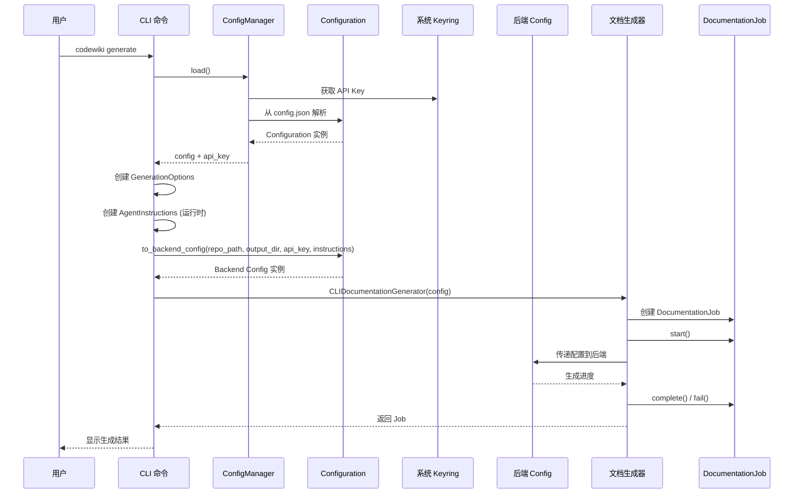
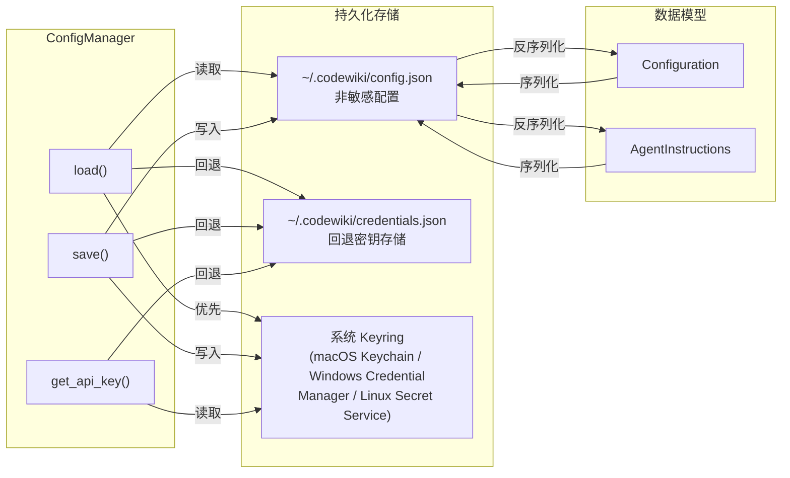

# CLI 数据模型模块（cli_models）

## 概述

`cli_models` 模块是 CodeWiki CLI 的核心数据层，定义了文档生成作业的生命周期管理、用户持久化配置以及 LLM 指令控制所需的所有数据结构。该模块位于 CLI 层与后端引擎之间，承担着**配置持久化**、**作业状态追踪**和**运行时参数传递**三大职责。

## 模块架构



## 核心组件

### 1. Configuration（`config.py`）

用户持久化配置模型，对应 `~/.codewiki/config.json` 文件。该模型定义了 CLI 运行所需的所有配置参数，并通过 `to_backend_config()` 方法将自身转换为后端运行时配置。

#### 属性说明

| 属性 | 类型 | 默认值 | 说明 |
|------|------|--------|------|
| `base_url` | `str` | `""` | LLM API 基础 URL |
| `main_model` | `str` | `""` | 主要文档生成模型 |
| `cluster_model` | `str` | `""` | 模块聚类模型 |
| `fallback_model` | `str` | `"glm-4p5"` | 备用模型 |
| `default_output` | `str` | `"docs"` | 默认输出目录 |
| `provider` | `str` | `"openai-compatible"` | LLM 提供商类型 |
| `aws_region` | `str` | `"us-east-1"` | AWS 区域（Bedrock） |
| `api_version` | `str` | `"2024-12-01-preview"` | Azure OpenAI API 版本 |
| `azure_deployment` | `str` | `""` | Azure OpenAI 部署名称 |
| `max_tokens` | `int` | `32768` | LLM 响应最大 token 数 |
| `max_token_per_module` | `int` | `36369` | 每模块聚类 token 上限 |
| `max_token_per_leaf_module` | `int` | `16000` | 叶模块 token 上限 |
| `max_depth` | `int` | `2` | 层次分解最大深度 |
| `agent_instructions` | `AgentInstructions` | `AgentInstructions()` | 自定义代理指令 |
| `api_keys` | `str` | `""` | 逗号分隔的多 API 密钥 |
| `concurrency` | `int` | `0` | 最大并发数（0=自动） |
| `disable_proxy` | `bool` | `True` | 禁用代理 |
| `cache_dir` | `str` | `".codewiki_cache"` | 检查点/缓存目录 |
| `resume` | `bool` | `True` | 启用检查点恢复 |
| `model_context_window` | `int` | `0` | 模型上下文窗口（0=自动检测） |
| `llm_timeout` | `int` | `1200` | LLM 调用超时（秒） |
| `llm_max_retries` | `int` | `10` | 最大重试次数 |
| `llm_retry_interval` | `int` | `60` | 重试间隔（秒） |

#### 关键方法

| 方法 | 说明 |
|------|------|
| `validate()` | 验证配置字段，支持订阅模式提供商（claude-code/codex）的特殊校验 |
| `is_complete()` | 检查必要字段是否已设置 |
| `to_backend_config(repo_path, output_dir, api_key, runtime_instructions)` | 将 CLI 配置转换为后端 `Config` 对象，桥接持久化设置与运行时作业配置 |
| `to_dict()` / `from_dict(data)` | 配置的序列化与反序列化 |

### 2. AgentInstructions（`config.py`）

代理指令模型，允许用户自定义文档生成的粒度、范围和风格。

#### 属性说明

| 属性 | 类型 | 说明 |
|------|------|------|
| `include_patterns` | `Optional[List[str]]` | 包含的文件模式（如 `["*.cs"]`） |
| `exclude_patterns` | `Optional[List[str]]` | 排除的文件/目录模式（如 `["*Tests*"]`） |
| `focus_modules` | `Optional[List[str]]` | 需要详细文档化的模块（如 `["src/core", "src/api"]`） |
| `doc_type` | `Optional[str]` | 文档类型（api/architecture/user-guide/developer） |
| `custom_instructions` | `Optional[str]` | 自由格式的额外指令 |

#### 文档类型对照

| 类型值 | 说明 |
|--------|------|
| `api` | API 文档：端点、参数、返回类型和使用示例 |
| `architecture` | 架构文档：系统设计、组件关系和数据流 |
| `user-guide` | 用户指南：功能使用方法和分步教程 |
| `developer` | 开发者文档：代码结构、贡献指南和实现细节 |

### 3. DocumentationJob（`job.py`）

文档生成作业模型，跟踪生成任务从创建到完成的完整生命周期。



#### 属性说明

| 属性 | 类型 | 说明 |
|------|------|------|
| `job_id` | `str` | UUID 唯一作业标识 |
| `repository_path` | `str` | 仓库绝对路径 |
| `repository_name` | `str` | 仓库名称 |
| `output_directory` | `str` | 输出目录路径 |
| `commit_hash` | `str` | Git 提交 SHA |
| `branch_name` | `Optional[str]` | Git 分支名 |
| `timestamp_start` | `str` | 作业开始时间（ISO 格式） |
| `timestamp_end` | `Optional[str]` | 作业结束时间 |
| `status` | `JobStatus` | 当前状态 |
| `error_message` | `Optional[str]` | 错误信息 |
| `files_generated` | `List[str]` | 已生成文件列表 |
| `module_count` | `int` | 已文档化的模块数 |
| `generation_options` | `GenerationOptions` | 生成选项 |
| `llm_config` | `Optional[LLMConfig]` | LLM 配置快照 |
| `statistics` | `JobStatistics` | 作业统计数据 |

### 4. 辅助模型（`job.py`）

#### JobStatus 枚举
```python
class JobStatus(str, Enum):
    PENDING = "pending"    # 等待执行
    RUNNING = "running"    # 正在执行
    COMPLETED = "completed"  # 已完成
    FAILED = "failed"      # 失败
```

#### GenerationOptions
| 属性 | 类型 | 默认值 | 说明 |
|------|------|--------|------|
| `create_branch` | `bool` | `False` | 创建 Git 文档分支 |
| `github_pages` | `bool` | `False` | 生成 GitHub Pages |
| `no_cache` | `bool` | `False` | 禁用缓存 |
| `custom_output` | `Optional[str]` | `None` | 自定义输出路径 |

#### JobStatistics
| 属性 | 类型 | 默认值 | 说明 |
|------|------|--------|------|
| `total_files_analyzed` | `int` | `0` | 已分析文件总数 |
| `leaf_nodes` | `int` | `0` | 叶节点数 |
| `max_depth` | `int` | `0` | 最大深度 |
| `total_tokens_used` | `int` | `0` | 总 token 消耗 |

#### LLMConfig
| 属性 | 类型 | 说明 |
|------|------|------|
| `main_model` | `str` | 主要模型名称 |
| `cluster_model` | `str` | 聚类模型名称 |
| `base_url` | `str` | API 基础 URL |

## 数据流



## 配置持久化流程



## 向后兼容性设计

`Configuration.to_backend_config()` 方法使用了 `inspect.signature()` 动态检测后端 `Config.from_cli` 方法接受的参数列表，确保新增加的字段（如 `api_keys`、`concurrency`、`disable_proxy`、`cache_dir`、`resume`、`model_context_window` 等 LLM 弹性参数）仅在旧版本后端支持时传递，实现 CLI 与后端的平滑并行升级。

## 相关模块

- [Configuration Manager](cli_config.md) — `ConfigManager` 类，负责配置的读写与密钥管理
- [CLI Adaptor](cli_adapters.md) — `CLIDocumentationGenerator`，使用数据模型驱动文档生成
- [CLI 命令](cli_commands.md) — `generate_command`、`config_group`，解析用户输入并调用数据模型
- [Backend Config](config.md) — 后端 `Config` 类，接收 CLI 模型转换后的运行时配置
- [Checkpoint](checkpoint.md) — `CheckpointManager`，与 `resume`、`cache_dir` 等配置项协作

## 示例：从用户输入到后端配置的完整链路

```python
# 1. 用户运行 codewiki generate --main-model gpt-4o --focus "src/core"
# 2. ConfigManager 加载 ~/.codewiki/config.json → Configuration 实例
# 3. generate_command 解析 CLI 参数 → AgentInstructions(focus_modules=["src/core"])
# 4. Configuration.to_backend_config(...) 合并持久化与运行时设置
# 5. 返回后端 Config 实例，准备开始文档生成
```
