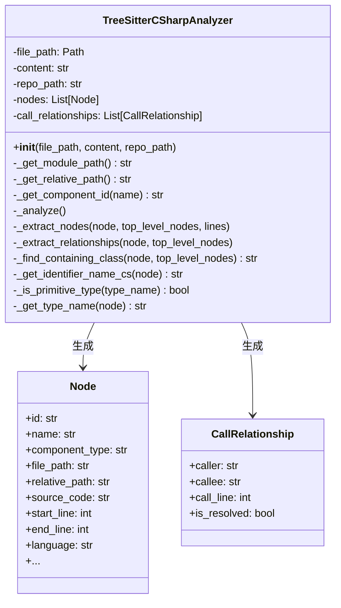
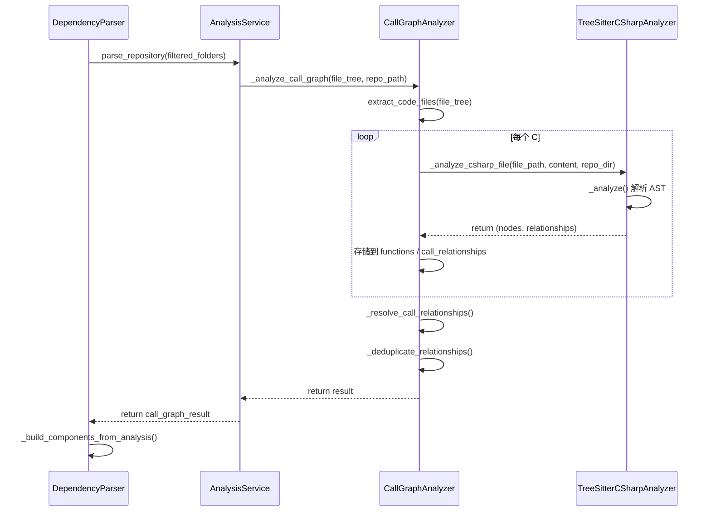

# C# 语言分析器模块 (csharp)

## 概述

C# 语言分析器模块提供了对 C# 源代码的静态分析能力，基于 **tree-sitter** 解析库实现。该模块能够从 C# 代码中提取**类**、**接口**、**结构体**、**枚举**、**记录**和**委托**等顶级代码组件，并分析**继承关系**以及**类成员之间的类型引用关系**，为上层依赖图构建和调用图分析提供基础数据。

该模块是 [dependency_analyzer](dependency_analyzer.md) 项目的多语言分析器之一，与 Python、Java、C++、JavaScript、TypeScript 等其他语言的分析器共同构成完整的跨语言依赖分析体系。

---

## 架构位置

```
dependency_analyzer/
├── analyzers/
│   ├── csharp/                       ← 当前模块
│   │   └── csharp.py                 TreeSitterCSharpAnalyzer, analyze_csharp_file()
│   ├── c/                            C 语言分析器
│   ├── cpp/                          C++ 语言分析器
│   ├── java/                         Java 语言分析器
│   ├── javascript/                   JavaScript 语言分析器
│   ├── kotlin/                       Kotlin 语言分析器
│   ├── php/                          PHP 语言分析器
│   ├── python/                       Python 语言分析器
│   └── typescript/                   TypeScript 语言分析器
├── analysis/
│   ├── analysis_service.py           AnalysisService（编排分析流程）
│   ├── call_graph_analyzer.py        CallGraphAnalyzer（调用图分析器）
│   └── repo_analyzer.py              RepoAnalyzer（仓库结构分析）
├── models/
│   ├── core.py                       Node, CallRelationship, Repository
│   └── analysis.py                   AnalysisResult, NodeSelection
├── ast_parser.py                     DependencyParser（高层入口）
└── dependency_graphs_builder.py      DependencyGraphBuilder
```

---

## 核心组件

### 1. `TreeSitterCSharpAnalyzer` 类

该类是 C# 语言分析的核心实现，使用 tree-sitter 的 C# 语言文法解析源代码，并提取代码结构信息和类型依赖关系。

#### 类图



#### 构造函数

```python
def __init__(self, file_path: str, content: str, repo_path: str = None):
```

| 参数 | 类型 | 说明 |
|------|------|------|
| `file_path` | `str` | 待分析的 C# 文件路径 |
| `content` | `str` | 文件内容字符串 |
| `repo_path` | `str` | 仓库根目录路径（可选），用于生成相对路径 |

构造时自动调用 `_analyze()` 方法完成解析，解析结果存储于 `nodes` 和 `call_relationships` 属性中。

#### 主要方法

| 方法 | 作用 |
|------|------|
| `_analyze()` | 主解析流程：初始化 tree-sitter 解析器，解析文件内容，调用节点提取和关系提取 |
| `_extract_nodes(node, top_level_nodes, lines)` | 递归遍历 AST，识别**类**、**接口**、**结构体**、**枚举**、**记录**和**委托**定义 |
| `_extract_relationships(node, top_level_nodes)` | 递归遍历 AST，提取继承关系、属性类型引用、字段类型引用和方法参数类型引用 |
| `_find_containing_class(node, top_level_nodes)` | 从给定节点向上查找所属的包含类/接口/结构体 |
| `_get_identifier_name_cs(node)` | 根据节点类型提取标识符名称（支持 class/interface/struct 关键字后的 identifier 定位） |
| `_is_primitive_type(type_name)` | 判断类型名称是否为 C# 基元类型或常见内置类型 |
| `_get_type_name(node)` | 从类型节点中提取类型名称（支持 identifier、generic_name、predefined_type 三种节点类型） |
| `_get_module_path()` | 计算文件对应的模块路径（将文件路径转换为点分隔的模块路径） |
| `_get_relative_path()` | 计算文件相对于仓库根目录的路径 |
| `_get_component_id(name)` | 生成组件的唯一标识符，格式为 `{相对路径}::{名称}` |

### 2. `analyze_csharp_file()` 函数

```python
def analyze_csharp_file(file_path: str, content: str, repo_path: str = None) -> Tuple[List[Node], List[CallRelationship]]:
```

该函数是 `TreeSitterCSharpAnalyzer` 的便捷封装，创建分析器实例并返回解析结果。

| 参数 | 类型 | 说明 |
|------|------|------|
| `file_path` | `str` | 文件路径 |
| `content` | `str` | 文件内容 |
| `repo_path` | `str` | 仓库根路径（可选） |

| 返回值 | 类型 | 说明 |
|--------|------|------|
| `nodes` | `List[Node]` | 提取的代码组件列表（类、接口、结构体等） |
| `call_relationships` | `List[CallRelationship]` | 提取的依赖关系列表 |

---

## AST 解析规则

### 节点提取（`_extract_nodes`）

Tree-sitter 解析 C# 语言 AST 后，模块识别以下几种顶级结构：

| Tree-sitter 节点类型 | 识别的组件类型 | 说明 |
|----------------------|---------------|------|
| `class_declaration` | `"class"` / `"abstract class"` / `"static class"` | 类定义。根据 `modifier` 子节点中的 `abstract` 或 `static` 关键字区分具体类型 |
| `interface_declaration` | `"interface"` | 接口定义 |
| `struct_declaration` | `"struct"` | 结构体定义 |
| `enum_declaration` | `"enum"` | 枚举定义 |
| `record_declaration` | `"record"` | 记录定义（C# 9+ 特性） |
| `delegate_declaration` | `"delegate"` | 委托定义 |

对于每个识别的节点，生成一个 `Node` 对象，包含：

- **唯一标识符**：`{相对路径}::{名称}`
- **源代码片段**：从 `start_point` 到 `end_point` 的行
- **行号信息**：起始行和结束行（1-based）
- **显示名称**：`"{type} {name}"` 格式（例如 `"class MyClass"`, `"interface IMyInterface"`）

**标识符定位逻辑**：

对于 `class_declaration`、`interface_declaration`、`struct_declaration`、`enum_declaration` 和 `record_declaration` 节点，采用**两步定位法**提取名称：

1. 先找到类型关键字子节点（如 `"class"`、`"interface"`、`"struct"`、`"enum"`、`"record"`）
2. 在该关键字之后的第一个 `identifier` 子节点即为类型名称

### 关系提取（`_extract_relationships`）

C# 分析器提取**四种类型的关系**，均以 `CallRelationship` 模型表示：

#### 1. 继承关系（`base_list`）

当遇到 `class_declaration` 节点且包含 `base_list` 子节点时，提取继承关系：

```
class_declaration
  ├── "class" keyword
  ├── identifier          ← 类名
  ├── base_list
  │   └── identifier      ← 基类/接口名
  └── body
```

- `caller`：子类的完整组件 ID
- `callee`：基类的完整组件 ID（如果存在于同文件的 `top_level_nodes` 中）
- `call_line`：类声明的行号
- `is_resolved`：如果基类在同文件中找到，设为 `True`；否则设为 `False`（由上层 `CallGraphAnalyzer` 进行跨文件解析）

> **注意**：当前实现仅当基类名称在同文件的 `top_level_nodes` 中匹配时才设置 `is_resolved = True`。对于跨文件的继承关系，由上层 `CallGraphAnalyzer._resolve_call_relationships()` 进行跨文件解析。

#### 2. 属性类型引用（`property_declaration`）

当属性声明的类型标识符不是基元类型时，建立从包含类到该类型的引用关系：

- 识别条件：`property_declaration` 子节点中包含至少 2 个 `identifier` 节点，第一个为类型名
- 排除基元类型：通过 `_is_primitive_type()` 过滤掉 `int`、`string`、`bool` 等内置类型
- `is_resolved`：初始为 `False`

#### 3. 字段类型引用（`field_declaration`）

当字段声明的类型标识符不是基元类型时，建立从包含类到该类型的引用关系：

- 识别条件：`field_declaration` 子节点中包含 `identifier` 类型的子节点
- 排除基元类型：同属性类型引用
- `is_resolved`：初始为 `False`

#### 4. 方法参数类型引用（`method_declaration` → `parameter_list` → `parameter`）

当方法参数的类型标识符不是基元类型时，建立从包含类到该类型的引用关系：

- 识别条件：`method_declaration` → `parameter_list` → `parameter` → `identifier`
- 排除基元类型：同属性类型引用
- `is_resolved`：初始为 `False`

### 基元类型过滤（`_is_primitive_type`）

该方法用于判断一个类型名称是否为 C# 基元类型或常见内置类型，避免将它们作为依赖关系记录。覆盖以下类别：

| 类别 | 类型名称 |
|------|---------|
| **C# 关键字类型** | `bool`, `byte`, `sbyte`, `char`, `decimal`, `double`, `float`, `int`, `uint`, `long`, `ulong`, `short`, `ushort`, `string`, `object`, `void` |
| **.NET 框架类型** | `Boolean`, `Byte`, `SByte`, `Char`, `Decimal`, `Double`, `Single`, `Int32`, `UInt32`, `Int64`, `UInt64`, `Int16`, `UInt16`, `String`, `Object`, `Void` |
| **常见泛型集合** | `List`, `Dictionary`, `IList`, `IDictionary`, `IEnumerable`, `ICollection` |
| **常用系统类型** | `Task`, `CancellationToken`, `DateTime`, `TimeSpan`, `Guid` |

---

## 数据模型依赖

该模块依赖 [models/core.py](models_core.md) 中定义的两个核心数据模型：

### `Node` 模型

| 字段 | 类型 | 说明 |
|------|------|------|
| `id` | `str` | 组件唯一标识，格式 `{相对路径}::{名称}` |
| `name` | `str` | 组件名称（类名/接口名/结构体名等） |
| `component_type` | `str` | 组件类型：`"class"`, `"abstract class"`, `"static class"`, `"interface"`, `"struct"`, `"enum"`, `"record"`, `"delegate"` |
| `file_path` | `str` | 绝对文件路径 |
| `relative_path` | `str` | 相对于仓库根目录的路径 |
| `source_code` | `Optional[str]` | 源代码片段（从起始行到结束行） |
| `start_line` / `end_line` | `int` | 起始/结束行号（1-based） |
| `display_name` | `Optional[str]` | 显示名称，格式 `"{component_type} {name}"` |
| `node_type` | `Optional[str]` | 与 `component_type` 相同 |
| `component_id` | `Optional[str]` | 与 `id` 相同 |

### `CallRelationship` 模型

| 字段 | 类型 | 说明 |
|------|------|------|
| `caller` | `str` | 调用方（依赖方）组件 ID |
| `callee` | `str` | 被调用方（被依赖方）ID（简单名称或完整 ID） |
| `call_line` | `Optional[int]` | 关系所在行号 |
| `is_resolved` | `bool` | 是否已解析为完整 ID |

---

## 数据流

```mermaid
flowchart LR
    subgraph Input
        A[C# 源文件 .cs]
        B[仓库根路径]
    end

    subgraph "C# 分析器模块"
        C[TreeSitterCSharpAnalyzer]
        D[tree-sitter-c-sharp<br>文法解析]
        E[节点提取<br>_extract_nodes]
        F[关系提取<br>_extract_relationships]
    end

    subgraph Output
        G[List[Node]]
        H[List[CallRelationship]]
    end

    subgraph "上层消费者"
        I[CallGraphAnalyzer<br>跨文件解析]
        J[DependencyParser<br>构建组件图]
        K[DependencyGraphBuilder<br>生成依赖图]
    end

    A --> C
    B --> C
    C --> D
    D --> E
    D --> F
    E --> G
    F --> H
    G --> I
    H --> I
    I --> J
    J --> K
```

---

## 集成流程



### 调度入口

在 `CallGraphAnalyzer._analyze_code_file()` 中，根据文件语言类型路由到对应的分析器：

```python
# CallGraphAnalyzer 中的调度逻辑
if language == "csharp":
    self._analyze_csharp_file(file_path, content, repo_dir)

def _analyze_csharp_file(self, file_path, content, repo_dir):
    from codewiki.src.be.dependency_analyzer.analyzers.csharp import analyze_csharp_file
    functions, relationships = analyze_csharp_file(file_path, content, repo_path=repo_dir)
    for func in functions:
        func_id = func.id if func.id else f"{file_path}:{func.name}"
        self.functions[func_id] = func
    self.call_relationships.extend(relationships)
```

---

## 支持的 C# 语言特性

| 特性 | 支持状态 | 说明 |
|------|---------|------|
| 类定义（class） | ✅ 支持 | 包括普通类、抽象类（`abstract`）、静态类（`static`） |
| 接口定义（interface） | ✅ 支持 | 提取接口名称和源码范围 |
| 结构体定义（struct） | ✅ 支持 | 提取结构体名称和源码范围 |
| 枚举定义（enum） | ✅ 支持 | 提取枚举名称和源码范围 |
| 记录定义（record） | ✅ 支持 | C# 9+ 的记录类型 |
| 委托定义（delegate） | ✅ 支持 | 委托类型声明 |
| 继承关系（base_list） | ✅ 支持 | 提取类/接口的基类型继承关系 |
| 属性类型引用 | ✅ 支持 | 属性声明的类型引用（排除基元类型） |
| 字段类型引用 | ✅ 支持 | 字段声明的类型引用（排除基元类型） |
| 方法参数类型引用 | ✅ 支持 | 方法参数的类型引用（排除基元类型） |
| 泛型类型名称 | ✅ 部分支持 | 通过 `generic_name` 节点提取泛型类型的基名称 |
| 方法实现体分析 | ❌ 不支持 | 方法体内部的调用关系、变量使用等 |
| 命名空间分析 | ❌ 不支持 | `namespace` 声明不纳入节点提取 |
| using 指令 | ❌ 不支持 | `using` 导入不纳入关系分析 |
| 访问修饰符 | ❌ 不提取 | `public`、`private`、`protected` 等修饰符不记录 |
| 嵌套类型 | ❌ 不支持 | 嵌套在类内部的类型不单独提取 |
| 事件/索引器 | ❌ 不支持 | 事件声明和索引器声明当前未识别 |
| 运算符重载 | ❌ 不支持 | 运算符重载方法不纳入分析 |
| 属性访问器（get/set） | ❌ 不支持 | getter/setter 内部不分析 |

### 当前限制说明

1. **仅提取顶级类型**：只提取文件最外层声明的类、接口、结构体等，嵌套类型（声明在类内部的类）不单独作为节点提取。
2. **无方法体分析**：方法体内部的函数调用、变量赋值、控制流等不会被分析。这意味方法级调用链不会从 C# 代码中提取。
3. **同文件继承解析**：继承关系仅在基类与子类位于同一文件中时才被标记为 `is_resolved = True`。跨文件继承由上层统一解析。
4. **无方法节点**：当前版本不将方法作为独立的 `Node` 提取，仅提取顶级类型定义。方法参数的类型引用通过 `CallRelationship` 记录。

---

## 与 C++ 分析器的对比

C# 分析器 ([csharp](csharp.md)) 与 C++ 分析器 ([cpp](cpp.md)) 在设计上有相似之处，但也存在重要差异：

| 维度 | C# 分析器 | C++ 分析器 |
|------|----------|-----------|
| 文法 | `tree-sitter-c-sharp` | `tree-sitter-cpp` |
| 节点类型 | class, interface, struct, enum, record, delegate | 函数, 类, 方法, 命名空间, 模板 |
| 关系类型 | 继承、属性类型、字段类型、参数类型引用 | 函数调用、继承、方法调用 |
| 方法体分析 | ❌ 不支持 | ✅ 支持（函数调用提取） |
| 基元类型过滤 | ✅ 有（内置类型列表） | ❌ 无 |
| 面向对象支持 | 类、接口、结构体、枚举、记录、委托 | 类、继承、虚函数、模板 |
| 参数类型引用 | ✅ 支持 | ❌ 不专门提取 |

---

## 使用示例

```python
# 通过 DependencyParser 高层入口使用
from codewiki.src.be.dependency_analyzer.ast_parser import DependencyParser

parser = DependencyParser(repo_path="/path/to/csharp_project")
components = parser.parse_repository()
# components 中包含所有 C# 代码组件的 Node 对象

# 直接使用 C# 分析器
from codewiki.src.be.dependency_analyzer.analyzers.csharp import analyze_csharp_file

nodes, relationships = analyze_csharp_file(
    file_path="src/Models/Person.cs",
    content='''
using System;

namespace MyApp.Models
{
    public interface IPerson
    {
        string Name { get; set; }
        int Age { get; set; }
    }

    public abstract class BaseEntity
    {
        public Guid Id { get; set; }
        public DateTime CreatedAt { get; set; }
    }

    public class Person : BaseEntity, IPerson
    {
        private string _name;
        private Address _address;

        public string Name { get; set; }
        public int Age { get; set; }

        public Person(string name, Address address)
        {
            _name = name;
            _address = address;
        }
    }

    public struct Address
    {
        public string Street { get; set; }
        public string City { get; set; }
    }

    public enum Gender
    {
        Male,
        Female,
        Other
    }
}
''',
    repo_path="/path/to/csharp_project"
)

for node in nodes:
    print(f"{node.component_type}: {node.name} ({node.start_line}-{node.end_line})")
# 输出:
#   interface: IPerson (5-8)
#   abstract class: BaseEntity (10-14)
#   class: Person (16-27)
#   struct: Address (29-33)
#   enum: Gender (35-40)

for rel in relationships:
    print(f"{rel.caller} -> {rel.callee} (line {rel.call_line}, resolved={rel.is_resolved})")
# 可能输出:
#   src/Models/Person.cs::Person -> src/Models/Person.cs::BaseEntity (line 16, resolved=True)
#   src/Models/Person.cs::Person -> IPerson (line 16, resolved=False)
#   src/Models/Person.cs::Person -> Address (line 20, resolved=False)
#   src/Models/Person.cs::Person -> Address (line 24, resolved=False)
```

---

## 扩展与定制

### 添加新的 C# 语法支持

若需要支持更多 C# 语言结构（如嵌套类型、事件、运算符重载等），可以在 `_extract_nodes` 或 `_extract_relationships` 方法中添加新的处理分支：

```python
# 示例：支持记录结构体（record struct）— C# 10+
elif node.type == "record_struct_declaration":
    node_type = "record struct"
    found_record_keyword = False
    for child in node.children:
        if child.type == "record":
            found_record_keyword = True
        elif found_record_keyword and child.type == "identifier":
            node_name = child.text.decode()
            break
```

### 扩展基元类型列表

若项目中使用了其他常见类型（如 `HttpClient`、`DbContext` 等），可以将其添加到 `_is_primitive_type` 方法的 `primitives` 集合中，以避免产生不必要的依赖关系。

### 自定义过滤规则

可在 `AnalysisService` 或 `RepoAnalyzer` 层面添加文件过滤规则：

```python
# 在 AnalysisService 中指定排除模式
analysis_service = AnalysisService()
result = analysis_service.analyze_local_repository(
    repo_path="/path/to/project",
    languages=["csharp"],
    max_files=200
)
```

---

## 参考资料

- [dependency_analyzer](dependency_analyzer.md) — 依赖分析器主模块
- [models/core.py](models_core.md) — Node 和 CallRelationship 数据模型定义
- [cpp](cpp.md) — C++ 语言分析器模块（对比参考）
- [c](c.md) — C 语言分析器模块（对比参考）
- [tree-sitter-c-sharp](https://github.com/tree-sitter/tree-sitter-c-sharp) — tree-sitter C# 语言文法官方仓库
- [tree-sitter 文档](https://tree-sitter.github.io/tree-sitter/) — tree-sitter 解析框架官方文档
- [C# Language Reference](https://docs.microsoft.com/en-us/dotnet/csharp/language-reference/) — C# 语言参考文档
