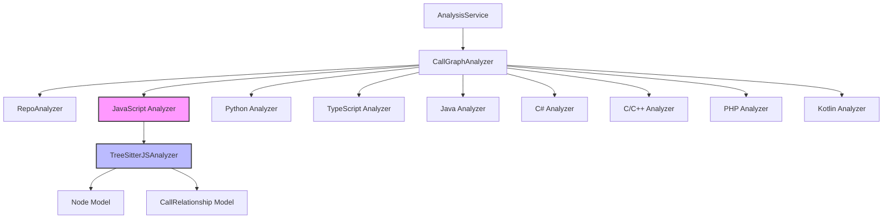
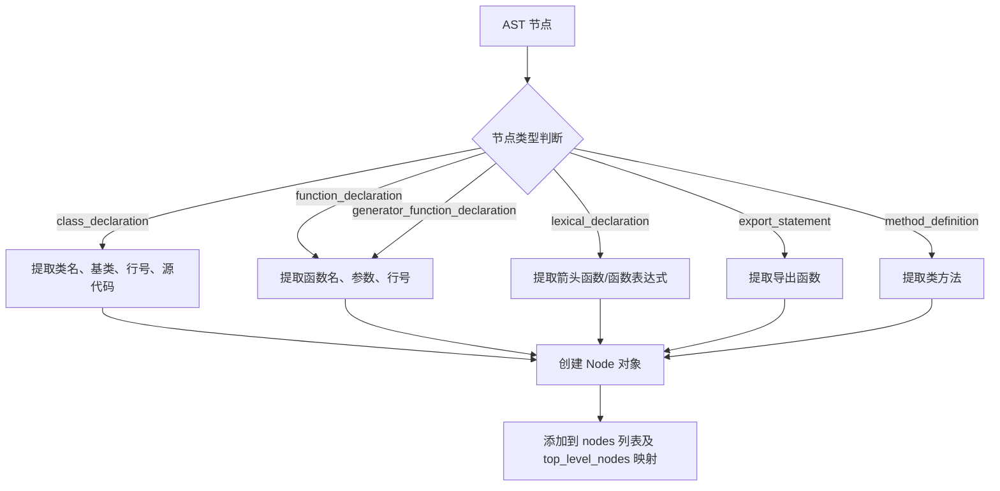
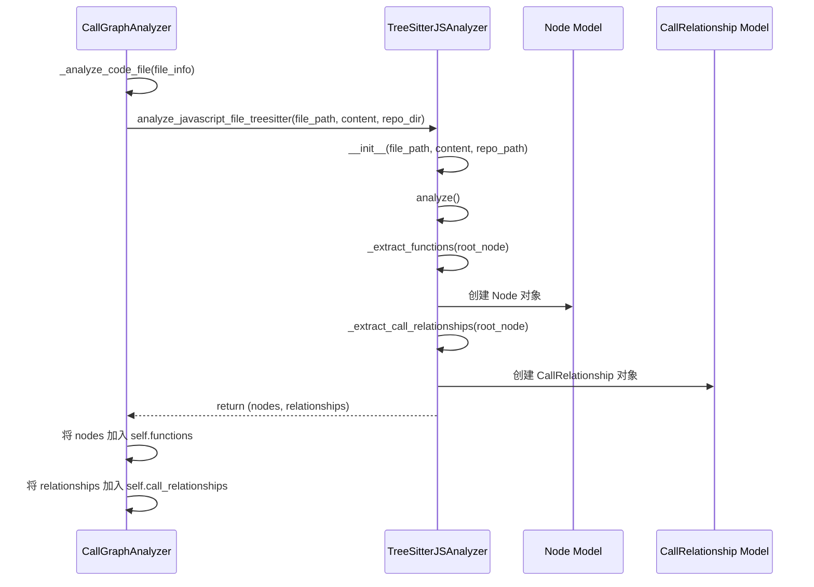
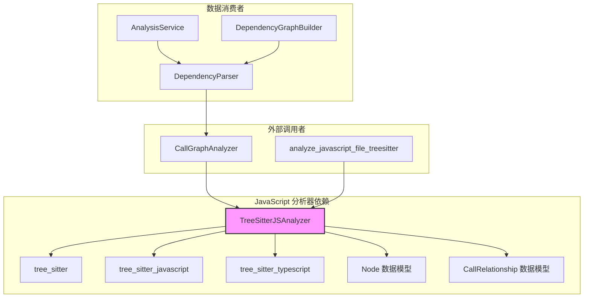

# JavaScript/TypeScript 依赖分析模块

## 概述

JavaScript 模块是 CodeWiki 依赖分析器中的核心分析组件之一，负责对 **JavaScript** 和 **TypeScript** 代码进行静态分析。它基于 [Tree-sitter](https://tree-sitter.github.io/tree-sitter/) 解析器构建，能够从 JS/TS 源文件中提取函数、类、方法等代码组件及其调用关系，为后续的依赖图构建和代码可视化提供基础数据。

该模块实现了对现代 JavaScript/TypeScript 语法的全面支持，包括 ES6+ 特性、类声明、箭头函数、生成器函数、异步函数以及 JSDoc 类型注解的解析。

---

## 架构位置

JavaScript 模块位于依赖分析系统的**分析器层**，被 `CallGraphAnalyzer` 调用。整体架构如下：



### 数据流

```mermaid
flowchart LR
    A[JS/TS 源文件] --> B[Tree-sitter Parser]
    B --> C[AST 语法树]
    C --> D[TreeSitterJSAnalyzer]
    D --> E[节点提取]
    D --> F[调用关系提取]
    D --> G[JSDoc 类型提取]
    E --> H[List[Node]]
    F --> I[List[CallRelationship]]
    G --> I
    H --> J[DependencyParser]
    I --> J
    J --> K[DependencyGraphBuilder]
    K --> L[依赖图 / 可视化]
```

---

## 核心组件

### `TreeSitterJSAnalyzer`

**文件**: `codewiki/src/be/dependency_analyzer/analyzers/javascript.py`

这是模块的核心类，负责对单个 JavaScript/TypeScript 文件执行 AST 分析。

#### 类属性

| 属性 | 类型 | 说明 |
|------|------|------|
| `file_path` | `Path` | 当前分析的文件路径 |
| `content` | `str` | 文件内容字符串 |
| `repo_path` | `str` | 仓库根目录路径 |
| `nodes` | `List[Node]` | 提取的顶层代码组件节点列表 |
| `call_relationships` | `List[CallRelationship]` | 提取的调用关系列表 |
| `top_level_nodes` | `dict` | 顶层节点名称到 Node 对象的映射字典 |
| `seen_relationships` | `set` | 已处理的调用关系去重集合 |
| `parser` | `Parser` | Tree-sitter 解析器实例 |
| `js_language` | `Language` | JavaScript 语言对象 |

#### 构造函数

```python
def __init__(self, file_path: str, content: str, repo_path: str = None):
```

初始化分析器，尝试加载 `tree_sitter_javascript` 语言包并创建解析器。如果初始化失败（如缺少依赖），`parser` 属性将为 `None`，后续 `analyze()` 调用将跳过分析。

---

## 主要功能

### 1. 代码组件提取

`_extract_functions()` 方法遍历 AST，识别并提取以下类型的代码组件：

#### 支持的节点类型

| AST 节点类型 | 提取组件类型 | 说明 |
|-------------|-------------|------|
| `class_declaration` | `class` | 类声明，提取基类信息 |
| `abstract_class_declaration` | `abstract class` | 抽象类声明 |
| `interface_declaration` | `interface` | 接口声明 |
| `function_declaration` | `function` | 普通函数声明 |
| `generator_function_declaration` | `generator function` | 生成器函数 (`function*`) |
| `export_statement` | `function` | 导出的函数 |
| `lexical_declaration` | `function` | `const/let/var` 声明的箭头函数或函数表达式 |
| `method_definition` | `method` | 类中的方法定义 |
| `field_definition` | `method` | 类中箭头函数属性 |

#### 节点标识符生成

`_get_component_id()` 方法生成统一格式的组件标识符：

- **顶层函数**: `relative/path/file.js::functionName`
- **类方法**: `relative/path/file.js::ClassName.methodName`



### 2. 调用关系提取

`_extract_call_relationships()` 方法遍历 AST，识别函数调用并记录调用关系。

#### 识别的调用类型

| 调用类型 | AST 节点 | 示例 |
|---------|---------|------|
| 普通函数调用 | `call_expression` | `foo()` |
| 方法链调用 | `member_expression` + `call_expression` | `obj.method()` |
| 异步调用 | `await_expression` + `call_expression` | `await foo()` |
| 构造函数调用 | `new_expression` | `new Foo()` |
| 继承关系 | `class_heritage` | `class A extends B` |

#### 调用关系去重

`_add_relationship()` 方法使用 `(caller, callee, call_line)` 三元组进行去重，确保同一位置对同一函数的多次调用只记录一次。

#### 调用关系解析

调用关系分为两类：

- **已解析 (is_resolved=True)**: 被调用函数已在当前文件的 `top_level_nodes` 中找到
- **未解析 (is_resolved=False)**: 被调用函数在当前文件中未找到，需要在后续跨文件解析阶段处理

```mermaid
flowchart TD
    A[AST 节点] --> B{节点类型}
    B -->|call_expression| C[提取被调用者名称]
    B -->|await_expression| D[查找子节点 call_expression]
    B -->|new_expression| E[提取构造函数名称]
    B -->|class_heritage| F[提取基类名称]
    C --> G{是否方法调用?}
    G -->|this.foo() / super.foo()| H[跳过类内部方法调用]
    G -->|其他| I[创建 CallRelationship]
    D --> C
    E --> I
    F --> I
    I --> J{被调用者在 top_level_nodes 中?}
    J -->|是| K[is_resolved=True]
    J -->|否| L[is_resolved=False]
    K --> M[添加到 call_relationships 列表]
    L --> M
```

### 3. JSDoc 类型依赖提取

`_extract_jsdoc_type_dependencies()` 方法解析 JSDoc 注释中的类型引用，将其作为隐式依赖关系记录下来。

#### 支持的 JSDoc 标签

| 标签模式 | 示例 |
|---------|------|
| `@param {Type}` | `@param {string} name` |
| `@return {Type}` / `@returns {Type}` | `@returns {Promise<void>}` |
| `@type {Type}` | `@type {MyType}` |
| `@typedef {Object} TypeName` | `@typedef {Object} ConfigOptions` |
| `@interface InterfaceName` | `@interface IConfig` |

#### 类型解析

`_extract_base_types_from_jsdoc()` 方法从类型字符串中提取基础类型名，处理：

- **简单类型**: `string`, `MyClass`
- **泛型**: `Promise<MyType>`, `Array<string>`
- **联合类型**: `string | number | MyType`
- **内置类型过滤**: 通过 `_is_builtin_type_js()` 过滤 JavaScript 内置类型（如 `string`, `number`, `Array`, `Promise` 等）

---

## 模块级接口

### `analyze_javascript_file_treesitter()`

```python
def analyze_javascript_file_treesitter(
    file_path: str, 
    content: str, 
    repo_path: str = None
) -> Tuple[List[Node], List[CallRelationship]]:
```

这是模块的**公共入口函数**，被 `CallGraphAnalyzer._analyze_javascript_file()` 调用。

**参数**:
- `file_path`: 文件的相对/绝对路径
- `content`: 文件内容字符串
- `repo_path`: 仓库根目录路径（用于生成相对路径标识符）

**返回值**:
- `nodes`: 提取的 `Node` 对象列表
- `call_relationships`: 提取的 `CallRelationship` 对象列表

**异常处理**: 如果分析过程中发生异常，函数会记录错误日志并返回空列表。

---

## 辅助方法说明

### 路径与标识符

| 方法 | 说明 |
|------|------|
| `_get_module_path()` | 将文件路径转换为模块路径（去除扩展名，斜杠转点号） |
| `_get_relative_path()` | 获取相对于仓库根目录的路径 |
| `_get_component_id()` | 生成组件唯一标识符 |

### AST 遍历与查询

| 方法 | 说明 |
|------|------|
| `_find_child_by_type(node, type)` | 在子节点中查找指定类型的第一个节点 |
| `_get_node_text(node)` | 获取 AST 节点对应的原始代码文本 |
| `_find_containing_class(node)` | 查找包含当前节点的父类声明 |
| `_find_containing_class_name(method_node)` | 获取方法所在的类名 |

### 调用提取

| 方法 | 说明 |
|------|------|
| `_extract_callee_name(call_node)` | 从调用表达式中提取被调用函数名 |
| `_extract_call_from_node(node, caller_name)` | 从调用节点提取完整的调用关系 |
| `_extract_parameters(node)` | 提取函数/方法的参数列表 |

---

## 与调用图分析器的集成

`CallGraphAnalyzer` 通过以下方式使用 JavaScript 分析器：

```python
def _analyze_javascript_file(self, file_path: str, content: str, repo_dir: str):
    from codewiki.src.be.dependency_analyzer.analyzers.javascript import analyze_javascript_file_treesitter

    functions, relationships = analyze_javascript_file_treesitter(
        file_path, content, repo_path=repo_dir
    )

    for func in functions:
        func_id = func.id if func.id else f"{file_path}:{func.name}"
        self.functions[func_id] = func

    self.call_relationships.extend(relationships)
```

集成流程：



---

## 依赖关系



### 依赖说明

| 依赖 | 用途 | 来源 |
|------|------|------|
| `tree_sitter` | 核心解析器框架 | 第三方 pip 包 |
| `tree_sitter_javascript` | JavaScript 语法定义 | 第三方 pip 包 |
| `tree_sitter_typescript` | TypeScript 语法定义（备用） | 第三方 pip 包 |
| `Node` | 代码组件数据模型 | [models_core](models_core.md) |
| `CallRelationship` | 调用关系数据模型 | [models_core](models_core.md) |
| `logging` | 日志记录 | Python 标准库 |

---

## 错误处理策略

1. **解析器初始化失败**: 如果 `tree_sitter_javascript` 语言包未安装，`parser` 属性设为 `None`，`analyze()` 方法会跳过文件分析并记录警告日志。
2. **单个文件分析异常**: 使用 `try/except` 包裹整个分析流程，异常时记录错误堆栈并返回空结果，不影响其他文件的分析。
3. **AST 节点处理异常**: 各提取方法内部使用 `try/except` 保护，单个节点处理失败不会影响整体分析。

---

## 扩展指南

### 添加对新语法特性的支持

1. 在 `_traverse_for_functions()` 中添加对新 AST 节点类型的处理分支
2. 实现对应的提取方法（如 `_extract_xxx()`），返回 `Node` 对象
3. 在 `_traverse_for_calls()` 中添加对新节点的调用关系提取逻辑

### 支持更多 JSDoc 标签

在 `_parse_jsdoc_types()` 的 `type_patterns` 列表中添加正则表达式模式即可。

---

## 相关文档

- [dependency_analysis_services](dependency_analysis_services.md) - 依赖分析器服务层
- [dependency_analyzer_models](dependency_analyzer_models.md) - Node 和 CallRelationship 数据模型定义
- [dependency_graph_construction](dependency_graph_construction.md) - 依赖图构建器
- [typescript_analyzer](typescript_analyzer.md) - TypeScript 分析器的独立实现
- [language_analyzers](language_analyzers.md) - 所有语言分析器的总览文档
