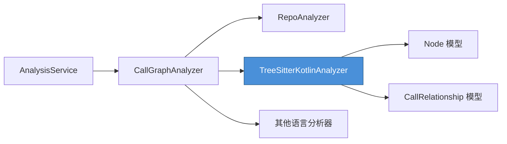
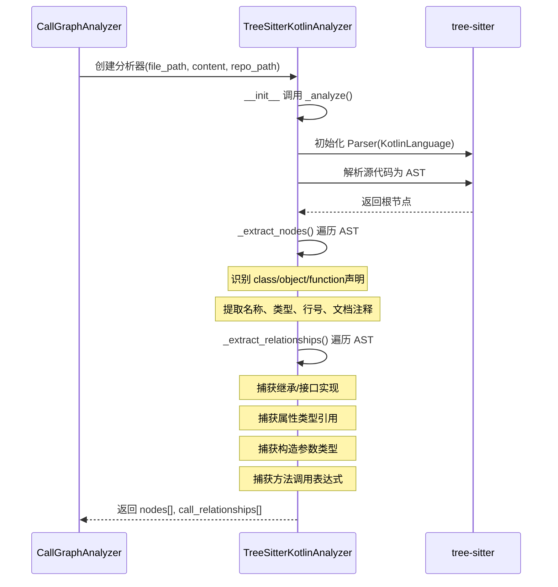
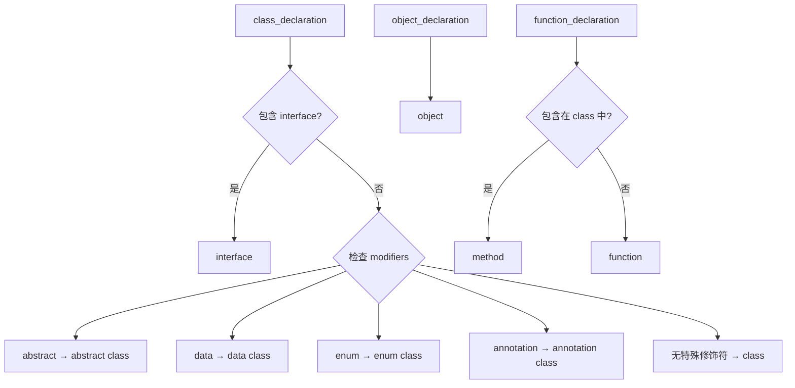
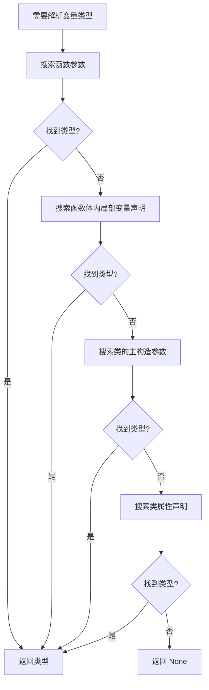

# Kotlin 语言分析器模块

## 概述

Kotlin 语言分析器是 CodeWiki 依赖分析系统中的一个语言特定模块，负责对 Kotlin 源代码文件进行静态分析。它基于 **tree-sitter** 解析器构建抽象语法树（AST），从中提取代码中的类型定义（类、接口、对象、函数）以及它们之间的调用关系和依赖关系。

该模块是 `CallGraphAnalyzer` 多语言分析架构中的一员，与 [python](python.md)、[java](java.md)、[javascript](javascript.md)、[typescript](typescript.md)、[csharp](csharp.md)、[c](c.md)、[cpp](cpp.md)、[php](php.md) 等其他语言分析器并列存在。

---

## 功能特性

- **完整的 Kotlin 语法支持**：通过 `tree-sitter-kotlin` 语法解析器，支持 Kotlin 的所有主要语言特性
- **节点提取**：识别类、抽象类、数据类、枚举类、注解类、接口、单例对象、顶层函数和成员方法
- **依赖关系提取**：捕获继承关系、属性类型引用、构造参数类型引用、方法调用等
- **变量类型推断**：通过作用域搜索（局部变量、函数参数、构造参数、类属性）推断变量类型
- **模块路径计算**：自动将文件路径转换为 Kotlin 风格的模块标识符

---

## 架构与位置

### 在系统中的位置

```
dependency_analyzer/
├── analyzers/
│   ├── kotlin.py          ← 当前模块
│   ├── python.py
│   ├── java.py
│   ├── javascript.py
│   ├── typescript.py
│   ├── csharp.py
│   ├── c.py
│   ├── cpp.py
│   └── php.py
├── analysis/
│   ├── analysis_service.py  ← 编排分析工作流
│   ├── call_graph_analyzer.py ← 调度各语言分析器
│   └── repo_analyzer.py
├── models/
│   ├── core.py              ← Node, CallRelationship 模型
│   └── analysis.py
└── ast_parser.py
```

### 调用链



1. `AnalysisService` 接收分析请求并协调完整工作流
2. `CallGraphAnalyzer` 提取代码文件列表，根据文件扩展名分发到对应的语言分析器
3. 对于 `.kt` 和 `.kts` 文件，调用 `TreeSitterKotlinAnalyzer` 进行解析
4. 分析结果以 `Node` 和 `CallRelationship` 模型返回，由 `CallGraphAnalyzer` 统一归并和消重

---

## 核心组件：`TreeSitterKotlinAnalyzer`

### 类定义

```python
class TreeSitterKotlinAnalyzer:
    def __init__(self, file_path: str, content: str, repo_path: Optional[str] = None):
```

#### 构造参数

| 参数 | 类型 | 说明 |
|------|------|------|
| `file_path` | `str` | Kotlin 源文件的路径 |
| `content` | `str` | 文件内容字符串 |
| `repo_path` | `Optional[str]` | 仓库根目录路径，用于计算相对路径和模块名 |

#### 核心属性

| 属性 | 类型 | 说明 |
|------|------|------|
| `nodes` | `List[Node]` | 提取的代码节点列表 |
| `call_relationships` | `List[CallRelationship]` | 提取的调用关系列表 |

---

### 分析流程



#### 分步说明

1. **AST 构建**：使用 `tree_sitter_kotlin.language()` 获取 Kotlin 语言定义，创建 Parser 实例，将源代码解析为语法树
2. **节点提取**（`_extract_nodes`）：递归遍历 AST 节点，提取以下类型声明：
   - 类声明（`class_declaration`）→ 分为 class / abstract class / data class / enum class / annotation class
   - 接口声明（`interface` 修饰符的类声明）
   - 对象声明（`object_declaration`）
   - 函数声明（`function_declaration`）→ 分为顶层函数（function）和成员方法（method）
3. **关系提取**（`_extract_relationships`）：递归遍历 AST 节点，提取四类关系
4. **结果输出**：通过模块级函数 `analyze_kotlin_file` 返回 `(List[Node], List[CallRelationship])`

---

### 节点提取规则

#### 识别 Kotlin 类型修饰符

`_get_class_modifiers()` 方法从 `modifiers` 节点中提取 `abstract`、`data`、`enum`、`annotation` 等修饰符，映射到对应的节点类型：



#### 节点 ID 格式

节点的 `component_id` 使用格式：`{relative_path}::{name}`

对于成员方法，格式为：`{relative_path}::{ClassName}.{methodName}`

#### 节点属性填充

| Node 字段 | 数据来源 |
|-----------|---------|
| `id` / `component_id` | 由 `_get_component_id()` 生成 |
| `name` | 声明的标识符名称 |
| `component_type` | `class` / `interface` / `abstract class` / `data class` / `enum class` / `annotation class` / `object` / `function` / `method` |
| `file_path` | 原始文件路径 |
| `relative_path` | 相对于仓库根目录的路径 |
| `source_code` | 声明的源代码片段 |
| `start_line` / `end_line` | 声明在文件中的行号范围（1-based） |
| `has_docstring` / `docstring` | 前导注释（支持行注释和块注释） |

---

### 关系提取规则

`_extract_relationships()` 方法捕获四种类型的依赖关系：

#### 1. 继承与接口实现（delegation_specifiers）

```kotlin
class MyClass : BaseClass(), MyInterface {
    // delegation_specifiers → constructor_invocation/user_type
}
```

通过 `delegation_specifiers` 节点分析类的基类和接口，创建从子类到父类/接口的 `CallRelationship`。

#### 2. 属性类型引用

```kotlin
class MyClass {
    val service: UserService  // property_declaration → variable_declaration → user_type
}
```

提取类属性声明中引用的类型，创建从所属类到属性类型的 `CallRelationship`。

#### 3. 构造参数类型引用

```kotlin
class MyClass(private val repo: UserRepository)  // class_parameter → user_type
```

提取主构造参数中的类型引用，创建从该类到参数类型的 `CallRelationship`。

#### 4. 方法调用表达式

```kotlin
userService.getUser()           // navigation_expression
UserRepository()                 // identifier (大写开头 → 构造函数调用)
someFunction()                   // identifier (小写开头 → 普通函数调用)
```

- **简单标识符**：如果首字母大写，视为类型引用（构造函数）；否则为普通函数调用
- **导航表达式**（`a.b()`）：尝试解析接收者类型（`a`），然后创建从包含方法到该类型的 `CallRelationship`

---

### 变量类型解析

`_find_variable_type()` 方法通过搜索作用域来推断变量的类型，搜索优先级如下：



支持显式类型注解和通过构造函数调用推断类型（如 `val user = UserService()` 会推断类型为 `UserService`）。

---

### 基本类型过滤

`_is_primitive_type()` 方法判断一个类型是否为 Kotlin 内建基本类型，避免为基本类型创建冗余的关系：

**基本类型集合**：
- 原始类型：`Boolean`, `Byte`, `Char`, `Double`, `Float`, `Int`, `Long`, `Short`
- 常用类型：`String`, `Unit`, `Nothing`, `Any`
- 集合类型：`List`, `Set`, `Map`, `Collection`, `Iterable`, `Sequence` 及其可变变体
- 数组类型：`Array`, `IntArray`, `LongArray` 等特化数组
- 元组类型：`Pair`, `Triple`

---

## 与其他组件的交互

### 与 CallGraphAnalyzer 的集成

`CallGraphAnalyzer._analyze_kotlin_file()` 方法：

```python
def _analyze_kotlin_file(self, file_path: str, content: str, repo_dir: str):
    from codewiki.src.be.dependency_analyzer.analyzers.kotlin import analyze_kotlin_file
    
    functions, relationships = analyze_kotlin_file(file_path, content, repo_path=repo_dir)
    for func in functions:
        func_id = func.id if func.id else f"{file_path}:{func.name}"
        self.functions[func_id] = func
    self.call_relationships.extend(relationships)
```

分析结果被合并到全局的 `functions` 字典和 `call_relationships` 列表中，随后经过：
1. **关系消解**（`_resolve_call_relationships`）：尝试匹配未解析的调用到实际的函数定义
2. **关系去重**（`_deduplicate_relationships`）：移除重复的调用关系
3. **可视化生成**（`_generate_visualization_data`）：生成 Cytoscape.js 兼容的图形数据

### 与 AnalysisService 的集成

`AnalysisService` 将 Kotlin 列为支持的语言之一，通过文件扩展名 `.kt` / `.kts` 识别 Kotlin 文件：

```python
CODE_EXTENSIONS = {
    ".kt": "kotlin",
    ".kts": "kotlin",
    # ... 其他语言
}
```

---

## 支持的文件类型

| 扩展名 | 语言 |
|--------|------|
| `.kt` | Kotlin 源文件 |
| `.kts` | Kotlin 脚本文件 |

---

## 使用示例

### 直接使用分析器

```python
from codewiki.src.be.dependency_analyzer.analyzers.kotlin import analyze_kotlin_file

# 分析单个 Kotlin 文件
nodes, relationships = analyze_kotlin_file(
    file_path="/path/to/UserService.kt",
    content=open("/path/to/UserService.kt").read(),
    repo_path="/path/to/repo"
)

# 输出结果
for node in nodes:
    print(f"{node.component_type}: {node.name} ({node.start_line}-{node.end_line})")

for rel in relationships:
    print(f"{rel.caller} → {rel.callee} (line {rel.call_line})")
```

### 通过分析服务使用

```python
from codewiki.src.be.dependency_analyzer.analysis.analysis_service import AnalysisService

service = AnalysisService()
result = service.analyze_local_repository(
    repo_path="/path/to/kotlin-project",
    max_files=100,
    languages=["kotlin"]
)

# result 包含 nodes, relationships 和 summary
```

---

## 性能与限制

### 性能考虑
- 每个文件分析设置 30 秒超时保护（由 `CallGraphAnalyzer` 统一管理）
- AST 遍历复杂度与源代码大小成正比，O(n) 其中 n 为 AST 节点数
- 变量类型解析涉及作用域搜索，在最坏情况下可能遍历整个函数体

### 已知限制
- ❌ 不支持 Kotlin 多平台（KMP）项目中的 expect/actual 声明
- ❌ 不支持 Gradle 构建脚本（`.gradle.kts` 文件虽然也是 Kotlin 语法但属构建配置）
- ❌ 不支持 Java 互操作场景中从 Java 代码的调用分析
- ⚠️ 变量类型解析仅覆盖局部作用域，不进行全局类型推断
- ⚠️ 方法调用的接收者类型解析依赖于局部变量声明和参数，不进行复杂的数据流分析
- ⚠️ 不支持 Kotlin 符号（`::`）引用和属性引用表达式

---

## 扩展指南

要扩展 Kotlin 分析器支持更多语法特性，可以：

1. **添加新节点类型**：在 `_extract_nodes()` 方法中增加对应 AST 节点类型的处理分支，如支持 `type_alias` 声明
2. **添加新关系类型**：在 `_extract_relationships()` 中增加新类型的依赖分析，如扩展函数接收者类型解析
3. **改进类型解析**：增强 `_find_variable_type()` 方法，支持更多作用域类型（如 lambda 参数、when 分支变量）
4. **添加对 Kotlin 协程的支持**：识别 `suspend` 函数和协程构建器（`launch`、`async` 等）

---

## 参考资料

- [tree-sitter-kotlin](https://github.com/fwcd/tree-sitter-kotlin): Kotlin 的 tree-sitter 语法定义
- [CallGraphAnalyzer 模块](call_graph_analyzer.md): 多语言调用图分析器
- [AnalysisService 模块](analysis_service.md): 分析服务编排层
- [Node 与 CallRelationship 模型](dependency_analyzer_models.md): 核心数据模型定义
