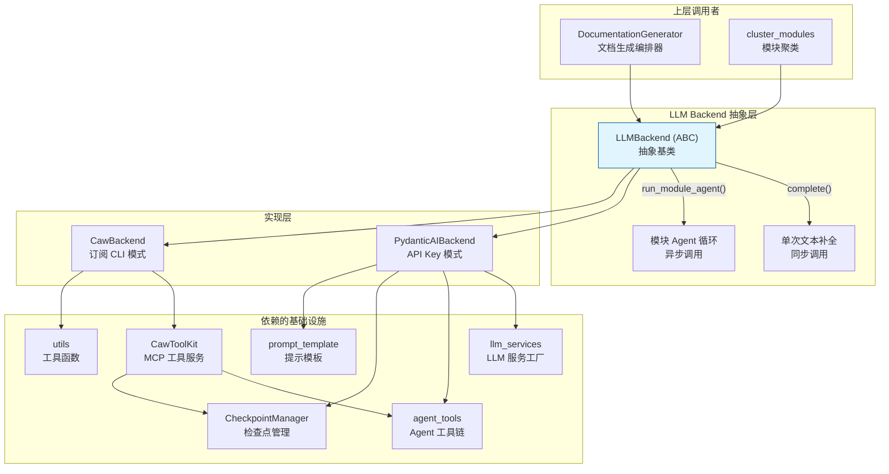
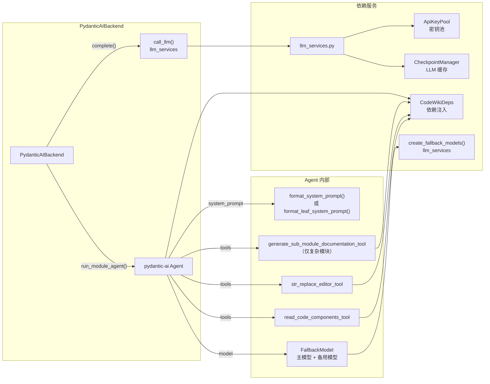
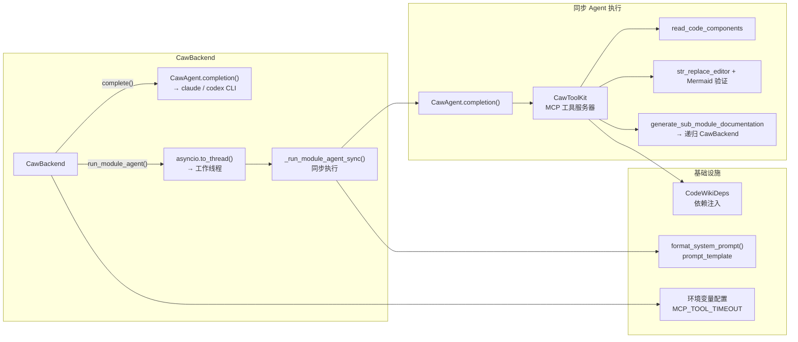
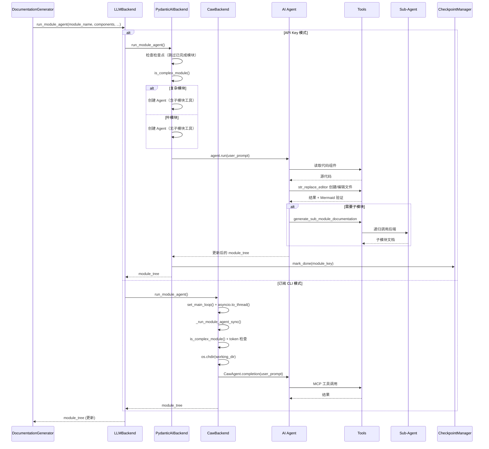
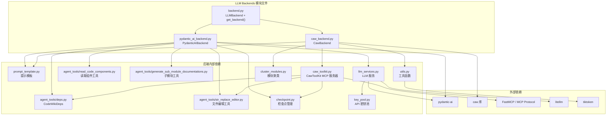

# LLM 后端抽象模块 (llm_backends)

## 概述

`llm_backends` 模块是 CodeWiki 文档生成系统的 **LLM 调用抽象层**，定义了统一的 `LLMBackend` 接口，并提供了两种完全不同的实现路径：

| 实现 | 认证方式 | 适用场景 | 
|------|----------|----------|
| **PydanticAIBackend** | API Key（OpenAI / Anthropic / Azure / Bedrock） | 标准 API 调用，多密钥并发 |
| **CawBackend** | OAuth 订阅（Claude Code / Codex CLI） | 使用本地 CLI 工具，无需 API Key |

模块的核心职责是将上层编排器（[DocumentationGenerator](documentation_generator.md)）与具体的 LLM 调用方式解耦，使文档生成引擎可以在不修改业务逻辑的情况下切换后端。

### 核心职责

- **单次补全 (Single-shot Completion)**：用于模块聚类（[cluster_modules](cluster_modules.md)）和父模块/仓库总览文档生成
- **多轮 Agent 循环 (Agent Loop)**：用于每个模块的深度文档生成，支持工具调用、递归子模块分解
- **提供者选择**：通过工厂函数根据配置自动选择合适的后端实现

---

## 架构设计



---

## 核心接口：`LLMBackend`

`LLMBackend` 定义在 `backend.py` 中，是所有 LLM 后端的抽象基类。它规定了两个核心抽象方法：

### `complete(prompt, *, model, temperature) -> str`

**同步单次文本补全**，用于：
- 模块聚类（[cluster_modules](cluster_modules.md) 中的 LLM 调用）
- 父模块总览文档生成（`generate_parent_module_docs`）
- 仓库总览文档生成（`REPO_OVERVIEW_PROMPT`）

参数：
- `prompt`：输入提示文本
- `model`：模型名称（可选，默认使用配置中的主模型/聚类模型）
- `temperature`：生成温度（默认 0.0，订阅模式不支持此参数）

返回：LLM 生成的文本响应。

### `run_module_agent(module_name, components, core_component_ids, module_path, working_dir) -> Dict[str, Any]`

**异步多轮 Agent 循环**，用于每个模块的深度文档生成。Agent 拥有以下能力：
- 读取代码组件（`read_code_components` 工具）
- 文件编辑（`str_replace_editor` 工具，含 Mermaid 图表自动验证）
- 递归生成子模块文档（`generate_sub_module_documentation` 工具）

参数：
- `module_name`：模块名称
- `components`：组件字典（`Dict[str, Node]`）
- `core_component_ids`：核心组件 ID 列表
- `module_path`：模块路径（如 `["src", "core", "utils"]`）
- `working_dir`：文档输出工作目录

返回：更新后的 `module_tree` 字典（包含新生成的子模块分支）。

### 提供者判断

工厂函数 `get_backend()` 提供了提供者判断辅助：

```python
CAW_PROVIDERS = frozenset({"claude-code", "codex"})

def is_caw_provider(provider: str) -> bool:
    """判断提供者是否使用 caw（订阅 CLI 模式）。"""
    return provider in CAW_PROVIDERS

def get_backend(config) -> "LLMBackend":
    """根据 config.provider 返回对应的后端实例。"""
    provider = getattr(config, "provider", "openai-compatible")
    if is_caw_provider(provider):
        from codewiki.src.be.caw_backend import CawBackend
        return CawBackend(config)
    from codewiki.src.be.pydantic_ai_backend import PydanticAIBackend
    return PydanticAIBackend(config)
```

---

## 实现一：`PydanticAIBackend`（API Key 模式）

### 架构



### 核心机制

#### 1. 单次补全 (`complete`)

```python
def complete(self, prompt, *, model=None, temperature=0.0):
    effective_model = model or self._config.main_model
    # 检查检查点缓存（断点续传）
    if self._ckpt is not None:
        cached = self._ckpt.get_llm_cache(prompt, effective_model)
        if cached is not None:
            return cached
    # 调用 LLM
    response = call_llm(prompt, self._config, model=model, temperature=temperature)
    # 保存到缓存
    if self._ckpt is not None and response:
        self._ckpt.save_llm_cache(prompt, effective_model, response)
    return response
```

`call_llm` 函数（来自 [llm_services](llm_services.md)）提供：
- **自动重试**：可配置重试次数（`llm_max_retries`）和间隔（`llm_retry_interval`）
- **错误分类**：可重试错误（超时、限流、服务端错误）vs 不可重试错误（认证、请求格式）
- **限流感知**：遇到 `RateLimitError` 时尊重服务端的 `retry-after` 头
- **密钥池集成**：如果配置了多 API 密钥，自动轮询使用

#### 2. 模块 Agent 循环 (`run_module_agent`)

该方法根据模块复杂度决定 Agent 配置：

```python
if is_complex_module(components, core_component_ids):
    # 多文件模块 → 完整系统提示 + 子模块委托工具
    agent = Agent(
        fallback_models,  # 主模型 + 备用模型
        tools=[read_code_components_tool, str_replace_editor_tool, 
               generate_sub_module_documentation_tool],
        system_prompt=format_system_prompt(module_name, custom_instructions),
        model_settings=_build_model_settings(config, config.main_model),
    )
else:
    # 单文件叶模块 → 精简提示 + 无委托工具
    agent = Agent(
        fallback_models,
        tools=[read_code_components_tool, str_replace_editor_tool],
        system_prompt=format_leaf_system_prompt(module_name, custom_instructions),
        model_settings=_build_model_settings(config, config.main_model),
    )
```

**关键设计决策**：
- **`is_complex_module()`**：判断依据是核心组件是否分布在多个文件中（`len(files) > 1`）。多文件模块才允许递归子模块委托，避免不必要的 Agent 开销。
- **FallbackModel**：由 `create_fallback_models()` 创建，主模型失败时自动切换到备用模型，提高系统鲁棒性。
- **`_build_model_settings()`**：自动适配 `max_completion_tokens`（Claude 新模型）vs `max_tokens`（其他模型），见 [llm_services](llm_services.md) 文档。
- **`CodeWikiDeps`**：Agent 运行的依赖注入容器，包含当前模块的组件信息、模块树、配置等上下文。

#### 3. 提示模板

Agent 的系统提示词来自 [prompt_template](prompt_template.md)：
- **`format_system_prompt()`**：完整系统提示，包含 `generate_sub_module_documentation` 工具的说明，适用于复杂模块
- **`format_leaf_system_prompt()`**：叶模块系统提示，不包含子模块委托工具说明
- **`format_user_prompt()`**：用户提示词，包含模块树结构、核心组件代码（带上下文窗口截断保护）

---

## 实现二：`CawBackend`（订阅 CLI 模式）

### 架构



### 核心机制

#### 1. 提供者映射

```python
_CAW_PROVIDER_MAP = {
    "claude-code": "claude_code",   # → claude CLI
    "codex": "codex",               # → codex CLI
}

_CLI_BINARY = {
    "claude-code": "claude",
    "codex": "codex",
}
```

#### 2. 初始化验证

构造函数中会立即检查 CLI 二进制是否存在：
```python
if shutil.which(cli) is None:
    raise RuntimeError(
        f"Subscription mode requires the '{cli}' CLI on PATH. "
        f"Install it and run '{cli} login', then try again."
    )
```

对于 Claude Code 模式，还会设置 MCP 超时环境变量以防止长时间的递归子模块生成被中断：
```python
os.environ.setdefault("MCP_TOOL_TIMEOUT", "86400000")  # 24 小时
os.environ.setdefault("MCP_TIMEOUT", "60000")
```

#### 3. 单次补全 (`complete`)

```python
def complete(self, prompt, *, model=None, temperature=0.0):
    effective_model = model or self._model
    agent = CawAgent(
        provider=self._caw_provider,
        model=effective_model,
        tools=ToolGroup.READER,  # 仅需读取能力
    )
    traj = agent.completion(prompt)
    return traj.result
```

- `temperature` 参数被忽略（订阅 CLI 不暴露温度控制）
- 使用 `ToolGroup.READER` 限制工具集（聚类和总览生成不需要写入）

#### 4. 模块 Agent 循环 (`run_module_agent`)

由于 `caw.completion()` 是同步阻塞调用（会 fork 子进程），该方法将执行推到工作线程：

```python
async def run_module_agent(self, ...):
    # 将主事件循环注册到 utils，使工作线程中的 Mermaid 验证回调可用
    set_main_loop(asyncio.get_running_loop())
    return await asyncio.to_thread(
        self._run_module_agent_sync, ...
    )
```

**同步执行 (`_run_module_agent_sync`)** 的核心流程：

1. **早期退出检查**：如果总览文档或模块文档已存在，直接跳过
2. **复杂度判断**：与 `PydanticAIBackend` 相同的 `is_complex_module()` + Token 阈值检查，决定是否允许子模块委托
3. **工具集限制**：对于 Codex 模式，额外启用 `ToolGroup.EXEC`（绕过沙箱限制）
4. **创建工作目录**：`os.chdir(working_dir)` 确保 Codex 的 `file_change` 工具写入正确的输出目录
5. **调用 CawAgent**：通过子进程执行 `claude` / `codex` CLI
6. **保存结果**：更新模块树 JSON 文件

#### 5. CawToolKit — MCP 工具服务器

`CawToolKit`（来自 [caw_toolkit](caw_toolkit.md)）是 CodeWiki 工具在 caw 环境中的 MCP 适配器，实现了三个核心工具：

| 工具 | 对应 pydantic-ai 工具 | 说明 |
|------|----------------------|------|
| `read_code_components` | `read_code_components_tool` | 通过 `CodeWikiDeps.components` 读取代码 |
| `str_replace_editor` | `str_replace_editor_tool` | 文件操作 + Mermaid 验证 |
| `generate_sub_module_documentation` | `generate_sub_module_documentation_tool` | 递归子模块委托 |

**Mermaid 验证的特殊处理**：由于 PythonMonkey（Mermaid 验证引擎）绑定在导入它的线程（主线程），而 caw 的 MCP 工具调用在 FastMCP 工作线程中运行，验证函数通过 `set_main_loop()` 注册的主事件循环回主线程执行。

**Codex 兼容性补丁**：
```python
# 为 CodexSession 添加 tool_timeout_sec 支持（caw 上游尚未提供）
def _patch_codex_tool_timeout():
    # 在每个 MCP 服务器配置中添加 tool_timeout_sec=86400
    ...
_patch_codex_tool_timeout()
```

---

## 数据流：模块文档生成



---

## 配置参考

LLM 后端相关的配置项（定义于 [Config](../config/config.md) 类）：

| 配置项 | 默认值 | PydanticAIBackend | CawBackend | 说明 |
|--------|--------|-------------------|------------|------|
| `provider` | `"openai-compatible"` | ✅ 任意非 caw 值 | ✅ `"claude-code"` / `"codex"` | LLM 提供者类型 |
| `main_model` | `"claude-sonnet-4"` | ✅ 传递给 `call_llm()` | ✅ 直接传递给 caw | 主模型名称 |
| `cluster_model` | `main_model` | ✅ 聚类时覆盖主模型 | ✅ 可通过 `complete(model=...)` 指定 | 聚类专用模型 |
| `fallback_model` | `""` | ✅ 用于 FallbackModel | ❌ caw 无内置回退 | 备用模型 |
| `max_tokens` | `32768` | ✅ 用于 `max_tokens` / `max_completion_tokens` | ❌ CLI 不支持 | 响应 Token 上限 |
| `llm_max_retries` | `3` | ✅ 自动重试 | ❌ CLI 无重试 | LLM 调用重试次数 |
| `llm_retry_interval` | `10` | ✅ 重试间隔 | ❌ CLI 无重试 | LLM 调用重试间隔（秒） |
| `llm_base_url` | `""` | ✅ 自定义 API 端点 | ❌ CLI 固定端点 | API 基础 URL |
| `api_keys` | `""` | ✅ 多密钥轮询 | ❌ OAuth 订阅 | API 密钥列表 |
| `max_depth` | `2` | ✅ Agent 递归深度 | ✅ Agent 递归深度 | 模块递归分解最大深度 |
| `max_token_per_leaf_module` | `16000` | ✅ 子模块委托 Token 阈值 | ✅ 子模块委托 Token 阈值 | 叶模块触发子代理的 Token 阈值 |

---

## 内部依赖关系



---

## 与其他模块的关系

| 模块 | 关系 | 说明 |
|------|------|------|
| [DocumentationGenerator](documentation_generator.md) | **调用者** | 编排器通过 `LLMBackend` 接口触发 Agent 循环和单次补全 |
| [agent_tools](agent_tools.md) | **依赖** | Agent 使用的文件操作和代码读取工具集 |
| [caw_toolkit](caw_toolkit.md) | **依赖** | CawBackend 使用的 MCP 工具服务器适配器 |
| [llm_services](llm_services.md) | **依赖** | PydanticAIBackend 的 LLM 调用底层实现（重试、密钥池、模型创建） |
| [checkpoint](checkpoint.md) | **依赖** | 断点续传和 LLM 响应缓存支持 |
| [key_pool](key_pool.md) | **间接依赖** | 多 API 密钥轮询管理（通过 llm_services 调用） |
| [prompt_template](prompt_template.md) | **依赖** | Agent 系统提示词和用户提示词模板 |
| [utils](utils.md) | **依赖** | CawBackend 的 Mermaid 验证、Token 计数、复杂度判断 |
| [cluster_modules](cluster_modules.md) | **调用者** | 聚类过程使用 `complete()` 方法 |
| [config](../config/config.md) | **依赖** | 全局配置定义 |
| [cli](../cli/cli.md) | **间接调用** | CLI 工具通过 DocumentationGenerator 调用后端 |

---

## 扩展指南：添加新的 LLM 后端

1. **创建后端类**：在 `codewiki/src/be/` 下新建文件，实现 `LLMBackend` 抽象类的两个方法：
   - `complete()` — 单次文本补全
   - `run_module_agent()` — 异步模块 Agent 循环

2. **注册提供者**：在 `backend.py` 的 `CAW_PROVIDERS` 集合（如适用）和 `get_backend()` 工厂函数中添加新分支

3. **处理工具调用**：
   - 如果新后端使用 pydantic-ai Agent，可直接复用 `agent_tools` 中的现有工具
   - 如果新后端使用其他 Agent 框架（如 LangChain、自定义实现），需要适配工具接口

4. **配置支持**：确保 [Config](../config/config.md) 类支持新后端的配置项，并在 CLI 层添加对应的提供商选项

5. **测试**：为新后端编写单元测试和集成测试，验证两种抽象方法的行为一致性
