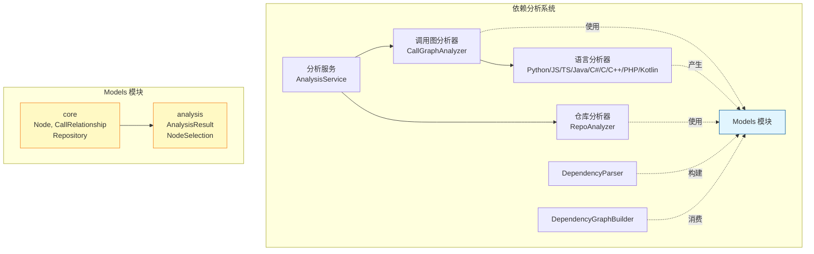
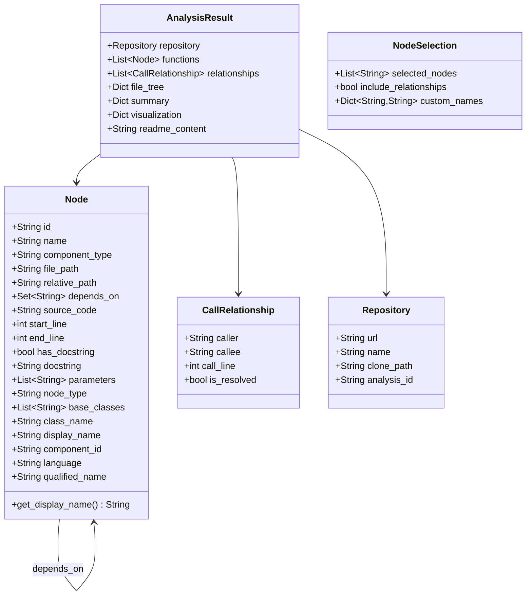
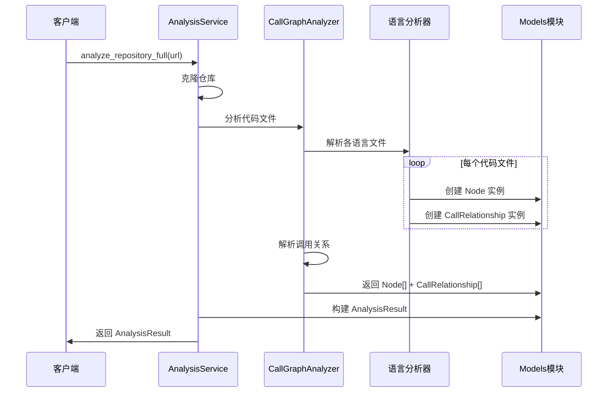

# Models 模块文档

## 概述

**Models** 模块是 `dependency_analyzer` 依赖分析系统的数据模型层，定义了系统中所有核心的数据结构和类型。该模块基于 Pydantic 构建，提供了强类型的数据建模、验证和序列化能力，是整个依赖分析管道中数据流转的基础。

该模块位于 `codewiki/src/be/dependency_analyzer/models/` 目录下，包含两个子模块：

- **[core](./models_core.md)**：定义基础实体模型（`Node`、`CallRelationship`、`Repository`）
- **[analysis](./models_analysis.md)**：定义分析结果和查询模型（`AnalysisResult`、`NodeSelection`）

## 架构概览

Models 模块在依赖分析系统中的位置如下：

## 核心数据模型关系

## 模块功能

### 1. Core 子模块 - [详细文档](./models_core.md)

提供依赖分析系统的基础实体模型：

- **`Node`**：代码组件节点模型，表示代码中的函数、方法、类等可分析单元
- **`CallRelationship`**：调用关系模型，记录两个节点之间的调用关系
- **`Repository`**：仓库模型，表示被分析的代码仓库

### 2. Analysis 子模块 - [详细文档](./models_analysis.md)

提供分析结果和查询控制模型：

- **`AnalysisResult`**：完整的分析结果，包含仓库信息、函数列表、调用关系、文件树、统计摘要和可视化数据
- **`NodeSelection`**：节点选择器，用于控制部分导出和自定义命名

## 数据流

## 与其他模块的关系

- **dependency_analyzer**：作为其数据模型层，Models 被分析服务、调用图分析器、依赖解析器等模块广泛使用
- **Analyzers 子模块**（参见 [analyzers 文档](./dependency_analyzer_analyzers.md)）：各语言分析器解析代码后产出 `Node` 和 `CallRelationship` 实例
- **Analysis 子模块**（参见 [analysis 文档](./dependency_analyzer_analysis.md)）：`AnalysisService` 和 `CallGraphAnalyzer` 消费 Models 模块的数据类型
- **AST Parser 模块**（参见 [ast_parser 文档](./dependency_analyzer_ast_parser.md)）：将分析结果转换为组件依赖图，使用 `Node` 构建组件关系
- **Graph Builder 模块**（参见 [dependency_graphs_builder 文档](./dependency_analyzer_graphs_builder.md)）：消费 Models 构建依赖图并生成叶子节点列表
