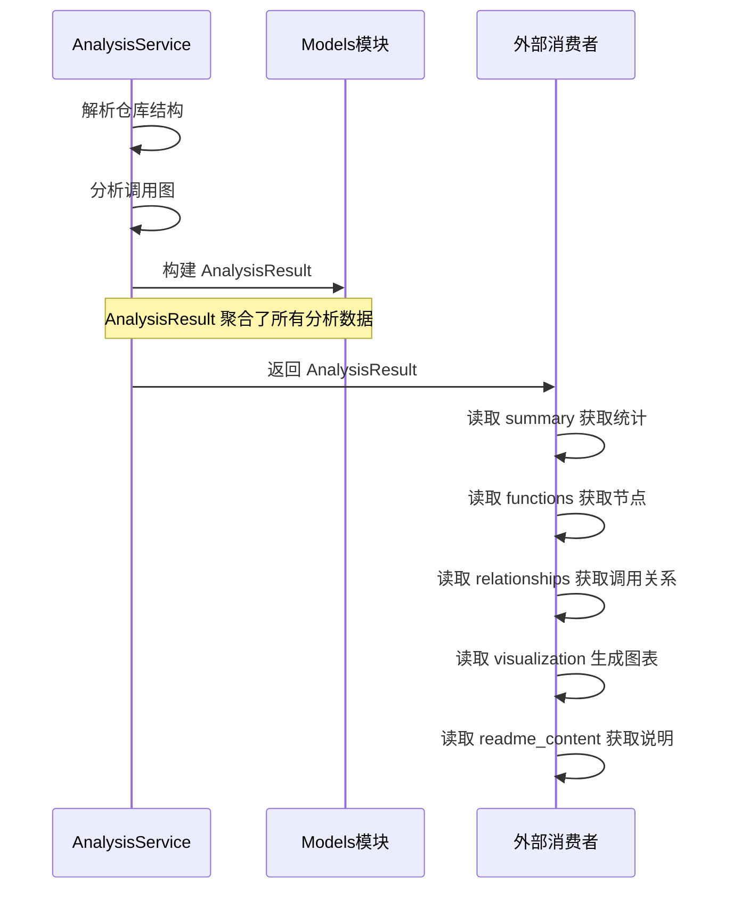

# Analysis 子模块文档

## 概述

`analysis` 子模块定义了依赖分析的结果模型和查询控制模型，是整个分析管道的输出层。分析完成后，所有数据被封装为 `AnalysisResult` 供外部消费。

**文件位置**: `codewiki/src/be/dependency_analyzer/models/analysis.py`

**核心类**:
- `AnalysisResult` — 完整分析结果
- `NodeSelection` — 节点选择器

## 核心组件

### AnalysisResult — 分析结果

`AnalysisResult` 是依赖分析系统的终极输出，包含了分析一个仓库后产生的所有数据。

#### 字段说明

| 字段 | 类型 | 描述 |
|------|------|------|
| `repository` | `Repository` | 被分析的仓库信息 |
| `functions` | `List[Node]` | 所有分析出的函数/方法/类节点列表 |
| `relationships` | `List[CallRelationship]` | 所有调用关系列表 |
| `file_tree` | `Dict[str, Any]` | 仓库文件树结构 |
| `summary` | `Dict[str, Any]` | 分析统计摘要 |
| `visualization` | `Dict[str, Any]` | 可视化数据（Cytoscape.js 格式） |
| `readme_content` | `Optional[str]` | 仓库 README 文件内容 |

#### 构建流程

`AnalysisResult` 在 `AnalysisService.analyze_repository_full()` 方法中构建，流程如下：

```python
analysis_result = AnalysisResult(
    repository=Repository(
        url=repo_info["url"],
        name=repo_info["name"],
        clone_path=temp_dir,
        analysis_id=f"{repo_info['owner']}-{repo_info['name']}",
    ),
    functions=call_graph_result["functions"],      # List[Node]
    relationships=call_graph_result["relationships"],  # List[CallRelationship]
    file_tree=structure_result["file_tree"],
    summary={
        **structure_result["summary"],
        **call_graph_result["call_graph"],
        "analysis_type": "full",
        "languages_analyzed": call_graph_result["call_graph"]["languages_found"],
    },
    visualization=call_graph_result["visualization"],
    readme_content=readme_content,
)
```

#### Summary 结构

`summary` 字典包含以下键：

| 键 | 类型 | 描述 |
|------|------|------|
| `total_files` | `int` | 分析的文件总数 |
| `total_size_kb` | `float` | 文件总大小（KB） |
| `total_functions` | `int` | 发现的函数/节点总数 |
| `total_calls` | `int` | 记录的调用关系总数 |
| `languages_found` | `List[str]` | 检测到的编程语言列表 |
| `files_analyzed` | `int` | 实际分析的文件数 |
| `analysis_approach` | `str` | 分析策略（如 `complete_unlimited`） |
| `analysis_type` | `str` | 分析类型（`full` 或 `structure_only`） |
| `languages_analyzed` | `List[str]` | 实际分析的语言列表 |

#### Visualization 结构

`visualization` 字典包含 Cytoscape.js 兼容的图数据：

```json
{
  "cytoscape": {
    "elements": [
      {
        "data": {
          "id": "file.py:my_function",
          "label": "my_function",
          "file": "src/file.py",
          "type": "function",
          "language": "python"
        },
        "classes": "node-function lang-python"
      },
      {
        "data": {
          "id": "file.py:my_function->file.py:other_function",
          "source": "file.py:my_function",
          "target": "file.py:other_function",
          "line": 42
        },
        "classes": "edge-call"
      }
    ]
  },
  "summary": {
    "total_nodes": 150,
    "total_edges": 320,
    "unresolved_calls": 12
  }
}
```

### NodeSelection — 节点选择器

`NodeSelection` 用于控制分析结果的导出范围，支持选择特定节点进行导出。

#### 字段说明

| 字段 | 类型 | 描述 |
|------|------|------|
| `selected_nodes` | `List[str]` | 选中的节点 ID 列表（为空时表示全部导出） |
| `include_relationships` | `bool` | 是否包含选中节点之间的调用关系 |
| `custom_names` | `Dict[str, str]` | 自定义节点名称映射（节点 ID -> 自定义名称） |

#### 使用场景

- **部分导出**: 只导出指定的节点及其依赖关系
- **自定义命名**: 为导出的节点提供更具可读性的名称
- **关系过滤**: 控制是否包含节点间的调用关系

## 数据流



## 跨模块使用

`analysis` 模块被以下模块直接依赖：

- **[core](./models_core.md)**: 直接依赖 `Node`、`CallRelationship` 和 `Repository` 模型
- **analysis_service**: `AnalysisService` 构建并返回 `AnalysisResult`
- **前端模块**: 接收 `AnalysisResult` 用于展示分析结果
- **CLI 模块**: 通过 CLI 命令触发分析并消费 `AnalysisResult`
