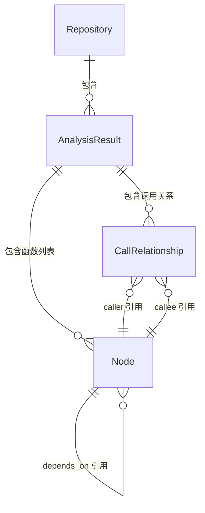

# Core 子模块文档

## 概述

`core` 子模块定义了依赖分析系统中的基础实体模型，是数据流转的基石。所有代码分析的结果最终都会映射为该模块定义的数据结构。

**文件位置**: `codewiki/src/be/dependency_analyzer/models/core.py`

**核心类**:
- `Node` — 代码组件节点模型
- `CallRelationship` — 调用关系模型
- `Repository` — 仓库信息模型

## 核心组件

### Node — 代码组件节点

`Node` 是系统中最重要的数据模型，代表代码中的一个可分析单元（函数、方法、类等）。它包含了代码组件的完整元信息。

#### 字段说明

| 字段 | 类型 | 描述 |
|------|------|------|
| `id` | `str` | 节点的唯一标识符 |
| `name` | `str` | 组件名称 |
| `component_type` | `str` | 组件类型（如 `function`、`method`、`class`） |
| `file_path` | `str` | 文件绝对路径 |
| `relative_path` | `str` | 相对于仓库根目录的路径 |
| `depends_on` | `Set[str]` | 依赖的其他节点 ID 集合 |
| `source_code` | `Optional[str]` | 源码片段 |
| `start_line` | `int` | 起始行号 |
| `end_line` | `int` | 结束行号 |
| `has_docstring` | `bool` | 是否包含文档字符串 |
| `docstring` | `str` | 文档字符串内容 |
| `parameters` | `Optional[List[str]]` | 参数列表 |
| `node_type` | `Optional[str]` | 节点类型（如 `function`, `class`, `interface`） |
| `base_classes` | `Optional[List[str]]` | 基类列表（仅类类型节点） |
| `class_name` | `Optional[str]` | 所属类名（仅方法类型节点） |
| `display_name` | `Optional[str]` | 显示名称 |
| `component_id` | `Optional[str]` | 组件 ID |
| `language` | `Optional[str]` | 编程语言 |
| `qualified_name` | `Optional[str]` | 完整限定名 |

#### 方法

**`get_display_name() -> str`**
返回用于显示的名称，优先返回 `display_name`，若未设置则返回 `name`。

```python
node = Node(id="1", name="my_function", component_type="function", ...)
display_name = node.get_display_name()  # 返回 "my_function"
```

#### 使用场景

- **分析阶段**: 语言分析器解析代码后创建 `Node` 实例
- **关系构建**: `depends_on` 字段用于构建组件依赖图
- **可视化**: `name`、`file_path`、`language` 等字段用于生成可视化节点
- **导出**: 序列化为 JSON 用于持久化和外部消费

### CallRelationship — 调用关系

记录两个代码组件之间的调用关系。

#### 字段说明

| 字段 | 类型 | 描述 |
|------|------|------|
| `caller` | `str` | 调用方节点 ID |
| `callee` | `str` | 被调用方节点 ID |
| `call_line` | `Optional[int]` | 调用发生的行号 |
| `is_resolved` | `bool` | 是否已解析到具体定义 |

#### 使用场景

- **调用图构建**: `CallGraphAnalyzer` 收集所有调用关系
- **关系解析**: `_resolve_call_relationships()` 方法尝试将 `callee` 解析到具体的 `Node` 定义
- **去重**: 通过 `(caller, callee)` 元组去重
- **可视化**: 生成 `cytoscape` 边数据

### Repository — 仓库信息

描述被分析的代码仓库。

#### 字段说明

| 字段 | 类型 | 描述 |
|------|------|------|
| `url` | `str` | 仓库 URL（如 GitHub 地址） |
| `name` | `str` | 仓库名称 |
| `clone_path` | `str` | 克隆到本地的临时路径 |
| `analysis_id` | `str` | 分析任务唯一标识（通常为 `owner-repo` 格式） |

#### 使用场景

- **分析启动**: `AnalysisService` 解析仓库 URL 后创建 `Repository` 实例
- **结果关联**: 作为 `AnalysisResult` 的一部分，标识分析结果的来源仓库
- **清理**: `clone_path` 用于在分析完成后清理临时文件

## 数据关系图



## 跨模块使用

`core` 模块被以下模块直接依赖：

- **[analysis](./models_analysis.md)**: `AnalysisResult` 和 `NodeSelection` 直接引用 `Node`、`CallRelationship` 和 `Repository`
- **analysis_service**: `AnalysisService` 构建 `AnalysisResult` 时使用这些模型
- **call_graph_analyzer**: `CallGraphAnalyzer` 解析代码后创建 `Node` 和 `CallRelationship`
- **analyzers**: 各语言分析器返回 `Node` 列表和 `CallRelationship` 列表
- **ast_parser**: `DependencyParser` 使用 `Node` 构建组件映射
- **dependency_graphs_builder**: 消费 `Node` 构建依赖图和叶子节点列表
