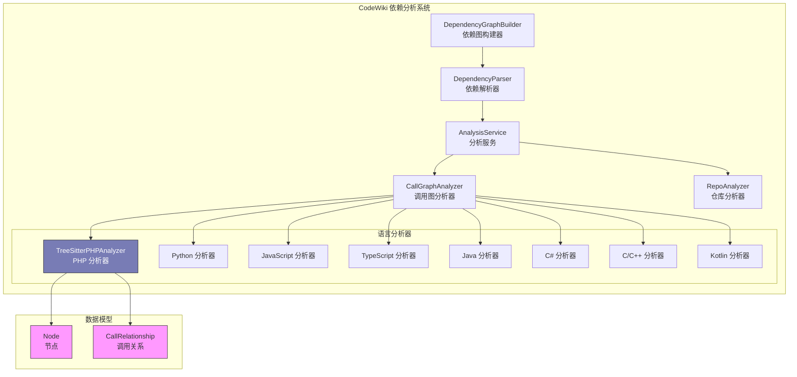
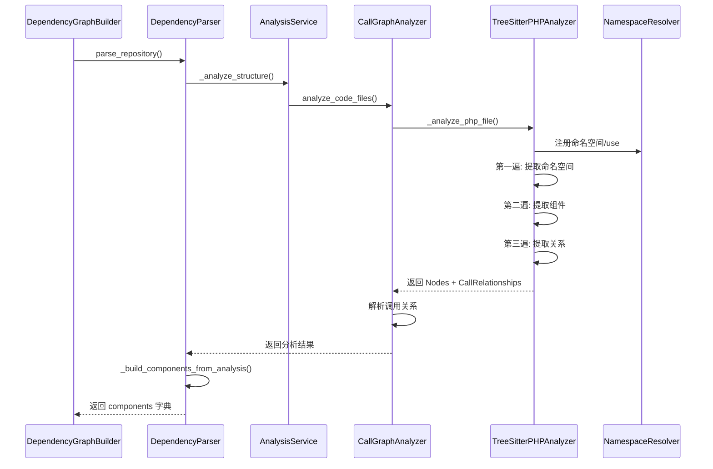

# PHP 语言分析器模块

## 概述

PHP 语言分析器模块是 CodeWiki 依赖分析系统中的一个重要组件，专门用于解析和分析 PHP 语言代码文件。该模块利用 tree-sitter-php 解析器对 PHP 文件进行抽象语法树（AST）分析，提取其中的类（classes）、接口（interfaces）、特质（traits）、枚举（enums）、函数（functions）和方法（methods）等代码组件，并建立它们之间的依赖关系。

该模块的核心能力包括：
- **PHP 文件解析**：使用 tree-sitter-php 引擎解析 PHP 代码，生成 AST
- **命名空间解析**：解析 `namespace` 和 `use` 语句，正确解析类的完全限定名（FQN）
- **组件提取**：提取类、接口、特质、枚举、函数、方法等代码组件
- **依赖关系提取**：识别 `extends`、`implements`、`new`、`::`（静态调用）等依赖关系
- **模板文件过滤**：自动跳过 Blade 模板（`.blade.php`）、PHTML 等视图文件

## 架构位置



## 模块组成

### 1. 命名空间解析器 (`NamespaceResolver`)

**职责**：解析 PHP 命名空间和 `use` 导入语句，将类名解析为完全限定名。

**核心功能**：
- 注册当前文件的命名空间（`namespace`）
- 注册 `use` 导入语句及其别名
- 解析类名到完全限定名

**解析算法**：

```mermaid
flowchart TD
    A[输入类名 name] --> B{name 为空?}
    B -->|是| C[返回空]
    B -->|否| D{以 \\ 开头?}
    D -->|是| E[去除前缀 \\ 返回]
    D -->|否| F{在 use_map 中?}
    F -->|是| G[返回 use_map[name]]
    F -->|否| H[按 \\ 拆分 name]
    H --> I{parts[0] 是别名?}
    I -->|是| J[拼接 base + 剩余部分]
    I -->|否| K{有当前命名空间?}
    K -->|是| L[拼接 namespace\\name]
    K -->|否| M[返回原 name]
    
    J --> N[返回结果]
    L --> N
    M --> N
    C --> N
    E --> N
    G --> N
```

### 2. PHP 分析器 (`TreeSitterPHPAnalyzer`)

**职责**：使用 tree-sitter-php 对 PHP 文件进行完整的 AST 分析，提取代码组件和依赖关系。

**核心处理流程**：

```mermaid
flowchart TD
    A[接收 PHP 文件] --> B{是模板文件?}
    B -->|是 (.blade.php, .phtml 等)| C[跳过分析]
    B -->|否| D[初始化 tree-sitter 解析器]
    D --> E[解析文件内容为 AST]
    E --> F[第一遍: 提取命名空间信息]
    F --> G[第二遍: 提取代码组件]
    G --> H[第三遍: 提取依赖关系]
    H --> I[返回 Nodes 和 CallRelationships]
    
    subgraph "第一遍: 命名空间"
        F1[查找 namespace_definition] --> F2[注册命名空间]
        F1 --> F3[查找 namespace_use_declaration]
        F3 --> F4[处理简单 use 和 group use]
        F4 --> F5[注册 use 别名映射]
    end
    
    subgraph "第二遍: 组件提取"
        G1[遍历 AST 节点] --> G2{节点类型}
        G2 -->|class_declaration| G3[提取类/抽象类]
        G2 -->|interface_declaration| G4[提取接口]
        G2 -->|trait_declaration| G5[提取特质]
        G2 -->|enum_declaration| G6[提取枚举]
        G2 -->|function_definition| G7[提取函数]
        G2 -->|method_declaration| G8[提取方法]
        G3 & G4 & G5 & G6 & G7 & G8 --> G9[创建 Node 对象]
        G9 --> G10[递归处理子节点]
    end
    
    subgraph "第三遍: 关系提取"
        H1[遍历 AST 节点] --> H2{关系类型}
        H2 -->|extends| H3[类继承关系]
        H2 -->|implements| H4[接口实现关系]
        H2 -->|new| H5[对象创建关系]
        H2 -->|::| H6[静态方法调用]
        H2 -->|use| H7[导入依赖关系]
        H2 -->|属性提升| H8[PHP 8+ 构造器属性提升]
        H3 & H4 & H5 & H6 & H7 & H8 --> H9[创建 CallRelationship]
    end
    
    F --> F1
    G --> G1
    H --> H1
```

## 核心类详细说明

### `NamespaceResolver`

| 属性 | 类型 | 说明 |
|------|------|------|
| `current_namespace` | `str` | 当前文件所在的命名空间 |
| `use_map` | `Dict[str, str]` | 别名到完全限定名的映射字典 |

| 方法 | 说明 |
|------|------|
| `register_namespace(ns)` | 注册当前命名空间（自动处理双反斜杠） |
| `register_use(fqn, alias)` | 注册 use 导入语句，支持显式别名和隐式别名 |
| `resolve(name)` | 将类名解析为完全限定名 |

### `TreeSitterPHPAnalyzer`

| 属性 | 类型 | 说明 |
|------|------|------|
| `file_path` | `Path` | PHP 文件路径 |
| `content` | `str` | 文件内容 |
| `repo_path` | `str` | 仓库根目录路径 |
| `nodes` | `List[Node]` | 提取的代码组件节点列表 |
| `call_relationships` | `List[CallRelationship]` | 提取的调用关系列表 |
| `namespace_resolver` | `NamespaceResolver` | 命名空间解析器实例 |

| 方法 | 说明 |
|------|------|
| `_analyze()` | 主分析方法，执行三遍扫描 |
| `_extract_namespace_info()` | 第一遍：提取命名空间和 use 信息 |
| `_extract_nodes()` | 第二遍：提取代码组件节点 |
| `_extract_relationships()` | 第三遍：提取依赖关系 |
| `_is_template_file()` | 检查是否为需要跳过的模板文件 |
| `_get_preceding_docstring()` | 提取节点前的 PHPDoc 注释 |
| `_extract_parameters()` | 提取函数/方法的参数列表 |
| `_extract_base_classes()` | 提取类的基类和接口列表 |
| `_is_primitive()` | 检查是否为 PHP 内置/原始类型 |

### 工具函数 `analyze_php_file()`

```python
def analyze_php_file(
    file_path: str, 
    content: str, 
    repo_path: str = None
) -> Tuple[List[Node], List[CallRelationship]]:
    """分析 PHP 文件，提取节点和调用关系"""
```

## 支持的依赖关系类型

| 关系类型 | AST 节点 | 示例 |
|----------|----------|------|
| 继承 (extends) | `base_clause` | `class AdminController extends Controller` |
| 实现 (implements) | `class_interface_clause` | `class User implements JsonSerializable` |
| 对象创建 (new) | `object_creation_expression` | `$user = new User()` |
| 静态调用 (::) | `scoped_call_expression` | `User::find($id)` |
| 构造器属性提升 | `property_promotion_parameter` | `public function __construct(private UserService $users)` |
| 导入依赖 | `namespace_use_declaration` | `use App\Models\User` |

## 过滤与排除机制

### 模板文件过滤

分析器会自动跳过以下类型的模板文件：

| 模式 | 说明 |
|------|------|
| `.blade.php` | Laravel Blade 模板 |
| `.phtml` | PHP 视图模板 |
| `.twig.php` | Twig PHP 模板 |
| `views/` 目录 | 视图目录 |
| `templates/` 目录 | 模板目录 |
| `resources/views/` 目录 | 资源视图目录 |

### 内置类型排除

以下 PHP 内置/原始类型会被自动排除在依赖关系之外，避免产生噪音：

**原始类型**：`string`, `int`, `float`, `bool`, `array`, `object`, `callable`, `iterable`, `mixed`, `void`, `null`, `false`, `true`, `never`, `self`, `static`, `parent`

**内置类**：`Exception`, `Error`, `Throwable`, `Closure`, `Generator`, `Iterator`, `DateTime`, `stdClass` 等 20+ 常用内置类

## 与其他模块的交互



## 使用示例

```python
from codewiki.src.be.dependency_analyzer.analyzers.php import analyze_php_file

# 分析单个 PHP 文件
nodes, relationships = analyze_php_file(
    file_path="/path/to/UserController.php",
    content=open("/path/to/UserController.php").read(),
    repo_path="/path/to/repo"
)

# 查看提取的组件
for node in nodes:
    print(f"组件: {node.display_name}")
    print(f"  类型: {node.component_type}")
    print(f"  位置: {node.file_path}:{node.start_line}")
    if node.docstring:
        print(f"  文档: {node.docstring[:100]}...")

# 查看提取的关系
for rel in relationships:
    print(f"调用者: {rel.caller} -> 被调用者: {rel.callee} (行 {rel.call_line})")
```

## 数据模型引用

该模块输出的数据结构基于以下模型（详见 [dependency_analyzer_models](dependency_analyzer_models.md)）：

- **`Node`**：表示代码中的一个组件（类、方法、函数等）
  - `id`: 唯一标识符
  - `name`: 组件名称
  - `component_type`: 组件类型（class, interface, trait, enum, function, method）
  - `file_path`: 所属文件路径
  - `start_line/end_line`: 代码位置
  - `parameters`: 参数列表（仅函数/方法）
  - `base_classes`: 基类/接口列表（仅类声明）
  - `docstring`: PHPDoc 注释

- **`CallRelationship`**：表示组件之间的调用/依赖关系
  - `caller`: 调用者 ID
  - `callee`: 被调用者 ID
  - `call_line`: 调用所在行号
  - `is_resolved`: 是否已解析为具体组件

## 性能与限制

### 安全机制
- **递归深度限制**：`MAX_RECURSION_DEPTH = 100`，防止深层嵌套导致的栈溢出
- **异常处理**：捕获 `RecursionError` 和通用异常，避免单个文件解析失败影响整体分析

### 已知限制
- 不支持动态方法调用（如 `$class->method()`）
- 不支持变量类名（如 `$class = new $className()`）
- 不支持魔术方法（如 `__call`、`__callStatic`）
- 对于高度动态的 PHP 代码（大量使用可变变量、call_user_func 等），依赖关系可能不完整

### 依赖项
- `tree_sitter`：Python tree-sitter 绑定库
- `tree_sitter_php`：PHP 语言 tree-sitter 解析器（提供 `language_php()`）

## 相关文档

- [依赖分析系统总览](dependency_analyzer.md) - 整个依赖分析系统的架构和使用
- [分析服务模块](analysis_service.md) - `AnalysisService` 如何编排多语言分析
- [调用图分析器](call_graph_analyzer.md) - `CallGraphAnalyzer` 如何调度各语言分析器
- [数据模型](dependency_analyzer_models.md) - `Node`、`CallRelationship`、`Repository` 等核心模型
