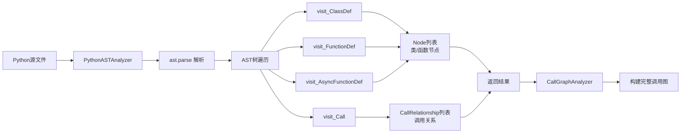
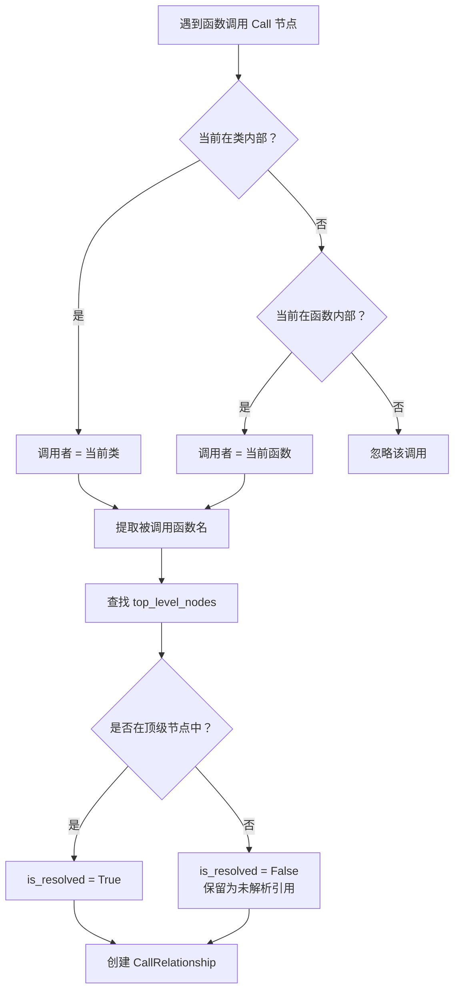

# Python 依赖分析模块 (Python Analyzer)

## 概述

Python 依赖分析模块是 CodeWiki 多语言代码分析框架中专门用于解析 Python 语言代码的核心组件。该模块基于 Python 标准库 `ast` 模块（Abstract Syntax Tree）实现，通过对 Python 源文件进行语法树解析，提取其中的类定义、函数定义以及函数调用关系，从而构建完整的代码依赖图谱。

该模块是 [dependency_analyzer](dependency_analyzer.md) 体系中语言专用分析器的一员，与其并列的还有 [javascript](javascript.md)、[typescript](typescript.md)、[java](java.md)、[csharp](csharp.md)、[c](c.md)、[cpp](cpp.md)、[php](php.md)、[kotlin](kotlin.md) 等分析器。

## 核心功能

1. **类定义提取**：识别文件中的所有顶级类定义，记录类名、基类、文档字符串、源代码位置等信息
2. **函数定义提取**：提取顶级函数（包括异步函数），记录函数名、参数列表、文档字符串、源代码位置等信息
3. **调用关系分析**：分析函数/方法内部的函数调用，建立调用者与被调用者之间的依赖关系
4. **内置函数过滤**：智能过滤 Python 内置函数调用，避免生成无意义的依赖关系
5. **跨文件引用支持**：通过对组件的唯一标识符设计，支持跨文件的依赖关系追踪

## 架构与组件关系

### 模块定位

```
┌─────────────────────────────────────────────────────────────┐
│                    Dependency Analyzer                      │
│  ┌───────────────────────────────────────────────────────┐  │
│  │                  AnalysisService                       │  │
│  │  ┌──────────────┐  ┌──────────────────────────────┐   │  │
│  │  │ RepoAnalyzer  │  │     CallGraphAnalyzer        │   │  │
│  │  └──────────────┘  └───────────┬──────────────────┘   │  │
│  └───────────────────────────────────┼────────────────────┘  │
│                                      │                       │
│  ┌───────────────────────────────────┼────────────────────┐  │
│  │          Language Analyzers       │                    │  │
│  │  ┌───────┬───────┬───────┬───────┼───────┬───────┐   │  │
│  │  │Python │  JS   │  TS   │ Java  │  C#   │  C    │   │  │
│  │  │ (当前) │       │       │       │       │       │   │  │
│  │  └───┬───┴───────┴───────┴───────┴───────┴───────┘   │  │
│  └──────┼────────────────────────────────────────────────┘  │
│         │                                                    │
│  ┌──────┴────────────────────────────────────────────────┐  │
│  │                    Models (core)                       │  │
│  │              Node, CallRelationship                    │  │
│  └───────────────────────────────────────────────────────┘  │
└─────────────────────────────────────────────────────────────┘
```

### 数据处理流程



### 类与核心组件关系

```mermaid
classDiagram
    class PythonASTAnalyzer {
        -file_path: str
        -repo_path: Optional[str]
        -content: str
        -lines: List[str]
        -nodes: List[Node]
        -call_relationships: List[CallRelationship]
        -current_class_name: Optional[str]
        -current_function_name: Optional[str]
        -top_level_nodes: Dict
        +analyze()
        +visit_ClassDef(node)
        +visit_FunctionDef(node)
        +visit_AsyncFunctionDef(node)
        +visit_Call(node)
    }
    
    class Node {
        +id: str
        +name: str
        +component_type: str
        +file_path: str
        +relative_path: str
        +source_code: Optional[str]
        +start_line: int
        +end_line: int
        +has_docstring: bool
        +docstring: str
        +parameters: Optional[List[str]]
        +base_classes: Optional[List[str]]
        +display_name: Optional[str]
    }
    
    class CallRelationship {
        +caller: str
        +callee: str
        +call_line: Optional[int]
        +is_resolved: bool
    }
    
    class CallGraphAnalyzer {
        +functions: Dict[str, Node]
        +call_relationships: List[CallRelationship]
        +analyze_code_files()
        -_analyze_python_file()
    }
    
    PythonASTAnalyzer --> Node : 创建
    PythonASTAnalyzer --> CallRelationship : 创建
    CallGraphAnalyzer --> PythonASTAnalyzer : 调用 _analyze_python_file
    CallGraphAnalyzer --> Node : 聚合
    CallGraphAnalyzer --> CallRelationship : 聚合

    <<module>> analyze_python_file
    analyze_python_file --> PythonASTAnalyzer : 工厂函数
```

## 核心类说明

### PythonASTAnalyzer

`PythonASTAnalyzer` 是 Python 代码分析的核心类，继承自 `ast.NodeVisitor`，通过访问者模式遍历 AST 树来提取代码结构信息。

#### 关键属性

| 属性 | 类型 | 说明 |
|------|------|------|
| `file_path` | `str` | 被分析的 Python 文件路径 |
| `repo_path` | `Optional[str]` | 仓库根目录路径，用于计算相对路径 |
| `content` | `str` | 文件的原始内容 |
| `lines` | `List[str]` | 按行分割的文件内容 |
| `nodes` | `List[Node]` | 提取的顶级代码节点（类和函数） |
| `call_relationships` | `List[CallRelationship]` | 提取的调用关系 |
| `current_class_name` | `Optional[str]` | 当前正在访问的类名（用于判断是否在类内部） |
| `current_function_name` | `Optional[str]` | 当前正在访问的函数名 |
| `top_level_nodes` | `Dict` | 顶级节点映射表，用于快速查找被调用者 |

#### 关键方法

**`analyze()`**
- 执行完整的文件分析流程
- 调用 `ast.parse()` 解析源代码为 AST 树
- 遍历 AST 树提取节点和关系
- 捕获语法错误和异常并记录日志

**`visit_ClassDef(node)`**
- 处理类定义节点
- 提取基类名称（支持 `Name` 和 `Attribute` 两种形式）
- 为每个类创建 `Node` 对象
- 记录基类继承关系为 `CallRelationship`
- 设置 `current_class_name` 上下文

**`visit_FunctionDef(node)` / `visit_AsyncFunctionDef(node)`**
- 处理普通函数和异步函数定义
- 仅在顶级作用域（不在类内部）时创建 `Node`
- 提取参数列表、文档字符串等信息
- 通过 `_should_include_function()` 过滤掉测试函数（以 `_test_` 开头的函数）

**`visit_Call(node)`**
- 处理函数调用表达式
- 提取被调用函数名称（通过 `_get_call_name()`）
- 根据当前上下文（类内或类外）确定调用者 ID
- 判断被调用者是否在顶级节点中（`is_resolved` 标记）

**`_get_call_name(node)`**
- 从 AST 调用节点提取函数名
- 支持简单名称（`func()`）和属性访问（`obj.method()`）
- 自动过滤 Python 内置函数（如 `print`, `len`, `isinstance` 等）
- 返回 `None` 表示该调用应被忽略

**`_get_component_id(name)`**
- 生成唯一组件标识符，格式为 `相对路径::类名.方法名` 或 `相对路径::函数名`
- 支持嵌套类中的方法引用

## 调用关系解析逻辑



## 内置函数过滤机制

`PythonASTAnalyzer` 维护了一个内置函数集合 `PYTHON_BUILTINS`，包含常见的 Python 内置函数（`print`, `len`, `str`, `int`, `range`, `open`, `super` 等约 50 个）。在 `_get_call_name()` 中，如果检测到被调用函数属于内置函数集合，则返回 `None`，从而避免生成无意义的依赖关系。

此外，`_should_include_function()` 方法会过滤掉以 `_test_` 开头的函数，避免将测试辅助函数纳入分析范围。

## 异常处理策略

| 异常类型 | 处理方式 |
|---------|---------|
| `SyntaxError` | 记录警告日志，跳过该文件继续分析 |
| `SyntaxWarning` | 使用 `warnings.catch_warnings()` 静默忽略（针对正则表达式中的无效转义序列） |
| 其他异常 | 记录错误日志和堆栈信息，继续处理 |

## 与外部模块的集成

### 调用入口

`PythonASTAnalyzer` 通过模块级别的工厂函数 `analyze_python_file()` 对外暴露：

```python
def analyze_python_file(
    file_path: str, content: str, repo_path: Optional[str] = None
) -> Tuple[List[Node], List[CallRelationship]]:
```

该函数由 [CallGraphAnalyzer](dependency_analyzer.md#callgraphanalyzer) 的 `_analyze_python_file()` 方法调用，是 Python 依赖分析的标准入口。

### 数据模型

分析结果使用 [models/core](models_core.md) 中定义的 `Node` 和 `CallRelationship` 模型：

- **Node**: 表示代码中的一个组件（类或函数），包含源代码位置、文档字符串、参数列表等元数据
- **CallRelationship**: 表示两个组件之间的调用关系，包含调用者、被调用者和是否已解析的标记

### 集成到完整分析流程

```
User Request
    │
    ▼
AnalysisService.analyze_repository_full()
    │
    ▼
RepoAnalyzer.analyze_repository_structure()  ── 构建文件树
    │
    ▼
CallGraphAnalyzer.analyze_code_files()       ── 分析所有代码文件
    │
    ├── _analyze_python_file()     ──▶ PythonASTAnalyzer
    ├── _analyze_javascript_file() ──▶ JavaScript 分析器
    ├── _analyze_typescript_file() ──▶ TypeScript 分析器
    └── ...其他语言分析器
    │
    ▼
DependencyParser._build_components_from_analysis()  ── 构建依赖图
    │
    ▼
DependencyGraphBuilder  ── 生成可视化图数据
```

## 使用示例

```python
from codewiki.src.be.dependency_analyzer.analyzers.python import analyze_python_file

# 分析单个 Python 文件
file_path = "/path/to/repo/src/module.py"
with open(file_path, "r") as f:
    content = f.read()

nodes, relationships = analyze_python_file(
    file_path=file_path,
    content=content,
    repo_path="/path/to/repo"
)

# 输出分析结果
for node in nodes:
    print(f"组件: {node.display_name} (类型: {node.component_type})")
    print(f"  位置: {node.relative_path}:{node.start_line}-{node.end_line}")
    if node.has_docstring:
        print(f"  文档: {node.docstring[:50]}...")
    if node.parameters:
        print(f"  参数: {', '.join(node.parameters)}")

for rel in relationships:
    print(f"调用关系: {rel.caller} → {rel.callee} (已解析: {rel.is_resolved})")
```

## 性能考量

1. **惰性导入**：`CallGraphAnalyzer._analyze_python_file()` 在方法内部导入 `analyze_python_file` 函数，避免在模块加载时引入不必要的依赖
2. **超时控制**：`CallGraphAnalyzer` 为每个文件设置了 30 秒的超时保护，防止恶意或超大文件导致分析挂起
3. **内存效率**：仅在顶级作用域创建 `Node`，避免为类方法和嵌套函数生成过多节点
4. **警告抑制**：使用 `warnings.catch_warnings()` 抑制分析目标文件中的语法警告，避免日志污染

## 参考文档

- [dependency_analyzer](dependency_analyzer.md) — 依赖分析器主模块
- [models_core](models_core.md) — 核心数据模型（Node, CallRelationship）
- [models_analysis](models_analysis.md) — 分析结果模型（AnalysisResult, NodeSelection）
- [javascript](javascript.md) — JavaScript 语言分析器
- [java](java.md) — Java 语言分析器
- [csharp](csharp.md) — C# 语言分析器
- [cpp](cpp.md) — C++ 语言分析器
- [c](c.md) — C 语言分析器
- [php](php.md) — PHP 语言分析器
- [kotlin](kotlin.md) — Kotlin 语言分析器
