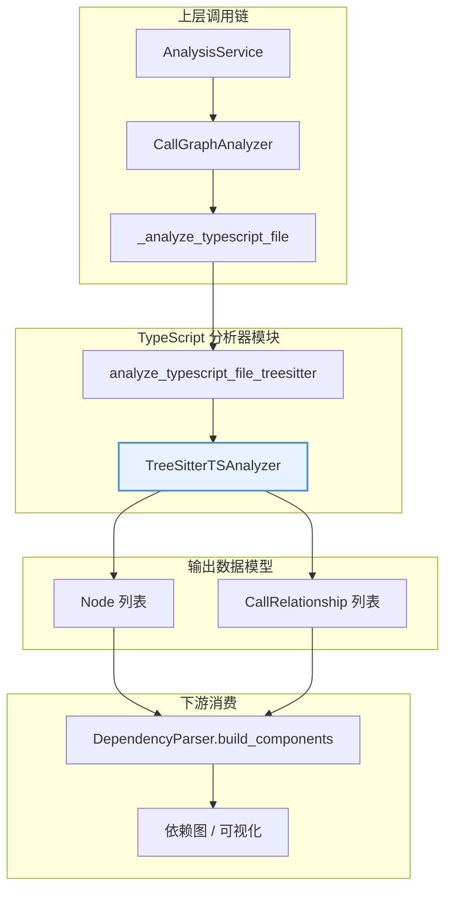
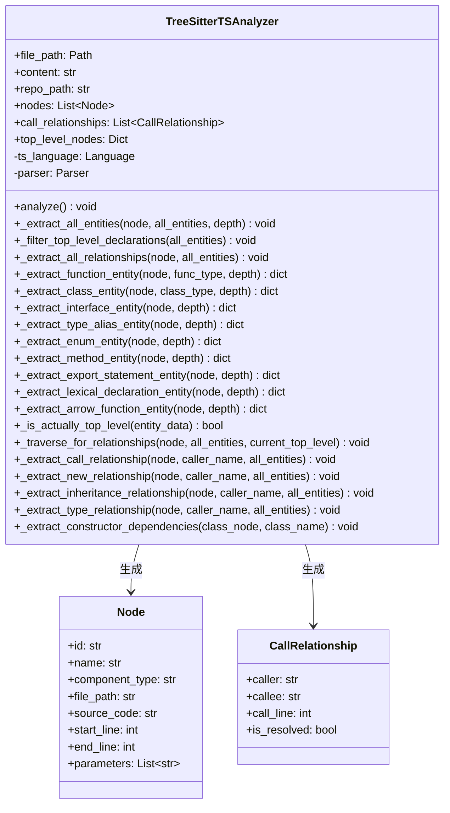
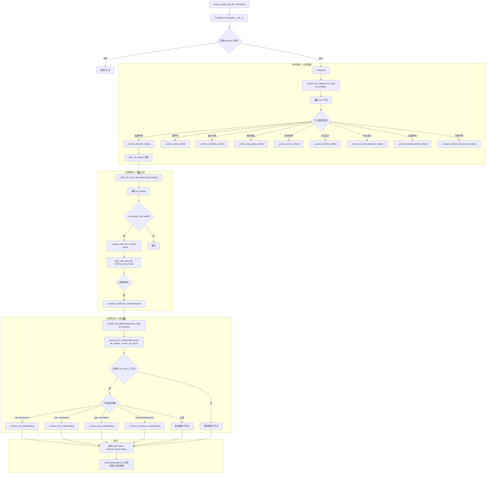
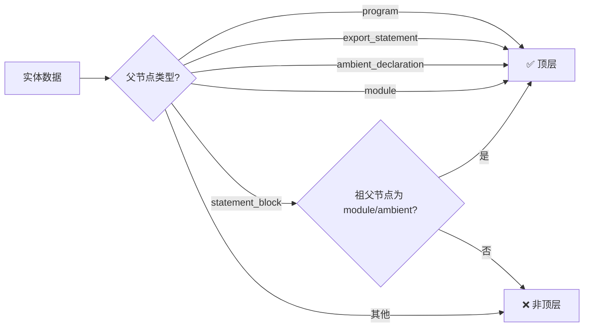
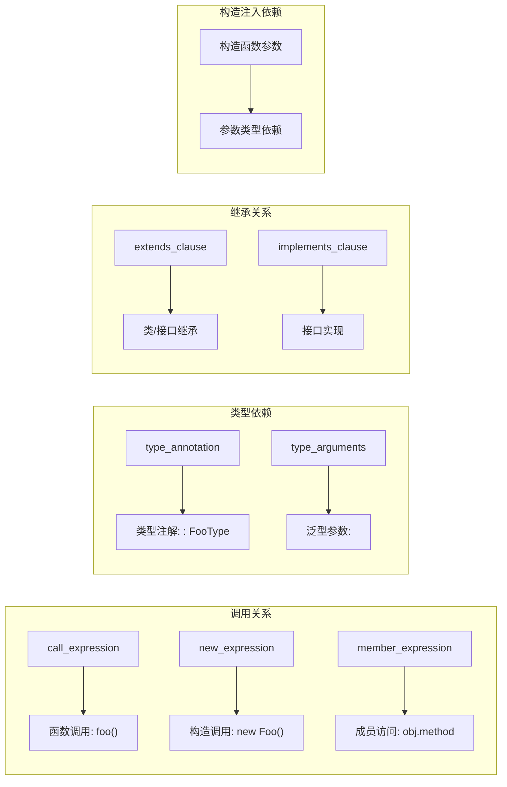
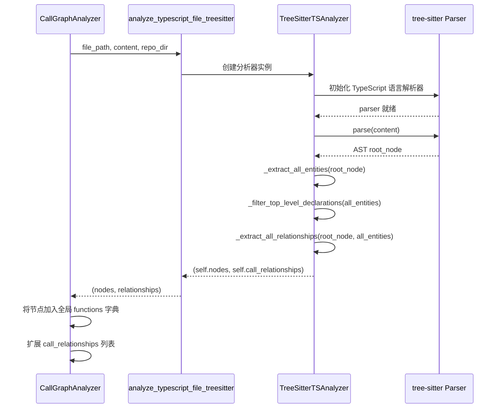

# TypeScript 代码分析器模块

## 概述

TypeScript 代码分析器是 CodeWiki 依赖分析系统的核心组件之一，专门负责对 TypeScript/TSX 源代码文件进行静态分析。该模块基于 **tree-sitter** 解析引擎，将 TypeScript 代码解析为抽象语法树（AST），然后从中提取顶层声明（函数、类、接口、类型别名、枚举等）以及它们之间的调用关系和依赖关系。

该分析器生成的 `Node` 和 `CallRelationship` 数据将被上层模块（如 `CallGraphAnalyzer`）汇总，构建完整的项目级调用图，并最终用于代码文档自动生成和依赖可视化。

---

## 模块定位与架构

### 在依赖分析系统中的位置



### 与其他分析器的关系

TypeScript 分析器与 JavaScript 分析器共享相似的架构设计（均基于 tree-sitter），但针对 TypeScript 的语法特性进行了扩展：

| 特性 | TypeScript (TreeSitterTSAnalyzer) | JavaScript (TreeSitterJSAnalyzer) |
|------|----------------------------------|----------------------------------|
| 解析引擎 | `tree-sitter-typescript` | `tree-sitter-javascript` |
| 接口声明 | ✅ 支持 | ❌ |
| 类型别名 | ✅ 支持 | ❌ |
| 枚举声明 | ✅ 支持 | ❌ |
| 抽象类 | ✅ 支持 | ❌ |
| 泛型参数 | ✅ 提取 | ❌ |
| 修饰符提取 | `async`/`static`/`ambient` | `async`/`generator` |
| JSDoc 类型 | ❌ | ✅ |

详细架构背景请参考：[dependency_analyzer 概述](models.md)

---

## 核心组件：`TreeSitterTSAnalyzer`

### 类结构



### 数据模型依赖

该模块使用的数据模型定义在 `models/core.py` 中，详细说明请参考 [models_core.md](models_core.md)。

---

## 分析流程

### 整体流程



---

## 实体提取详解

### 支持的 AST 节点类型

`TreeSitterTSAnalyzer` 能够识别并提取以下 TypeScript 语法结构：

| 节点类型 (tree-sitter) | 提取方法 | 映射的 component_type | 备注 |
|------------------------|----------|----------------------|------|
| `function_declaration` | `_extract_function_entity` | `function` | 含 async |
| `generator_function_declaration` | `_extract_function_entity` | `generator_function` | 生成器函数 |
| `arrow_function` | `_extract_arrow_function_entity` | `function` | 需绑定变量 |
| `method_definition` | `_extract_method_entity` | `function` | 类方法 |
| `class_declaration` | `_extract_class_entity` | `class` | 含 extends/implements |
| `abstract_class_declaration` | `_extract_class_entity` | `abstract_class` | 抽象类 |
| `interface_declaration` | `_extract_interface_entity` | `interface` | 含 extends |
| `type_alias_declaration` | `_extract_type_alias_entity` | `type` | 类型别名 |
| `enum_declaration` | `_extract_enum_entity` | `enum` | 枚举 |
| `export_statement` | `_extract_export_statement_entity` | 委托内部声明 | 递归处理 |
| `lexical_declaration` | `_extract_lexical_declaration_entity` | `variable` | const/let |
| `variable_declaration` | `_extract_variable_declaration_entity` | `variable` | var |
| `ambient_declaration` | `_extract_ambient_declaration_entity` | `ambient_declaration` | `declare module/namespace` |

### 顶层实体过滤策略

分析器的核心设计之一是区分**顶层声明**和**嵌套声明**。只有顶层声明才会被输出为 `Node` 对象，嵌套声明（如函数体内的局部函数）被过滤以保持依赖图的简洁性。

过滤逻辑 `_is_actually_top_level()` 判断规则：



此外，`_is_inside_function_body()` 会检测节点是否位于函数体（`statement_block`）内，如果是则直接判定为非顶层。

### 节点创建映射

`_create_node_from_entity()` 方法将实体字典转换为 `Node` 对象，关键映射关系：

```python
Node(
    id          = f"{relative_path}::{name}",  # 唯一标识
    name        = entity_data['name'],
    component_type = entity_data['type'],       # function / class / interface / type / enum / variable
    file_path   = str(self.file_path),
    relative_path = relative_path,
    source_code = entity_data['code_snippet'],
    start_line  = entity_data['start_line'],
    end_line    = entity_data['end_line'],
    parameters  = entity_data.get('parameters', []),
    node_type   = entity_data.get('subtype'),    # 更具体的子类型
    base_classes = entity_data.get('base_classes'),
    display_name = entity_data['display_name'],
)
```

---

## 关系提取详解

### 支持的关系类型



### 调用关系提取 (`_extract_call_relationship`)

当遍历到 `call_expression` 节点时：

1. **提取被调用者名称** - 从 `call_expression` 的第一个子节点获取
2. **过滤内置函数** - 跳过已知的内置函数
3. **过滤自身方法调用** - `this.method()` 或 `super.method()` 如果方法属于当前类则跳过
4. **检查目标是否在顶层节点** - 如果在 `self.top_level_nodes` 中，添加关系
5. **检查目标是否是顶层声明** - 对于未知节点，通过 `_is_actually_top_level()` 判断
6. **添加关系记录** - 构造 `CallRelationship(caller, callee, call_line, is_resolved=False)`

### 继承关系提取 (`_extract_inheritance_relationship`)

处理 `extends_clause` 和 `implements_clause` 节点，从中提取父类/父接口的标识符，并建立依赖关系。

### 类型关系提取 (`_extract_type_relationship`)

从 `type_annotation` 节点递归查找所有 `type_identifier`，将类型引用转换为依赖关系。内置类型（如 `string`, `number`, `boolean` 等）被自动过滤。

### 构造函数依赖提取 (`_extract_constructor_dependencies`)

专门处理 TypeScript 特有的依赖注入模式——从类构造函数的参数类型注解中提取依赖关系。例如：

```typescript
class UserService {
    constructor(
        private userRepo: UserRepository,   // → UserService 依赖 UserRepository
        private logger: Logger              // → UserService 依赖 Logger
    ) {}
}
```

---

## 集成接口

### 模块入口函数

```python
def analyze_typescript_file_treesitter(
    file_path: str, 
    content: str, 
    repo_path: str = None
) -> Tuple[List[Node], List[CallRelationship]]:
```

该函数是模块的对外接口，供 `CallGraphAnalyzer._analyze_typescript_file()` 调用。它封装了 `TreeSitterTSAnalyzer` 的完整流程，并执行异常处理和日志记录。

### 调用链路



---

## 依赖的外部组件

| 依赖 | 用途 | 文档参考 |
|------|------|----------|
| `tree-sitter` | AST 解析引擎 | - |
| `tree-sitter-typescript` | TypeScript 语法定义 | - |
| `Node` (models/core.py) | 代码节点数据模型 | [models_core.md](models_core.md) |
| `CallRelationship` (models/core.py) | 调用关系数据模型 | [models_core.md](models_core.md) |
| `CallGraphAnalyzer` | 上层调度与分析汇总 | [models.md](models.md) |
| `AnalysisService` | 完整的分析服务编排 | [models.md](models.md) |

---

## 关键设计决策

### 1. 顶层声明优先策略

分析器只输出顶层声明作为 `Node` 对象，函数体内的局部变量/函数不会被纳入依赖图。这一设计：
- **优点**：保持依赖图的简洁性，避免噪声
- **缺点**：可能丢失闭包依赖、内部函数调用等信息

### 2. 未解析关系标记

所有新提取的调用关系默认标记为 `is_resolved=False`，由 `CallGraphAnalyzer._resolve_call_relationships()` 在后处理阶段进行跨文件、跨语言的符号解析。

### 3. 变量声明过滤

`_should_include_node()` 方法中，`component_type == "variable"` 的节点被跳过。这意味着 `const x = 5` 这类纯变量声明不会出现在依赖图中，但 `const fn = () => {}` 这类箭头函数绑定会被提取为函数节点。

### 4. 构造函数注入模式识别

TypeScript 特有的依赖注入模式（通过构造函数参数类型注解）被专门处理，这能帮助识别现代框架（如 Angular、NestJS）中的依赖关系。

---

## 常见使用场景

### 场景 1：独立分析单个 TypeScript 文件

```python
from codewiki.src.be.dependency_analyzer.analyzers.typescript import analyze_typescript_file_treesitter

with open("service.ts", "r") as f:
    content = f.read()

nodes, relationships = analyze_typescript_file_treesitter(
    file_path="/path/to/service.ts",
    content=content,
    repo_path="/path/to/repo"
)

for node in nodes:
    print(f"Found: {node.display_name} ({node.start_line}:{node.end_line})")
```

### 场景 2：集成到完整分析流程

通过 `AnalysisService.analyze_local_repository()` 或 `AnalysisService.analyze_repository_full()` 自动触发 TypeScript 分析。TypeScript 文件会按照以下扩展名自动识别：

- `.ts` → `typescript`
- `.tsx` → `typescript`
